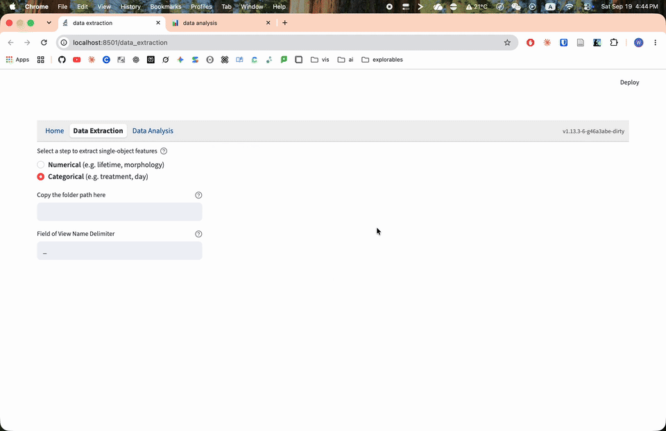
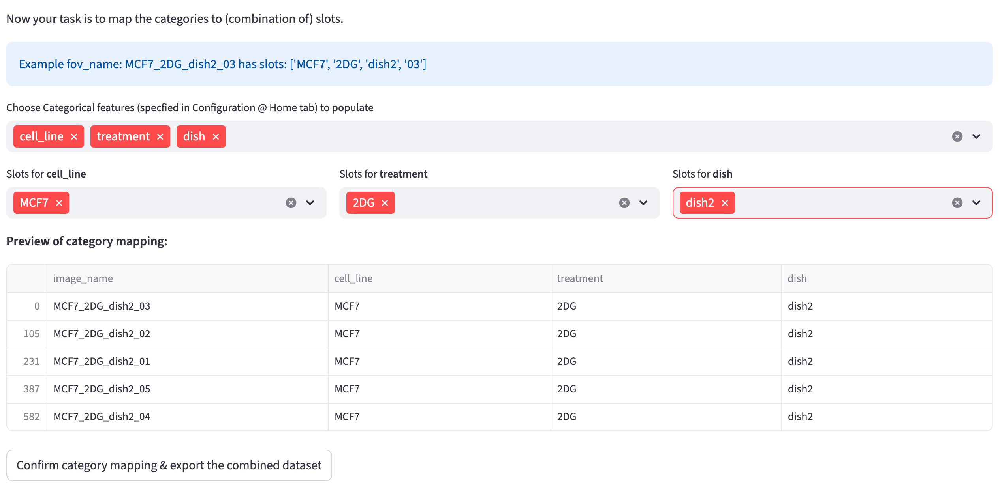

# Categorical Feature Extraction {#sec-categorical-feature-extraction}

Open **Data Extraction → Categorical** in a [local installation](index.qmd#installation). Using the CSV tables saved by [Numerical](#sec-numerical-feature-extraction), FLIM Playground:

- [merges the datasets](#merging-datasets) into a single dataset
- [assigns categorical features](#assigning-categorical-features) to each cell in the merged dataset

{width=100% fig-align=center fig-alt="Categorical Feature Extraction with a local dataset folder, underscore delimiter, category selections, slot mappings, and a preview of the assigned labels."}

## Merging Datasets

Enter the full path to the folder containing your saved [numerical feature CSV files](numerical_feature_extraction.qmd#save-results). The folder is scanned recursively for CSV files. Each usable dataset must contain the configured [cell and FOV identifiers](data_extraction_config.qmd#identifiers). Cell identifiers must be nonmissing and unique within the file and across the accepted files; a file containing overlapping identifiers is skipped.

:::{.callout-important #fov-id-categorical}
**The FOV identifier uniquely identifies a field of view and is assumed to contain all information necessary to extract the categorical features (e.g., treatment, time point, etc.), by including segments separated by a certain delimiter (e.g., `_`). Categorical features are assigned from individual segments or their combinations.** Example: The FOV `Panc1_Cyanide_dish1` denotes that it comes from the Panc1 cell line, under the Cyanide treatment, in the 1st dish.  
:::

Therefore, it checks if all field-of-view names include the same number of segments to determine the eligibility of [categorical feature assignment](#assigning-categorical-features). 

Before merging, all-empty columns are removed. The remaining datasets are stacked using only their common columns, and the page reports columns discarded during merging.

## Assigning Categorical Features

Available categories are the [configured categorical names](data_extraction_config.qmd#categorical-features) that are not already columns in the merged dataset.

Set `Field of View Name Delimiter` to the separator used in the [FOV names](#fov-id-categorical). Leaving it empty treats each complete name as one slot. For each chosen category, select one or more slots; their values are joined in the selected order.

The live preview shows one row from each of the first five FOVs. Check the assigned values before exporting.

{width=100% fig-align=center fig-alt="FOV-name slots map to categorical columns, with a preview above Confirm category mapping & export the combined dataset."}

Clicking `Confirm category mapping & export the combined dataset` then writes the merged dataset with the categorical features as a timestamped CSV (`{timestamp}_combined.csv`) into the same folder as the input dataset. Note that this is a direct file write rather than a browser download, so the file is saved on the machine running FLIM Playground. The hosted app provides Data Analysis only, so upload the combined CSV there with **Use a table from another source** on; in a local app, upload extraction output with the checkbox off.
