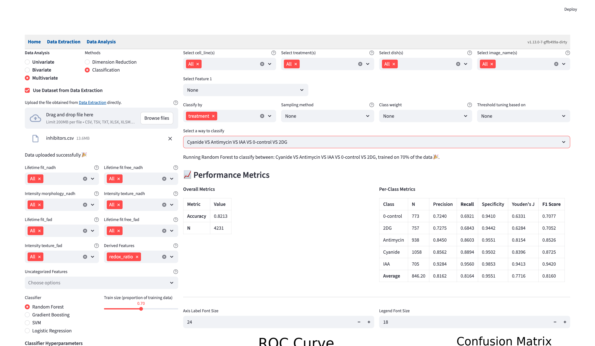
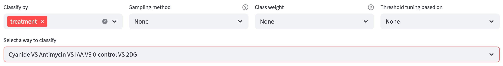
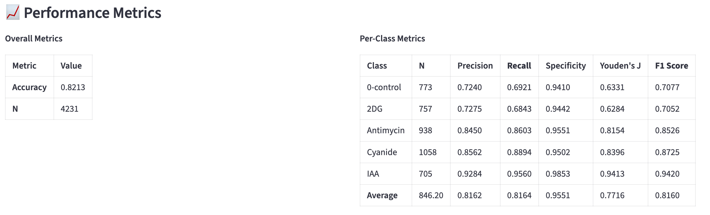
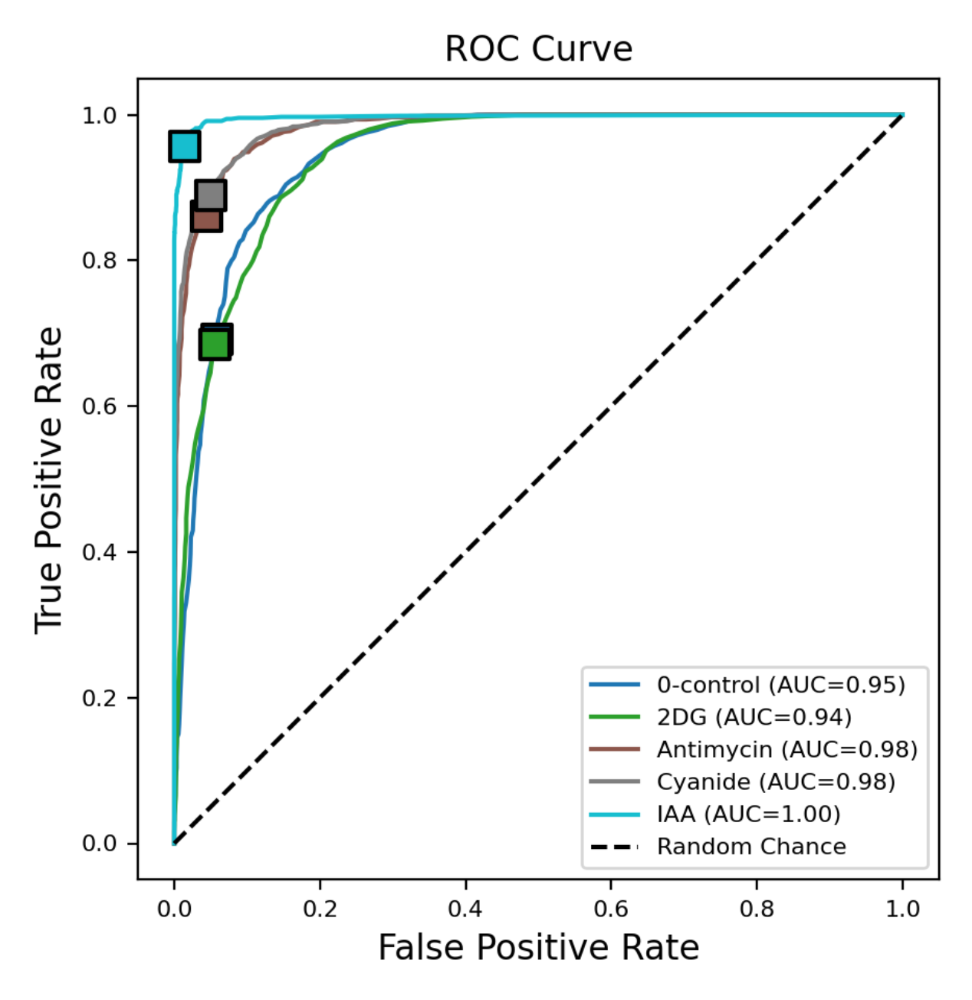
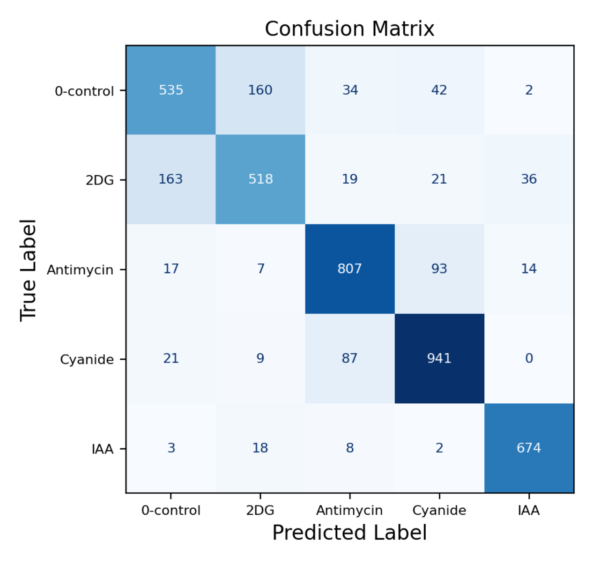
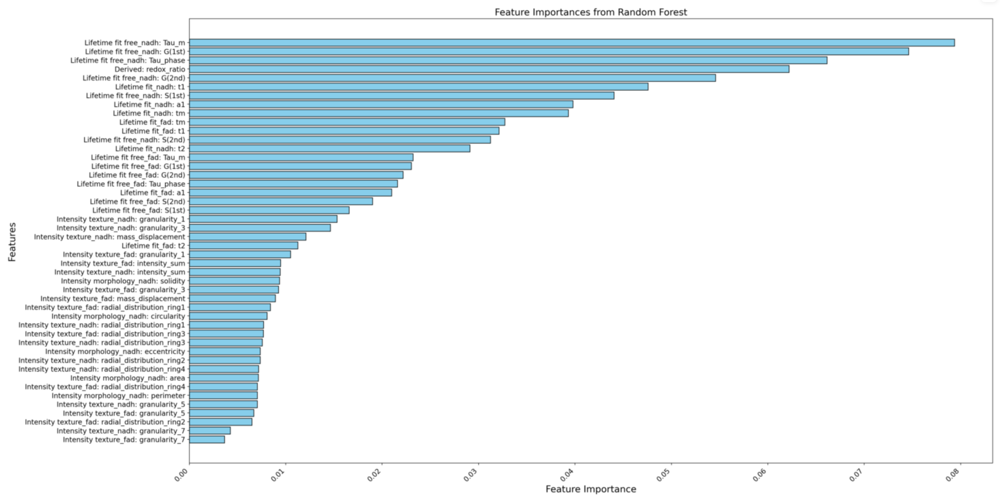

# Classification {#sec-classification}
A machine learning classifier learns patterns from categorized data and then predicts the category of new, unseen data. This module provides a set of machine learning classifiers and interactive widgets to help users perform classification. 

All classifiers use `scikit-learn`, with a fixed random seed of 42 for reproducibility. The app evaluates predictions on a held-out test set and reports [performance metrics](#performance-metrics), a [confusion matrix](#confusion-matrix), and [ROC curves](#roc-curve).

{width=100% fig-align=center fig-alt="Classification interface with feature pickers and Random Forest settings on the left, and filters, target-class controls, and performance metrics on the right."}

An overview of the pipeline: 

- Choose one or more numerical features on the left.
- Choose the classifier, train-test split, and [hyperparameters](#classifier-hyperparameters).
- Filter the dataset. 
- Choose categorical features to form classes. 
- Choose any of the methods to handle [class imbalance](#class-imbalance-handling).
- Choose the classes to be classified.
- Look at the [performance metrics](#performance-metrics), [confusion matrix](#confusion-matrix), and [ROC curve](#roc-curve).
- Compare the results using the metrics that matter for your classification task, then [export the analysis](#export-the-analysis) to reproduce it.

SVM and Logistic Regression standardize features with a z-score within their training pipeline; test observations use that training-fitted transformation. Random Forest and Gradient Boosting use the original feature scale. Classification does not automatically remove rows with missing selected measurements, so a classifier that cannot accept them reports an error. Clean those measurements or use the [numerical filters](data_analysis.qmd#numerical-filters) to select complete observations.

## Shared Interface Components
- On the left, users can use the [selection widgets](data_analysis.qmd#multivariate-analysis) to select numerical features for the classifier. Multiple features can be selected from each feature group. 
- On the top right, users can use the [filters](data_analysis.qmd#filter-widgets) to subset the data to find the groups of interest. 
- Font-size controls appear between the performance metric tables and the ROC/confusion-matrix plots. They use the shared [plot styling settings](data_analysis.qmd#plotting-configuration-widgets).

## Method-specific Components
- Choose a **Classifier** and **Train size (proportion of training data)** on the left. The slider ranges from 0.5 to 0.9 in steps of 0.1, with a default of 0.7. The remaining observations form the held-out test set. Available classifiers are:
    - [`Random Forest`](https://mlu-explain.github.io/random-forest/)
    - `Gradient Boosting`
    - Support Vector Machine (`SVM`)
    - [`Logistic Regression`](https://mlu-explain.github.io/logistic-regression/)

The [train-test split](https://mlu-explain.github.io/train-test-validation/) is stratified to preserve class proportions. The app does not create a separate validation set for choosing model hyperparameters; those are set with the controls below the classifier. Optional [threshold tuning](#threshold-tuning) uses cross-validation within the training data.

::: {.callout-warning title="The split is by row, not by field of view"}
Both the train-test split and the cross-validation used in [threshold tuning](#threshold-tuning) operate on individual rows (i.e. single cells), stratified by class. They do not group rows by field of view, so cells segmented from the same image can end up in both the training set and the test set.

Cells from one image are usually more similar to each other than to cells from a different image, because they share a field of view, an acquisition session, and often a well. When such cells appear on both sides of the split, the reported metrics can look better than the classifier's true performance on a genuinely new image. Keep this in mind when interpreting the [performance metrics](#performance-metrics), particularly when the dataset contains many cells drawn from relatively few fields of view.
:::

- **Classify by** forms target classes from one or more categorical columns. With multiple columns, each distinct combination becomes a class, with values joined by underscores. Classification requires at least one categorical column with two distinct values after filtering. The designated field-of-view column in extraction data is excluded from this picker; a user-table field-of-view column is an ordinary categorical column.

- **Select a way to classify** chooses the classes included in a run. With two classes, the app offers their binary comparison. With more classes, it offers combinations of two or more classes, including the full multiclass problem, and a `class VS the rest` option for each class. A one-versus-rest choice combines all other classes into `the rest`. If the number of combinations is too large, the app asks you to narrow the categories or filters.

{width=100% fig-align=center fig-alt="Classify by is treatment, all five treatment classes are selected, and Sampling method, Class weight, and Threshold tuning based on are set to None."}

### Classifier Hyperparameters

The main hyperparameters appear below the classifier; open **Advanced settings** for additional controls. The tables below describe parameters using three roles:

- `Model-Form/Capacity`: defines the hypothesis family or expressive power.
- `Regularization`: constrains model complexity to reduce overfitting.
- `Optimization`: affects training convergence and runtime behavior.

For Random Forest, **max_depth (0=None)** uses `0` for an unrestricted depth. SVM shows **degree** only for the polynomial kernel and **coef0** for polynomial or sigmoid kernels. Logistic Regression updates its regularization choices when the solver changes and shows **l1_ratio** for `saga` with `elasticnet`.

#### Random Forest

::: {.callout-note collapse="true" title="Parameter table"}

| Param | Role | Effect | Priority |
| --- | --- | --- | --- |
| `n_estimators` | Model-Form/Capacity | More trees increase ensemble capacity; gains usually show diminishing returns after enough trees. | High |
| `max_depth` | Regularization | Caps tree depth to reduce overfitting; also directly limits capacity. | High |
| `min_samples_split` | Regularization | Requires more samples before splitting, reducing fragmentation on small partitions. | Medium |
| `min_samples_leaf` | Regularization | Enforces minimum leaf size, smoothing predictions. | Medium |
| `max_features` | Regularization | Fewer features per split increase tree diversity and reduce variance/overfitting. | Medium-High |

:::

#### Gradient Boosting

::: {.callout-note collapse="true" title="Parameter table"}

| Param | Role | Effect | Priority |
| --- | --- | --- | --- |
| `n_estimators` | Model-Form/Capacity | More stages increase additive model capacity; strongly interacts with `learning_rate`. | High |
| `learning_rate` | Regularization | Shrinks each stage contribution; lower values typically need more trees and often generalize better (also affects optimization dynamics). | High |
| `max_depth` | Regularization | Limits base learner complexity; also limits capacity. | High |
| `subsample` | Regularization | `< 1.0` introduces stochastic boosting, reducing variance and overfitting risk. | High |

:::

#### Support Vector Machine (SVM)

::: {.callout-note collapse="true" title="Parameter table"}

| Param | Role | Effect | Priority |
| --- | --- | --- | --- |
| `C` | Regularization | Higher `C` penalizes training errors more, which usually weakens regularization. | High |
| `kernel` | Model-Form/Capacity | Chooses hypothesis family (`linear` vs non-linear kernels). | High |
| `gamma` | Model-Form/Capacity | Controls influence radius of samples for `rbf`/`poly`/`sigmoid`; higher values create tighter boundaries. | High |
| `degree` | Model-Form/Capacity | Polynomial order for `poly` kernel; higher degree increases flexibility. | Medium-High |
| `coef0` | Model-Form/Capacity | Kernel offset for `poly`/`sigmoid`, shifting boundary behavior. | Medium |
| `tol` | Optimization | Convergence tolerance; mostly affects runtime/termination behavior. | Low |

:::

#### Logistic Regression

::: {.callout-note collapse="true" title="Parameter table"}

| Param | Role | Effect | Priority |
| --- | --- | --- | --- |
| `regularization` | Regularization | Selects regularization type; available options depend on `solver` (see table below). | High |
| `C` | Regularization | Inverse regularization strength; higher `C` means weaker regularization. | High |
| `l1_ratio` | Regularization | Balances `l1` vs `l2` when `solver='saga'` and `regularization='elasticnet'`. | Medium |
| `fit_intercept` | Regularization | Disabling intercept is a mild structural constraint. | Low |
| `solver` | Optimization | Optimization algorithm; affects convergence speed and which regularization options are available. | Low-Medium |
| `max_iter` | Optimization | Iteration budget; too low can stop before convergence. | Low-Medium |
| `tol` | Optimization | Convergence threshold; mainly runtime-sensitive. | Low |

**Regularization options by solver:**

| Solver | Available regularization |
| --- | --- |
| `lbfgs` | `l2`, `none` |
| `liblinear` | `l1`, `l2` |
| `newton-cg` | `l2`, `none` |
| `newton-cholesky` | `l2`, `none` |
| `sag` | `l2`, `none` |
| `saga` | `l1`, `l2`, `elasticnet`, `none` |

:::

### Class Imbalance Handling

We provide three options for handling class imbalance (i.e., one or more classes in a dataset have significantly fewer samples than others, which would otherwise cause a classifier to bias toward the majority class). Note: to prevent data leakage, all the methods below are applied to the training set only.

- **Sampling methods**: 
    - `None`: stratified random sampling of the data on classification classes, regardless of the class size. It is implemented using `train_test_split` from `sklearn.model_selection`. 
    - `Undersampling`: All classes are downsampled to the size of the smallest class. It is implemented using `RandomUnderSampler` from [`imbalanced-learn`](https://imbalanced-learn.org/stable/). 
    - `Oversampling`: All classes are upsampled to the size of the largest class by randomly duplicating samples from minority classes. It is implemented using `RandomOverSampler` from `imbalanced-learn`. 

- **Class weights**: 
    - `None`: no class weights.
    - `Balanced`: the class weights are inversely proportional to the class size (support). Note: Gradient Boosting does not support class weights in the scikit-learn implementation, and thus this option is not available for it.

- **Threshold tuning**: Whereas the previous two options influence the probability estimation part of the classifier, this option adjusts only the decision boundary used to convert predicted probabilities into class labels. 
    - `None`: uses the classifier's default decision rule without tuning a threshold.
    - `Balanced Accuracy`: the threshold is set to maximize the balanced accuracy score, which is the unweighted average of each class's recall (i.e., the minority class's recall is as important as the majority class's recall). 
    - `F1 Score`: the threshold is set to maximize the unweighted average of each class's F1 score. 

::: {.callout-note collapse="true" title="How does threshold tuning work?" #threshold-tuning}

It treats threshold selection as a separate optimization problem from model training, allowing thresholds to be tuned independently of the underlying classifier's probability estimates.

**K-fold cross-validation for the probability model**: The procedure uses a stratified [k-fold cross-validation](https://mlu-explain.github.io/cross-validation/) scheme (default k=5) within the training data, after any selected resampling. That training data is divided into k mutually exclusive subsets; for each fold, one subset serves as validation while the other k-1 subsets train the probability model. The held-out test set is not used to choose the thresholds.

The probability models are trained separately for each cross-validation fold. This process yields k distinct probability models, each trained on a different subset of the data, along with their corresponding validation set probability predictions that collectively cover all samples exactly once.

**Threshold optimization**: A single threshold optimization procedure is performed once using all cross-validation folds. The threshold optimization process differs for binary and multi-class classification problems. For binary classification, a single threshold parameter $\theta \in [0, 1]$ is optimized, where class 1 is predicted when $P(\text{class } 1 \mid x) \geq \theta$, and class 0 otherwise. For multi-class problems, a threshold vector $\theta = [\theta_1, \theta_2, \ldots, \theta_k]$ is optimized simultaneously for all $k$ classes, where thresholds are applied through a normalized probability scheme: predictions are made by selecting the class with the highest normalized probability $P(\text{class } i \mid x) / (\theta_i + \epsilon)$, where $\epsilon = 10^{-10}$ prevents division by zero.

The optimization objective function evaluates candidate thresholds by: (1) applying the same threshold(s) on top of the fold-specific probability models to generate prediction classes for the fold-specific validation set, (2) computing the specified evaluation metric (e.g., balanced accuracy, F1-score) between predicted and true labels for each fold, and (3) returning the negative mean cross-validated score across all folds (for minimization using the Nelder-Mead simplex algorithm). 

Finally, the optimized threshold(s) are applied on top of the probability model trained on the entire training set to the test set to generate the final predictions.

:::

::: {.callout-note collapse="true" title="Interpreting class-imbalance settings"}

Keep the features, classifier, hyperparameters, and train size fixed when comparing class-imbalance settings. Sampling and class weights change model training, so they can change the predicted probabilities and ROC curve. Changing only the decision threshold preserves the probabilities and ROC curve, but can move the operating point and change the confusion matrix.

Lowering a binary class's probability threshold makes it easier to assign that class. Compare recall, specificity, precision, and accuracy to understand the trade-off. Thresholds are optimized within the training data; improvement on the held-out test set is not guaranteed. Choose the settings according to the metrics most important to the task.

:::

### Confusion Matrix
FLIM Playground evaluates the trained classifier on the held-out test set using its default decision rule or the tuned probability thresholds. The resulting predicted labels are summarized with `sklearn.metrics.confusion_matrix`. In the binary case, it is represented as:

|                     | Predicted Positive                     | Predicted Negative                          |
| ------------------- | -------------------------------------- | ------------------------------------------- |
| **Actual Positive** | **True Positive (TP)** – correct hits  | **False Negative (FN)** – missed positives  |
| **Actual Negative** | **False Positive (FP)** – false alarms | **True Negative (TN)** – correct rejections |

### Performance Metrics

The **Overall Metrics** table reports accuracy and **N**, the number of held-out test observations. **Per-Class Metrics** reports each class's test-set support and the measures below, with an unweighted average across classes. Recall is highlighted when threshold tuning uses Balanced Accuracy, and F1 Score is highlighted when it uses F1 Score.

Overall accuracy is the number of correct predictions divided by the number of test observations: the sum of the confusion matrix's diagonal divided by the sum of all its entries. For binary classification, this is:

- Accuracy: $\frac{TP + TN}{TP + FP + TN + FN}$

Other metrics are calculated for each class based on the confusion matrix:

- Precision: $\frac{TP}{TP + FP}$
- Recall (Sensitivity): $\frac{TP}{TP + FN}$
- Specificity: $\frac{TN}{TN + FP}$
- Youden's Index: $\text{Sensitivity} + \text{Specificity} - 1$
- F1 Score: $\frac{2 \times \text{Precision} \times \text{Recall}}{\text{Precision} + \text{Recall}}$

{width=100% fig-align=center fig-alt="Overall Metrics table with accuracy and N, followed by Per-Class Metrics for the five treatment classes and their average."}

::: {.callout-tip title="Performance Metrics Example"}

The reason that we need metrics in addition to accuracy is because *Accuracy is Not Enough*. For a visual explanation of metrics, see [here](https://mlu-explain.github.io/precision-recall/). In short, it is all about trade-off. 

:::

### ROC Curve
Another way to look at the performance of the classifier is to plot the Receiver Operating Characteristic (ROC) curve and its Area Under the Curve (AUC). 

The confusion matrix summarizes one decision rule, while the ROC curve shows how true-positive and false-positive rates change as the probability threshold varies.

At a threshold above the highest predicted probability, every observation is classified as negative, so the false-positive rate $\text{FPR} = \frac{\text{FP}}{\text{FP} + \text{TN}}$ and true-positive rate $\text{TPR} = \frac{\text{TP}}{\text{TP} + \text{FN}}$ are both 0. At a threshold of 0, every observation is classified as positive, giving the endpoint (1, 1).

AUC summarizes the area under the ROC curve. It is the probability that a randomly chosen positive observation receives a higher score than a randomly chosen negative observation, with tied scores contributing one-half.

The ROC curve displays the operating point (FPR, TPR) associated with the confusion matrix on the right. 

In a binary problem, the curve's legend names the class treated as positive. Read the displayed threshold in terms of that class's probability; the app converts it to match the class shown on the curve.

For a visual explanation, see [here](https://mlu-explain.github.io/roc-auc/).

#### Multi-class ROC Curve

In multi-class classification, each class's ROC curve is computed as a one-vs-rest binary classification problem. The operating point (FPR, TPR) associated with the confusion matrix is displayed for each class. 

{width=80% fig-align=center fig-alt="ROC curves for five treatment classes, with AUC values, square operating points, and a dashed random-chance diagonal."}

{width=80% fig-align=center fig-alt="Five-class confusion matrix with counts for the held-out treatment predictions."}

### Feature Importance
`Random Forest` and `Gradient Boosting` classifiers provide feature importance scores. 

{width=100% fig-align=center fig-alt="Horizontal bar chart of feature importance scores from the Random Forest classifier."}

## Export the analysis

Click **Export the entire analysis as a Python script** below the results to retain the selected features, filters, target classes, classifier, hyperparameters, train size, sampling, class weights, threshold tuning, and font sizes. The script runs the classification workflow from the original input table, prints the metrics, and saves `roc_curve.svg` and `confusion_matrix.svg`. Random Forest and Gradient Boosting also save `feature_importance.svg`.

Follow the [shared script workflow](data_analysis.qmd#export-workflow-as-python-script) to run it or change its settings. The script repeats the row-based split and classification decisions used in the app.
