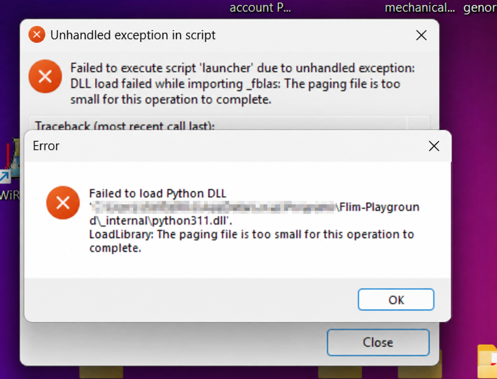

# Common Q & A

**Why is a numerical feature missing from a picker?**

For a user-provided table, reopen its [column review](data_analysis_config.qmd#id-config) and check that the column has the **Numerical** role. Look in `Uncategorized Features` if it has no feature group. A numerical picker needs usable numbers: the app tolerates stray text in up to **1%** of non-empty values, replacing those cells with NaN. Above that threshold the column remains text; clean the values and upload it again. See [feature recognition](data_analysis.qmd#feature-recognition).

**Why is a categorical column missing?**

For a user table, assign **Categorical** in its [profile review](data_analysis_config.qmd#id-config) and save. For an extraction table, check the active [extraction configuration](data_extraction_config.qmd#categorical-features). A filter or visual picker may omit a column with only one remaining value. Other choices can also narrow the options: for example, a column used for `Separate by` cannot also define the color groups, except in Dimension Reduction. See [shared controls](data_analysis.qmd#shared-interactive-widgets).

**Do I need to add an ID column before uploading my table?**

No. Leave **Row ID** unassigned to use generated row numbers. An assigned ID must be nonmissing and unique. Generated numbers follow input row order and are regenerated for each upload; provide your own ID if it must remain stable when rows are reordered. See [identifiers](data_analysis_config.qmd#identifiers-config).

**What should I do if an extraction file could not be saved?**

Correct the folder or permission issue reported by the app, then use **Retry saving metadata** or **Retry exporting features**. A metadata-save failure blocks extraction. Retrying a feature export saves the already calculated table without calculating it again. Both files are saved in the source folder; see [Save Results](numerical_feature_extraction.qmd#save-results).

**Which checkbox setting should I use for Data Analysis?**

Leave **Use a table from another source** off for FLIM Playground extraction output. Turn it on for your own table to review its column roles and groups. The hosted app offers Data Analysis only and defaults this checkbox to on.

**Why do two cells appear as one in the extraction output?**

A [mask](data_extraction_config.qmd#mask) label defines the cell, so all pixels carrying that integer become one cell even when they lie in separate regions. Their pixel decays are summed into one curve, and morphology and texture are measured over the combined region. The app does not check that a label's pixels are connected, because a binary mask, where one label covers several objects, is valid input. Relabel the mask in the segmentation software when separate cells should be measured separately.

**Where are exported files saved?**

 Numerical extraction automatically saves the metadata and single-cell feature CSVs into the source folder; the page reports their paths. Categorical merging writes a timestamped combined CSV to its input folder. Run extraction on a [local installation](index.qmd#installation) so these folders are available. Any download button you click will save the file to your browser's default download location. For example, the [analysis Python export](data_analysis.qmd#export-workflow-as-python-script).

**How do I use a light or dark theme?**

The app follows its Streamlit theme setting, which can follow the system or select Light or Dark. Use the app's **Settings → Theme** when available. The documentation examples use Light.

**On Windows, how do I fix “The paging file is too small” or a Python DLL loading error?**

**Check free disk space first. In the reported case, freeing disk space alone resolved the error; no paging-file settings needed to be changed.**

FLIM Playground may display **“Failed to execute script 'launcher'”** while importing `_fblas`, or **“Failed to load Python DLL”** for `python311.dll`, followed by **“The paging file is too small for this operation to complete.”** The paging file is disk space Windows uses to extend its memory capacity. A nearly full drive can prevent Windows from growing this file when more memory is needed.

{width=593px fig-align=center fig-alt="Two Windows error dialogs report that the paging file is too small while loading _fblas and Flim-Playground's python311.dll. The directory prefix before Flim-Playground is blurred."}

- Free up disk space
- if the error persists after freeing disk space, close other memory-heavy applications and restart Windows. If the error still occurs, check that Windows can manage the paging file: press **Windows + R**, enter `sysdm.cpl`, then go to **Advanced → Performance: Settings → Advanced → Virtual memory: Change**. Enable **Automatically manage paging file size for all drives** if it is disabled, click **OK**, and restart Windows after changing the setting. If it is already enabled, leave it enabled; manual sizing is not required for the disk-space fix described above.