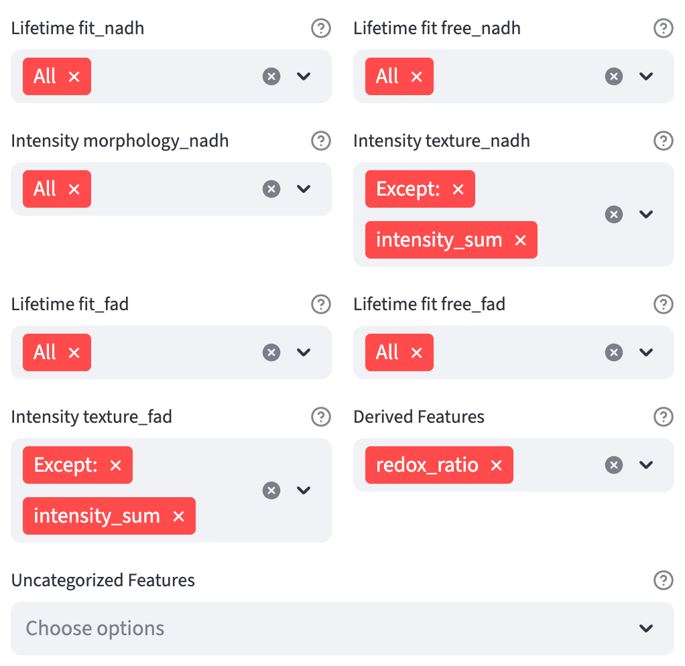
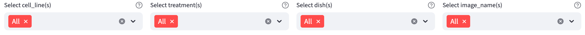
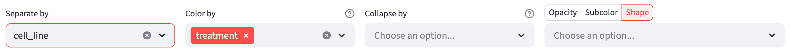
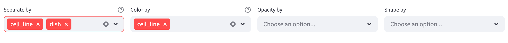
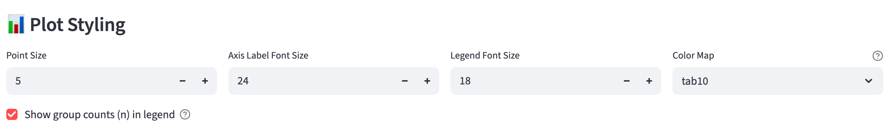

# Overview {#sec-data-analysis}

Data Analysis lets you explore a table of measurements with interactive plots, statistical comparisons, and machine learning. Use a table from [Data Extraction](#sec-data-extraction) or upload your own measurements and [review their column roles](data_analysis_config.qmd).

## General Workflow

1. [Upload your table](#input). For a user-provided table, review and save its column roles and feature groups before analysis.
2. Choose an analysis type and method on the left, then select its [numerical features](#numerical-selection-widgets).
3. Use the [categorical and numerical filters](#filter-widgets) to select the observations to analyze. Later controls operate on this filtered dataset.
4. Choose [groups and visual encodings](#visual-channels-widgets). In Feature Comparison and 2D Feature Distribution, **Collapse by** can replace individual observations with one mean per category within each analysis group.
5. Adjust the method-specific controls, [plot style](#plotting-configuration-widgets), and [hover over points](#unique-id-hover) to inspect observations.
6. [Export the analysis as a Python script](#export-workflow-as-python-script) to reproduce or customize it. GMM analyses also offer labeled CSV downloads.

The plots and results update as you change the controls.

## Methods

| Analysis type | Method | Numerical input |
| --- | --- | --- |
| Univariate | [Feature Comparison](#sec-feature-comparison) | One feature compared across groups |
| Univariate | [Feature Histogram](#sec-feature-histogram) | One feature's histogram or Gaussian mixture model |
| Bivariate | [2D Feature Distribution](#sec-feature-distribution) | Two features on a scatter plot |
| Bivariate | [Phasor Plot](#sec-phasor-analysis) | A matching pair of phasor G and S coordinates |
| Multivariate | [Dimension Reduction](#sec-dimension-reduction) | At least two features projected into two dimensions |
| Multivariate | [Classification](#sec-classification) | One or more features used to predict categorical labels |

**Phasor Plot** is available after upload only when the table contains a complete G/S pair with the [expected phasor column names](phasor_analysis.qmd#select-phasor-coordinate). All methods use the shared controls below, with additional controls described in their chapters.

## Input
Leave **Use a table from another source** off for a table produced by [Data Extraction](#sec-data-extraction). Turn it on for your own table, **upload first**, then review its column roles and feature groups in the [interactive configuration walkthrough](data_analysis_config.qmd). It defaults to off in a local installation and on in the hosted app, which provides Data Analysis only. The uploader accepts CSV, TSV/TXT with tab, semicolon, or pipe separators, Excel `.xlsx`/`.xlsm`, and OpenDocument `.ods`. Spreadsheet uploads use the first sheet.

### Requirements

Use a plain table with column headers on the first row, one observation per row, and at least one usable numerical measurement. For a user-provided table, categorical columns, a unique row identifier, and a field-of-view column are optional. With **Use a table from another source** off, the table must contain the identifier named in its extraction configuration.

### Column roles {#column-roles}

Each column in a user-provided table has one role. The app suggests roles after upload; review them according to what the values mean.

- **Row ID** identifies an individual observation in [hover text](#unique-id-hover), such as a cell or flower. This role is optional and can belong to at most one column. Its values must be nonmissing and unique after conversion to text. Without an assigned Row ID, the app creates row numbers from `1` through the number of input rows. See [automatic row numbering and changing identifiers](data_analysis_config.qmd#identifiers-config).
- **Categorical** supplies labels for [filters](#categorical-filters) and visual grouping, such as species, treatment, day, or patient. Numeric codes can be categorical when they represent labels rather than quantities. For a user table, a field-of-view label also uses this role. Categories are stored as text. If every nonmissing value in a numeric category column is a whole number, labels use `1` rather than `1.0`; missing values become `N/A`.
- **Numerical** supplies measurements for plotting and analysis, such as length, intensity, or lifetime. At least one column with this role must contain usable numbers. Numerical columns can be organized into [feature groups](data_analysis_config.qmd#feature-group-management), each providing a dropdown in the feature pickers.
- **Ignore** excludes a column from analysis while recording its header in the profile, so future uploads can still be matched to the complete table structure.

Use the column's **Role** dropdown to correct a suggestion or change how it is used, then save the profile. For example, assigning Categorical to a numeric treatment code makes it available as a category filter. Changing a Numerical column to another role removes its feature-group assignment. The [column-review walkthrough](data_analysis_config.qmd#id-config) explains these changes and the checks before saving.

::: {.callout-tip #feature-recognition}
If a **numerical feature** is missing from the feature pickers, including `Uncategorized Features`, first check that its Role is Numerical in a user-table review. Then inspect its values for stray text such as `--`. If non-numeric values account for **1% or less** of the column's non-empty values, the app converts the column to numeric, replaces those cells with NaN, and reports their count. Above that threshold, the column remains text and cannot be used as a numerical feature until those values are cleaned, even if most values are numbers.

FLIM Playground searches for **categorical features** in the uploaded dataset based on the [user-specified configuration](#sec-data-analysis-config) if the dataset is not extracted by [Data Extraction](#sec-data-extraction). Otherwise, it searches for categorical features specified in the [Data Extraction configuration](data_extraction_config.qmd#categorical-features). 

:::

### Warning Messages

Warnings report cleanup such as dropping empty columns or converting a small number of stray non-numeric values to NaN (see [feature recognition](#feature-recognition)). Missing measurements can remain in the table. Plot methods use rows with valid values for their [selected numerical features](#numerical-selection-widgets); [Classification](classification.qmd) passes the selected rows to the classifier and reports an error if it cannot accept their missing measurements.

### Error Messages

Errors block saving or analysis until the input or roles are corrected. Examples include a malformed table, an assigned Row ID containing missing or duplicate values, or no usable Numerical column. Duplicate row identifiers are not silently removed. In a user-table review, correct the identifier, choose another column, or leave Row ID unassigned to use generated row numbers. For an extraction table, check the identifier and its extraction configuration.

## Shared Interactive Widgets

Feature selection is on the left; filters, grouping controls, plots, and exports are on the right. Only controls supported by the current method are shown.

### Numerical Selection Widgets 
For extraction tables, numerical features are grouped by [extractor](data_extraction_config.qmd#feature-extractor) and channel. For user-provided tables, the [saved column review](data_analysis_config.qmd#feature-group-management) defines the numerical features and their groups. Ungrouped measurements appear under `Uncategorized Features`. Each group has its own picker.

#### Univariate Analysis
One single-select widget is rendered per group; choosing a feature in any group clears the selections and resets the others to `Select`.

#### Bivariate Analysis
For 2D Feature Distribution, choose an X feature and a different Y feature from the same or different feature groups. Each axis uses the single-feature selection behavior above, and the X feature is excluded from the Y options. Once selected, an axis's pickers collapse into an expander labeled with the full feature name; reopen it to change the selection. [Phasor Plot](phasor_analysis.qmd#select-phasor-coordinate) instead selects a channel and a complete G/S harmonic pair.

#### Multivariate Analysis
One set of selection widgets, each can select multiple features from a feature group, is rendered. A special value `All` is introduced so that users can conveniently select all features under the feature group. If users select `All`, all the other options will be cleared, and vice versa.

`Except:` selects every feature in a group except the ones you name. For example, select `Except:` together with `intensity_sum` to exclude that measurement while keeping the other features. Selecting `All` clears everything else, while selecting a feature clears `All` but keeps `Except:`, so you can add exclusions as you click.

{width=80% fig-align=center fig-alt="Numerical feature groups with multiselect pickers. Intensity texture_nadh and Intensity texture_fad each show Except: and intensity_sum; the other categorized groups show All, and Derived Features contains redox_ratio."}

### Filter Widgets

#### Categorical Filters
{width=100% fig-align=center fig-alt="Categorical filter row with selections for the treatment, cell line, dish, and image categories."}

For complex datasets that are collected over multiple days, experiments, treatments, etc., it is useful to filter the data to focus on a subset of the data (data of interest). One filter widget is rendered for each categorical feature so that users have the flexibility to filter the data based on combinations of categorical features. `All` is a special option that include all categories of the selected categorical feature. Once it is selected, all the other options are cleared, and vice versa.

Use `Except:` when it is easier to name the categories to leave out. For example, select `Except:` and one value in an `image_name` filter to keep every other field of view. The exclusion is evaluated against the current data, so categories added by widening another filter are included unless you excluded them explicitly.

The filters work as a set rather than in sequence: each one offers only the categories that still have data under everything else you have selected. That means you can approach a subset from whichever direction is natural — narrowing `treatment` first and then `day` leaves you the same options as doing it the other way around — and no combination is out of reach because of the order the categorical features happen to be listed in your configuration.

One consequence is worth knowing about. Tightening one filter can deselect a choice you made elsewhere. Say you have fields of view picked out under `image_name` and then narrow `cell_line` to `Panc1`: every MCF7 field of view among them is left with no rows. Rather than hand you an empty plot, FLIM Playground deselects those fields of view and tells you which selection ruled them out.

A filter therefore never quietly stops matching what you asked for. 

#### Numerical Filters

Users can further filter the data based on numerical features. Each row specifies a condition to filter the data: 

- `Feature`: the numerical feature to filter on
- `Operator`: `>` or `<=`
- `Threshold`: the range of values to filter on, dynamically updated based on previous filters, is displayed for reference. The entered value should be within the range.
- `Add another`: show the next condition. Clear it to stop applying later rows; choose `None` in a feature picker to stop at that row.

After the two sets of filters are applied, the final filtered data is used for visualization and analysis.

::: {.callout-important}
Make sure you clearly state all numerical filters used.
:::

### Visual Channels Widgets

Visual encodings map categories to color, opacity, or marker shape, making patterns easier to compare [@cleveland1984]. Grouping controls also determine which observations are compared or modeled together.

| Method | Grouping and layout | Point encoding |
| --- | --- | --- |
| Feature Comparison | `Color by` / `Group by`, `Separate by`, `Collapse by` | Choose one of `Opacity`, `Subcolor`, or `Shape`, then a column |
| Feature Histogram | `Color by`, `Separate by` | — |
| 2D Feature Distribution | `Color by`, `Separate by`, `Collapse by` | Choose `Opacity` or `Shape`, then a column |
| Phasor Plot | `Color by`, `Separate by` | Independent `Opacity by` and `Shape by` pickers |
| Dimension Reduction | `Color by`, up to two columns in `Separate by` | Independent `Opacity by` and `Shape by` pickers |
| Classification | `Classify by` forms the target classes | — |

{width=100% fig-align=center fig-alt="Feature Comparison controls for Separate by, Color by, Collapse by, and the Opacity, Subcolor, or Shape selector with one shared column picker."}

#### Color by

Choose one or more categorical features in `Color by`. Each distinct combination receives a color; combined labels use `::` between categories. In Feature Comparison, these groups also define the x-axis positions. When its [`Subcolor`](feature_comparison.qmd#subcolor-by) mode is selected, `Color by` becomes `Group by`: it still defines the comparisons, while the selected subcolor column supplies point colors.

Leave the grouping picker empty to analyze all filtered observations as one group. In Classification, [`Classify by`](classification.qmd#method-specific-components) defines the labels the classifier learns instead.

::: {#nte-order .callout-note}
# How to order the groups

The order of selected categorical features determines the grouping hierarchy. For example, choose `cell_line` and then `treatment` to keep each cell line's treatments together; reverse the selection order to keep treatments together.

Within each feature, groups use numeric-alphabetical sorting: labels containing a number are ordered by that number, then by their text. Thus `Panc1` precedes `MCF7`, and `Day 30` precedes `Day 100`. Feature Comparison also provides [custom x-axis ordering](feature_comparison.qmd#reorder-x-axis-groups).
:::

#### Opacity and Shape by

`Opacity by` gives ordered categories different transparencies, and `Shape by` gives them different marker shapes. Each uses one categorical column, with categories ordered [numeric-alphabetically](#nte-order). These encodings change the appearance of points while preserving the groups used for modeling.

{width=100% fig-align=center fig-alt="Dimension Reduction encoding row showing two Separate by columns, Color by, Opacity by, and Shape by."}

Feature Comparison shares one column picker between **Opacity**, **Subcolor**, and **Shape**. 2D Feature Distribution shares one between **Opacity** and **Shape**. Select the mode above the picker, then choose a column; switching modes keeps that column when it is available. Clear the column to turn the encoding off. Only the active mode is applied.

#### Separate by

`Separate by` organizes the current data into category views:

- [Feature Comparison](feature_comparison.qmd#separate-by) places categories in sections on one x-axis.
- [Feature Histogram](feature_histogram.qmd#separate-by) stacks one histogram or GMM panel per category.
- [2D Feature Distribution](feature_distribution.qmd#separate-by) and [Dimension Reduction](dimension_reduction.qmd#separate-by) show a full-data overview beside one highlight panel per category.
- [Phasor Plot](phasor_analysis.qmd#separate-by) shows one category at a time with the others in gray for context.

For the first four methods, the separation column cannot also be used for `Color by`. Dimension Reduction permits the same column for both because separation highlights parts of one shared embedding.

#### Collapse by

In [Feature Comparison](feature_comparison.qmd#collapse-by) and [2D Feature Distribution](feature_distribution.qmd#collapse-by), `Collapse by` averages observations that share a value in a selected categorical column, separately within each analysis group. The category determines what each mean represents. For example, choose `dish` to plot one mean per dish within each treatment and cell line, or `patient` to average observations from the same patient within each group.

The resulting category means become the input to the method's summaries, statistics, and models. The method chapters explain which measurements enter each mean and how [SuperPlot](feature_comparison.qmd#superplot) can show the original observations alongside them. Choose the grouping columns first: the same column cannot also be selected for collapse.

### Unique ID Hover

Hover over a point to see its measurement values and identifier. Extraction tables label the identifier `Cell ID` and include the configured field-of-view column when present. User tables show the assigned Row ID column's name, or `ID` when the app generated row numbers. User-table field-of-view columns remain ordinary categories.

With `Collapse by`, the hover identifies the category and the number of observations averaged into that point, such as `dish1 (n=1874)`. SuperPlot's smaller observation points retain their individual identifiers.

### Plotting Configuration Widgets

{width=100% fig-align=center fig-alt="Plot Styling inputs for Point Size, Axis Label Font Size, Legend Font Size, Color Map, and Show group counts in legend."}

Under **Plot Styling**, adjust `Point Size` for point plots, `Axis Label Font Size`, `Legend Font Size`, and `Color Map` when color groups are present. Available palettes include `tab10`, `tab20`, `colorblind`, `Set1`–`Set3`, `Pastel1`, `Pastel2`, `Accent`, `viridis`, `plasma`, `inferno`, `magma`, and `cividis`.

`Show group counts (n) in legend` adds counts where supported. Counts refer to the points used in the analysis: individual observations, or category means when `Collapse by` is active. When `Separate by` is active, Phasor counts only points from the selected separation category, while 2D Feature Distribution keeps one shared legend whose counts come from the full filtered table. Histogram panels report their own group counts; Dimension Reduction's shared legend reports counts for the full embedding.

Classification places its font-size controls between the metric tables and the ROC/confusion-matrix plots.

### Feature Labels

Numerical features extracted by [Data Extraction](#sec-data-extraction) are automatically rendered in proper FLIM notation on plot axes, legends, and hover text. For example, the column `Lifetime fit_nadh: a1` is shown as "nadh $\alpha_1$ (%)", and other extracted features map to symbols such as "$\tau_1$ (ps)", "$\tau_m$", "$\tau_{m,i}$", "$\chi_r^2$", and "$\tau_{\mathrm{mod}}$". The mapping (channel + Greek/scientific symbol + unit) follows the feature naming convention introduced in [Lifetime Features (Fit)](lifetime_fit.qmd). Columns that are not recognized — identifiers, categorical features, or arbitrary user-provided columns — are displayed unchanged. The same labels are used in the [exported script](#export-workflow-as-python-script), so its figures match what you see in the app.

### Export Workflow as Python Script

Click **Export the entire analysis as a Python script** below the results and styling controls. The script records the selected features, filters, grouping, point encodings, plot style, and method settings, including collapse, category separation, GMM export names, and the promoted facet where applicable.

{width=80% fig-align=center fig-alt="Export the entire analysis as a Python script download button."}

Keep the original uploaded table beside the downloaded `.py` file and run the script from that directory, or edit its `DATA_PATH` to point to the table. The dataset is not embedded in the script. The script reproduces the analysis with matplotlib and saves SVG figures that you can edit or use in a publication.

For [1D](feature_histogram.qmd#export-labeled-data) and [2D GMM](feature_distribution.qmd#export-labeled-data) analyses, the app also offers labeled CSV downloads. Those downloads contain the analyzed data, including any collapse or log transformation. In the Python script, set `SAVE_DERIVED_DATA = True` to write the corresponding labeled CSV alongside the figures.
