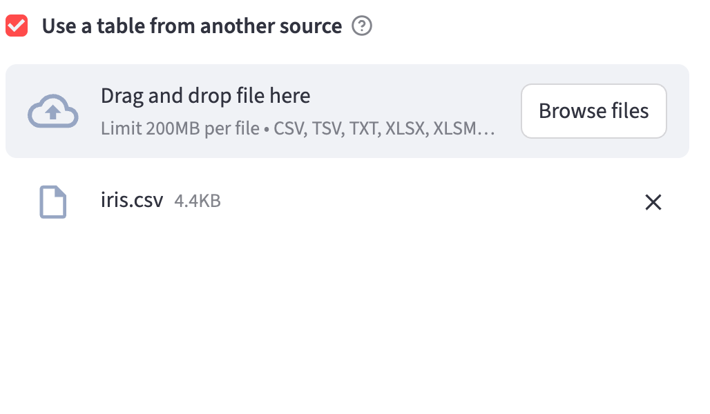
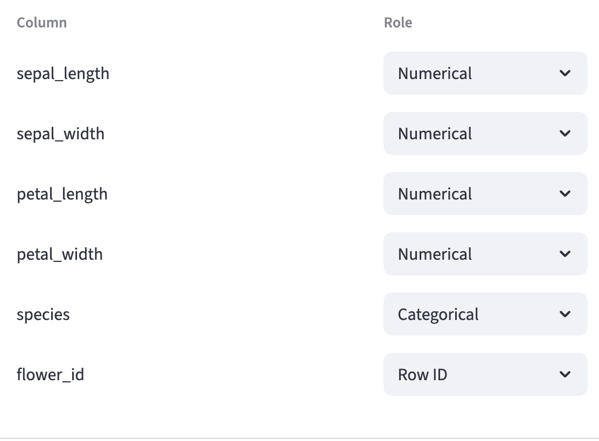
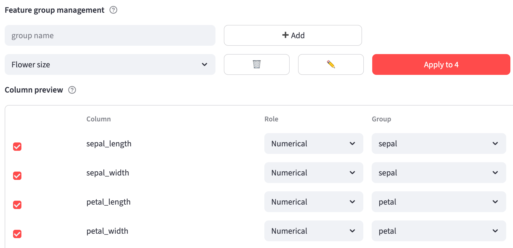
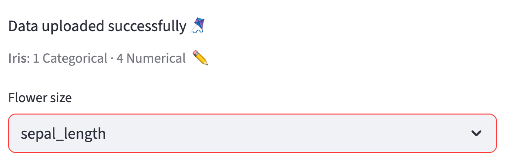
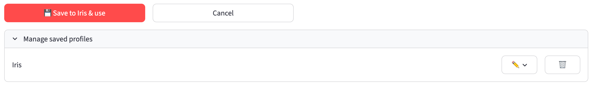

# Configuration {#sec-data-analysis-config}

For a table you prepared yourself, configuration starts after upload on **Data Analysis**. Review how each column will be used, organize measurements into feature groups, and save those choices as an analysis profile. The app can reuse a profile for later tables with matching headers.

This walkthrough uses [iris.csv](analysis_ui_shots/iris.csv), a table of **150 flowers and six columns**. Download it to follow the screenshots. Each step includes a detail view; the web version also links to each full screenshot.

## 1. Upload Iris {.unnumbered}

Turn on **Use a table from another source**, then upload `iris.csv`. This checkbox is on by default in the hosted app.

If **Which profile describes this file?** appears, choose **Auto-detect — start a new profile**. This fills the column review with suggested roles and groups. If a saved profile already matches this table, analysis may open directly; use the summary pencil described in Step 5 to inspect it.

{width=65% fig-align=center fig-pos="H" fig-alt="Use a table from another source is checked above the Upload your table area and Browse files button."}

::: {.content-visible when-format="html"}
[Open the full-resolution upload screenshot](analysis_ui_shots/config_upload_full.png).
:::

For your own data, use a plain grid with column names on the first row and one observation per row. The uploader also accepts TSV/TXT with tab, semicolon, or pipe separators, Excel `.xlsx`/`.xlsm`, and OpenDocument `.ods`. Put a spreadsheet's intended table on its **first sheet**.

## 2. Review column roles {#id-config .unnumbered}

The review reports **6 columns × 150 rows**. Each column has one **Role**: **Row ID** identifies an observation, **Categorical** supplies labels for filtering or grouping observations, **Numerical** supplies measurements, and **Ignore** excludes a column. See [Column roles in the Data Analysis overview](data_analysis.qmd#column-roles) for their uses and requirements.

For Iris, keep the four length and width columns **Numerical**, `species` **Categorical**, and `flower_id` **Row ID**:

{width=70% fig-align=center fig-pos="H" fig-alt="Role dropdowns assign sepal_length, sepal_width, petal_length, and petal_width to Numerical, species to Categorical, and flower_id to Row ID."}

::: {.content-visible when-format="html"}
[Open the full-resolution column-review screenshot](analysis_ui_shots/config_columns_full.png).
:::

**To change a role**, open that column's **Role** dropdown and choose its intended use. For example, change a numeric treatment code from Numerical to Categorical so it appears as a category filter. Check the preview values before deciding: a unique integer measurement can be guessed as Row ID. A change away from Numerical removes the column's feature-group assignment; changing it back enables its **Group** dropdown so you can assign it again. Save the profile to apply role changes to analysis.

::: {#identifiers-config}
A **Row ID is optional**. Auto-detection first tries the leftmost column containing distinct, nonmissing whole numbers or text labels. If no column has the Row ID role, the app automatically adds **Row number** to the analysis table, populated with `1` through `150` for Iris (or `1` through the number of input rows). These labels follow the uploaded row order and identify points in hover text. They are regenerated for each upload, so use your own identifier when identity must remain stable across reordered files. If `Row number` already exists, the generated column uses `Row number.1`, then `.2`, and so on as needed.

To use generated numbers for Iris, change `flower_id` from Row ID to **Ignore**; choose Categorical or Numerical instead if you need that column for another purpose. The review then says **Rows will be identified by row number.** Only one column can be Row ID. Assigning it to another column automatically changes the previous holder to Numerical if it contains numbers, or Categorical otherwise; check that reassignment. Missing or repeated values in an assigned ID block saving, so correct the values, choose another identifier, or remove the role.
:::

::: {#categorical-feature-config}
At least one **Numerical** column must contain usable numbers. Categorical labels are stored as text. If every nonmissing value in a numeric category column is a whole number, labels use `1` rather than `1.0`; missing values become `N/A`.
:::

Profile matching uses **exact headers**. Case, spaces, and punctuation matter; `IL-18` and `IL_18` are different names. Reordering columns does not change the match.

## 3. Feature group management {#feature-group-management .unnumbered}

**Feature group management**, above **Column preview**, organizes Numerical columns into shorter lists. Each group becomes a dropdown in the analysis feature pickers, making related measurements easier to find in a wide table. Groups are optional: unassigned measurements remain available under **Uncategorized Features**. Feature groups organize columns; categorical features such as `species` group or filter observations. Changing a feature group does not change measurement values.

### How group names are inferred {.unnumbered}

For a new profile, the app takes the prefix before the earliest `_`, `.`, or `: ` (a colon followed by a space) in each Numerical column's header. At least two new Numerical columns must share that prefix to create a suggested group:

| Column headers | Suggested group |
|---|---|
| `sepal_length`, `sepal_width` | **sepal** |
| `petal_length`, `petal_width` | **petal** |
| `NADH.mean`, `NADH.std` | **NADH** |
| `Texture: contrast`, `Texture: entropy` | **Texture** |

Hyphens remain part of a name: `anti-PD1_mean` and `anti-PD1_std` form **anti-PD1**. A header without a supported prefix, or a lone prefix in a new profile, stays ungrouped. Saved assignments are preserved when reusing a profile. A new column can follow existing columns with the same prefix into their saved group, including a renamed group; otherwise it can join an existing group whose name matches its prefix.

### Change groups in bulk {.unnumbered}

Keep the suggested **sepal** and **petal** groups, or combine their four measurements into **Flower size** as shown here:

1. In **Feature group management**, type `Flower size` in the **Group name** box and click **➕ Add**. This creates and selects an empty destination group.
2. Tick the checkboxes beside the Numerical columns you want to move. For Iris, click **Select all** to tick all four measurements; this button becomes **Clear** to deselect them.
3. Select **Flower size** in the group dropdown above the table, then click **Apply to 4**. The number on **Apply to N** counts the ticked columns. Their **Group** values change together.

{width=100% fig-align=center fig-pos="H" fig-alt="Feature group management has Flower size selected and Apply to 4 enabled. Checkboxes beside all four Iris measurements are ticked; their current Group values are sepal or petal."}

::: {.content-visible when-format="html"}
[Open the full-resolution grouping screenshot](analysis_ui_shots/config_num_group_full.png).
:::

Only Numerical columns have enabled selection checkboxes and **Group** dropdowns. For a single feature, change its row's Group directly. To remove several assignments together, tick those columns, choose **Uncategorized** as the destination, and click **Apply to N**.

To **rename an entire group**, select it in Feature group management, type the replacement name in **Group name**, and click **✏️**. Every member follows the new name; entering another existing group's name **merges** the groups. To **delete a group**, select it and click **🗑️**; its columns remain available as Uncategorized Features. Save the profile to retain any group changes.

## 4. Save as Iris {.unnumbered}

For a new profile, type `Iris` in the profile-name box beside **💾 Save profile as**, then click the button. Initial review requires a save before analysis can begin. Saving applies the reviewed roles and groups to this upload and stores them for future uploads; editing the review alone does not update a saved profile. An existing profile instead offers **💾 Save to {profile} & use**.

{width=100% fig-align=center fig-pos="H" fig-alt="The Save profile as button is beside a profile-name field containing Iris."}

::: {.content-visible when-format="html"}
[Open the full-resolution save screenshot](analysis_ui_shots/config_save_full.png).
:::

If `Iris` already exists, the first click requests confirmation. **⚠️ Replace profile** overwrites that profile's roles and groups; enter a different name to keep both configurations.

## 5. Reopen from the Iris summary {.unnumbered}

After saving, select **sepal_length** from **Flower size** to begin analysis. If you kept the automatic groups, select it from **sepal** instead.

The applied-profile summary reads **Iris: 1 Categorical · 4 Numerical**. Its counts omit the optional Row ID. Click the small **✏️** beside this summary to review the columns again.

{width=70% fig-align=center fig-pos="H" fig-alt="Iris: 1 Categorical · 4 Numerical appears beside a pencil button. The Flower size feature picker has sepal_length selected."}

::: {.content-visible when-format="html"}
[Open the full-resolution applied-profile screenshot](analysis_ui_shots/config_applied_full.png).
:::

Reopening hides the analysis controls and plots while preserving their settings. **💾 Save to Iris & use** saves your changes and resumes analysis. **Cancel** discards the current column and group edits, reloads the saved decisions, and resumes analysis. Cancel is available when reopening a saved decision.

## 6. Manage saved profiles {.unnumbered}

While review is open, expand **Manage saved profiles** below the save controls. It lists every saved profile. To rename one, click its **✏️**, enter a name in **Rename to**, and click **Rename**. To delete one, click its **🗑️**, then choose **Delete** or **Keep**.

{width=100% fig-align=center fig-pos="H" fig-alt="Reopened review has Save to Iris & use and Cancel buttons. The expanded Manage saved profiles section lists Iris with rename and delete controls."}

::: {.content-visible when-format="html"}
[Open the full-resolution reopened-review screenshot](analysis_ui_shots/config_manage_full.png).
:::

Renames and confirmed deletions take effect immediately; Cancel only discards column and group edits. Deleting the profile supplying this review clears its decisions and returns to the chooser. Deleting the last profile leaves no saved profiles. You can store **20 profiles**; at the limit, replace an existing profile or delete one before saving another.

On later uploads, the app compares the **complete header set**, including columns marked Ignore. One exact match with valid stored roles applies automatically. Otherwise, the chooser offers profiles sharing at least one column and reports **shared**, **missing**, and **new** counts, followed by Auto-detect.

Selecting a partial match keeps saved roles and groups for present columns and guesses new ones. Changing the chooser selection discards your current edits. **Save to {profile} & use** replaces that profile with this file's decisions: new columns are recorded and absent columns are removed. Review the match counts before updating a profile used by other tables.
