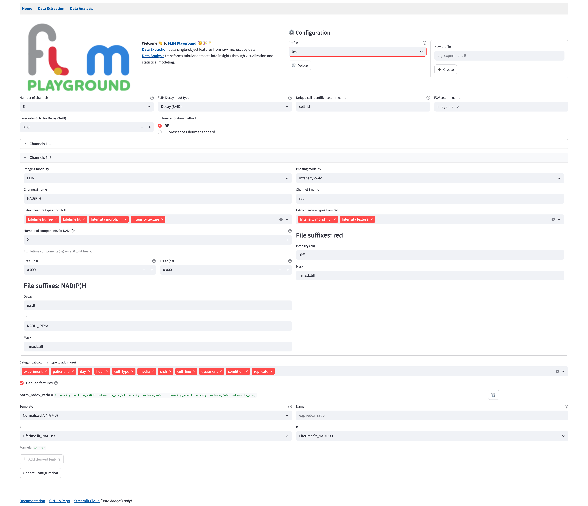
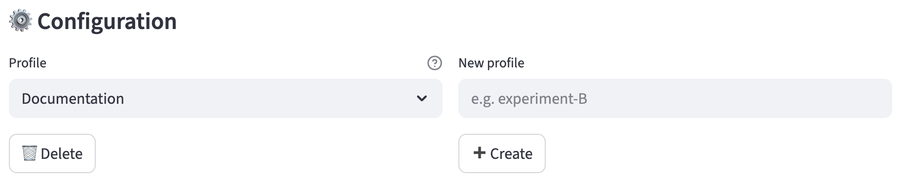
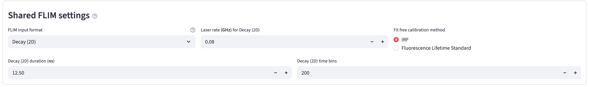
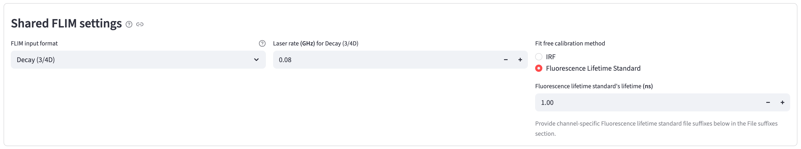
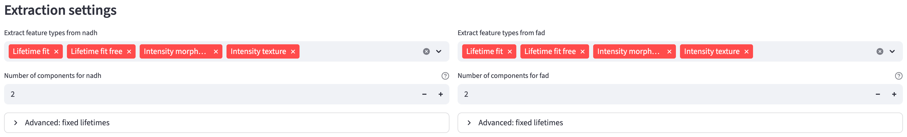
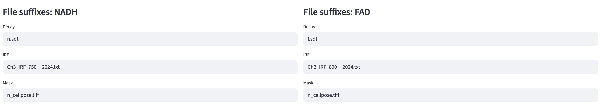

# Configuration {#sec-data-extraction-config}
::: {.callout-note}
Configure FLIM Playground once and it is applied to all future data. You can also keep multiple named **configuration profiles** and switch between them — see [Extraction Profiles](#extraction-profiles).
:::

Constructing a framework that balances flexibility and usability is about choosing the right abstraction level. FLIM Playground chooses acquisition *channel* from [data levels](index.qmd#data-levels) as the focus and adopts the **channel-centric framework**. Settings are divided into two categories: [cross-channel configurations](#cross-channel-configurations) and [per-channel configurations](#per-channel-configurations).

The page begins with the active profile, channel count, and identifier names. `Channels` contains channel names and imaging modalities. `Shared FLIM settings` appears when at least one channel uses FLIM, followed by per-channel `Extraction settings`. Categorical columns and the derived-feature builder are near the bottom.

{width=100% fig-align=center fig-alt="Configuration page showing profile controls, two FLIM channels, identifier names, and shared FLIM settings."}

## Extraction Profiles

Keep up to **10 extraction profiles**, each storing the settings for an experiment or dataset.

On the **Configuration** page:

- Select an existing profile from the `Profile` dropdown to load it.
- Enter a name in `New profile`, then click `➕ Create`.
- Delete the active profile with `🗑️ Delete` (disabled when only one profile remains).

{width=100% fig-align=center fig-alt="Profile dropdown beside a New profile field, Create button, and Delete button."}

A newly created profile starts blank. Fill in the settings described below and click `Update Configuration` to save it. Everything described below pertains to the current profile.

## Cross-Channel Configurations

### Categorical Features

Categorical features organize observations into groups in [Data Analysis](#sec-data-analysis). Use `Categorical columns (type to add more)` to choose names for the [Categorical Feature Extraction](#sec-categorical-feature-extraction) step; type a new name to add it.

### Decay Types 

Choose `FLIM input format` under `Shared FLIM settings`: 2D decay, 3D/4D decay, or 3D/4D pixel pre-fit input.

#### 2D Decay {#two-d-decay}

In the system developed by Samimi et al. [@Samimi2024], single cells flow through and a decay curve is acquired for each cell by aggregating all the photon arrival time delays deemed to be from the same cell. In exchange for spatial distribution, the acquisition speed is increased enormously. The output of the system is a tabular data sheet with each row representing a cell and each column representing a time bin. **FLIM Playground currently supports 2D decay in the CSV format.** 

::: {.callout-note}
A 2D decay CSV must be headerless, with only numeric time bins. Do not include a header, cell-label column, or annotation column. Non-numeric columns are rejected because every column must represent a time bin.
:::

#### 3D/4D Decay {#three-d4d-decay}

In TCSPC-based FLIM, the data is stored in a 3D/4D array and in special format (e.g. `.sdt`, `.ptu`). In addition to the spatial dimensions and the time dimension (`XYT`), the channel dimension may also be present, making it 4-dimensional (`CXYT`). **FLIM Playground currently supports both `.sdt` and `.ptu` files as 3D/4D decay images.** Here, `T` is the photon-arrival time axis within a laser pulse interval.

It reads the `duration` and the number of `time bins` from the decay file's acquisition metadata. For PTU files, the bin count is the laser period divided by the TCSPC resolution, rounded down to a whole number of bins. The duration is **bin count × TCSPC resolution**, expressed in nanoseconds. This preserves the recorded bin width and can make the duration slightly shorter than the nominal laser period. The bin count may not necessary be the last time bin that happened to receive a photon.

Repeated frames in a PTU file are summed into one decay image per FOV, and the [FOV metadata step](fov_metadata.qmd#decay-info-1) warns when frames have been combined. For actual time-lapse acquisitions, split the data into one file per time point before extraction so that the time points remain separate.

#### 3D/4D pixel pre-fit {#three-d4d-pixel-pre-fit}

Since FLIM Playground currently does **not** support pixel-fitting, users have the option to provide pixel pre-fit outputs from [SPCImage](https://www.becker-hickl.com/products/spcimage/) in the format of `.asc`. See [here](lifetime_fit.qmd#pixel-pre-fit) for how FLIM Playground processes SPCImage outputs to obtain cell-level lifetime fitting features. 

### Identifiers

#### Cell Identifier

Users can specify the column name for the unique identifier of the cell to be stored in the output dataset. The cell identifier is constructed as `{FOV Identifier}_{cell_label}`, where the `cell_label` is the unique integer label in the mask or the row number if the decay type is [2D decay](#two-d-decay). 

#### FOV Identifier

Users can specify the column name for the field of view identifier. If the decay type is [2D decay](#two-d-decay), users may want to specify the column name as `exp_name`, because the FOV is not an image.

### Decay Info

#### Laser frequency

Enter the laser frequency in GHz, up to 1 GHz; for example, 0.08 GHz equals 80 MHz. This control appears when at least one FLIM channel selects `Lifetime fit free`, and the value is used for phasor extraction and [analysis](#sec-phasor-analysis).

#### 2D Decay-specific
Since the [2D decay](#two-d-decay) file does not provide the `duration` and the number of `time bins` per laser pulse interval, users need to specify them. 

{width=100% fig-align=center fig-alt="Shared FLIM settings set to Decay (2D), with a 12.5 ns duration, 200 time bins, a 0.08 GHz laser rate, and IRF calibration."}

### Calibration Method

When `Lifetime fit free` is selected, choose between two calibration methods:

- `IRF`: [shift-based calibration](irf_calibration.qmd#irf-shift).
- `Fluorescence Lifetime Standard`: [reference-based calibration](lifetime_fit_free.qmd#fit-free-standard-calibration).

Since the instrumental response function (IRF) or the fluorescence lifetime standard is measured for each channel, they are set in the [per-channel configurations](#per-channel-configurations). The fluorescence lifetime standard's lifetime is channel-agnostic. 

{width=100% fig-align=center fig-alt="Shared FLIM settings with Fluorescence Lifetime Standard selected for calibration and its lifetime set to 1 ns."}

### Number of Channels

Each FOV is assumed to have the same number of channels. The configuration will dynamically adjust the [per-channel configurations](#per-channel-configurations) based on the specified number of channels. Currently, the maximum number of channels is 8. When more than four channels are configured, the first four fold into a collapsed `Channels 1–4` group while the newer channels (5 and up) stay expanded, so the ones you just added remain in view.

## Per-Channel Configurations

### Channel Name

Users can customize the channel name based on, for example, the name of the fluorophore. 

### Imaging Modality

Users can specify the imaging modality for each channel. Currently, two modalities are supported: 

- `FLIM`: The signal is time-resolved, i.e., has a time dimension, and is expected to be from one of the [decay types](data_extraction_config.qmd#decay-types).
- `Intensity-only`: The signal is a spatial map of intensity values (2 spatial dimensions), i.e., has no time dimension. **Currently, the only supported signal type is a 2D intensity image in the format of `.tiff/.tif`.**

::: {.callout-tip}
This setup allows users to image some channels in FLIM mode, and others in non-FLIM mode. It also allows users to extract and analyze their data if they image in non-FLIM microscopic systems such as epifluorescence, confocal, brightfield, etc. by selecting `Intensity-only` for all channels.
:::

::: {.callout-note}
A configuration cannot mix [2D decay](#two-d-decay) FLIM channels with intensity-only channels. Select a 3D/4D format or change the channel modalities.
:::

### Feature Extractor

Four types of feature extractors are available if the [imaging modality](#imaging-modality) is `FLIM`:

- [Lifetime fit](#sec-lifetime-fit)
- [Lifetime fit free](#sec-lifetime-fit-free)
- [Intensity Morphology](#sec-intensity-morphology)
- [Intensity Texture](#sec-intensity-texture)

{width=100% fig-align=center fig-alt="NADH and FAD extraction settings with lifetime fitting, fit-free, morphology, and texture extractors selected, two lifetime components, and fixed-lifetime expanders."}

::: {.callout-note}
If the decay type is [2D decay](#two-d-decay), the [Intensity Morphology](#sec-intensity-morphology) feature extractor is **not** applicable, because there is no ROI mask to measure. The [Intensity Texture](#sec-intensity-texture) extractor *is* available, but a 2D decay CSV has no intensity image, so it produces only the single `intensity_sum` feature (the sum of each cell's decay curve).
:::

The [Intensity Morphology](#sec-intensity-morphology) and [Intensity Texture](#sec-intensity-texture) feature extractors are available if the [imaging modality](#imaging-modality) is `Intensity-only`.

Each channel can be assigned its own set of feature extractors. For example, if users do not intend to do lifetime extraction, they can de-select the `Lifetime fit` and `Lifetime fit free` options. 

### Number of Components

If users select the `Lifetime fit` under this channel, they can specify the number of components to fit. 

### Fixed Lifetimes

When the number of components is greater than one, open `Advanced: fixed lifetimes` to set a known component lifetime in nanoseconds, using controls such as `Fix τ1 (ns)` and `Fix τ2 (ns)`. Set a component to `0` to leave it free for optimization. Positive values become defaults for the [interactive fitting phase](irf_calibration.qmd#fixed-lifetimes).

::: {.callout-note}
Fixed lifetimes apply only to channels that FLIM Playground fits. For [pre-fit](#three-d4d-pixel-pre-fit) inputs (SPCImage `.asc`), whose lifetimes are read rather than fit, the fixed-lifetime controls are not shown.
:::

### File Suffix

The [FOV Metadata Extraction](#sec-fov-metadata) step finds inputs using file suffixes. The selected [decay type](#decay-types), [calibration method](#calibration-method), and [extractors](#feature-extractor) determine the required file types. Enter a filename suffix for each. Additional SPCImage component suffixes are inferred from the `t1` suffix.

{width=100% fig-align=center fig-alt="Separate NADH and FAD decay and IRF suffixes, with the same cell-mask suffix used for both channels."}

The two-channel example uses separate NAD(P)H and FAD decay and IRF suffixes. Both channels use the same mask suffix to measure the same cell ROIs. Choose suffixes that unambiguously identify each input in the folder you will scan.

For detailed information on what file formats are supported for each file type (Mask, IRF, etc.), see [input file types](data_extraction.qmd#input-file-types). 

For detailed information on how the file suffixes are used, and what each file type (e.g. `IRF`, `Mask`, etc.) is, see the [FOV Metadata Extraction](#sec-fov-metadata) page. 

## Derived Features

The Configuration page also hosts the `Derived features` builder, which composes new single-cell features by arithmetic over the features you already extract — optionally combining operands from different channels (for example, an optical redox ratio). Definitions are saved with the [current profile](#extraction-profiles) and computed later, during [Numerical Feature Extraction](#sec-numerical-feature-extraction). See [Derived Features](#sec-derived-feature) for the full walkthrough.

## Save
Finally, users can save the configuration into the **current profile** for future use by clicking the `Update Configuration` button.

If you keep FLIM Playground open in more than one browser tab, saving here does not reach the others on its own. Any tab already showing Data Extraction will notice and post a small notice asking you to reload it, so you can finish what you are in the middle of first and pick up the new settings when it suits you.
