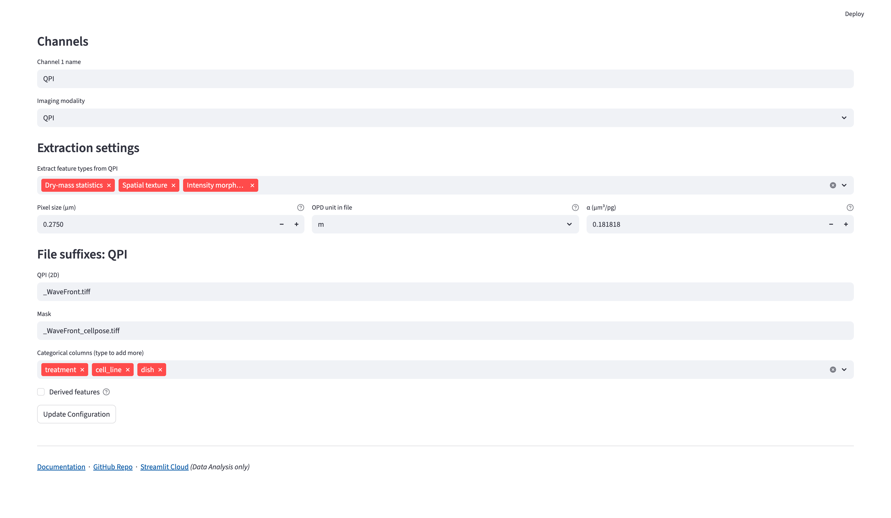

# Configuration {#sec-data-extraction-config}

::: {.callout-note}
Configure FLIM Playground once and it is applied to future data. You can keep up to 10 named **configuration profiles** and switch between them for different experiments.
:::

Configuration has two levels: settings shared by the experiment and settings chosen for each channel. For a mixed-modality experiment, assign a modality to every channel first, then complete the input and extractor settings for each channel.

## Shared settings

### Extraction Profiles

On the **Configuration** page:

- Select an existing profile from the `Profile` dropdown to load it.
- Enter a name in `New profile`, then click `➕ Create`.
- Delete the active profile with `🗑️ Delete` (disabled when only one profile remains).

{width=100% fig-align=center fig-alt="Profile dropdown beside a New profile field, Create button, and Delete button."}

A newly created profile starts blank. Complete the settings below and click `Update Configuration` to save it. Everything described below pertains to the current profile.

### Categorical Features

Categorical features organize observations into groups in [Data Analysis](data_analysis.qmd). Use `Categorical columns (type to add more)` to add categories to be extracted in the [Categorical Feature Extraction](categorical_feature_extraction.qmd) step.

### Number of Channels

Each FOV is expected to have the same number of channels. The configuration creates one set of per-channel controls for each channel, up to a maximum of 8.

{width=100% fig-align=center fig-alt="Configuration page showing profile controls, identifier names, and number of channels."}

### Identifiers

#### Cell Identifier {#cell-identifier}

Choose the output column name for the unique identifier of each cell. For example, if the `cell_id` is chosen the extracted dataset will contain a column named `cell_id` with unique values for each cell.

#### FOV Identifier {#fov-identifier}

Choose the output column name for the field-of-view identifier. Together with the cell identifier, it uniquely identifies each cell.

## Configure each channel

### Channel Name

Customize each channel name, for example with the fluorophore name.

### Imaging Modality {#imaging-modality}

Choose one modality for each channel:

| Modality | Use it for | Input formats |
|---|---|---|
| `FLIM` | Time-resolved signals | [2D decay](#two-d-decay) (`.csv`), [3D/4D decay](#three-d4d-decay) (`.sdt`, `.ptu`), or [3D/4D pixel pre-fit](#three-d4d-pixel-pre-fit) (`.asc`) |
| `Intensity-only` | 2D intensity images without a time axis | `.tiff`, `.tif`, `.asc` |
| `QPI` | 2D optical path difference images | `.tiff`, `.tif`, `.asc` |

#### FLIM input format {#decay-types}

Choose one format for the FLIM channels in this profile. The detailed file description is grouped below so that you can open only the format you use.

::: {.panel-tabset}

##### 2D Decay {#two-d-decay}

A 2D decay CSV contains one cell per row and one time bin per column. It must be headerless and numeric. Do not include identifier or annotation columns. Because each row already represents a cell, no mask is required.

A profile using 2D decay CSVs cannot include QPI or intensity-only image channels. Use an image-based FLIM input format for a mixed-modality workflow.

2D decay settings

Because a 2D decay CSV does not provide acquisition timing, enter its `duration` and number of `time bins` per laser pulse interval.

{width=100% fig-align=center fig-alt="Shared FLIM settings set to Decay (2D), with a 12.5 ns duration, 200 time bins, an 80 MHz laser rate, and IRF calibration."}

##### 3D/4D Decay {#three-d4d-decay}

3D/4D decay stores spatial dimensions and a time dimension; an optional additional dimension represents acquisition channels.

- `.sdt`: Becker & Hickl
- `.ptu`: PicoQuant/Leica

The app reads duration and time-bin information from the acquisition metadata. Repeated PTU frames are summed into one decay image per FOV. For a time-lapse acquisition, split the data into one file per time point before extraction.

##### 3D/4D Pixel Pre-fit {#three-d4d-pixel-pre-fit}

Use pixel pre-fit inputs when lifetime fitting was performed in [SPCImage](https://www.becker-hickl.com/products/spcimage/). FLIM Playground aggregates the pixel features inside each cell mask.

- `.asc`: a 2D spatial array containing one lifetime feature value per pixel, such as `t1`.
- Additional component and fraction files are inferred from the `t1` filename by replacing `t1` with `t2`, `t3`, `a1[%]`, and so on.

The mask is required for cell aggregation. Fixed-lifetime controls are not shown because the lifetimes are read from the pre-fit files.

:::

### Feature Extractor {#feature-extractor}

Choose extractors according to the measurements you need:

| Measurement goal | Extractor | Applies to |
|---|---|---|
| Fit lifetime components and fractions | [Lifetime fit](lifetime_fit.qmd) | FLIM raw decay or pixel pre-fit |
| Phasor coordinates and fit-free lifetimes | [Lifetime fit free](lifetime_fit_free.qmd) | FLIM decay |
| Cell shape measurements | [Intensity Morphology](intensity_morphology.qmd) | Image-based FLIM, intensity-only, or QPI |
| Intensity texture | [Intensity Texture](intensity_texture.qmd) | Image-based FLIM or intensity-only |
| Dry mass and mass-distribution statistics | [Dry-mass statistics](qpi.qmd#dry-mass-statistics) | QPI |
| QPI spatial texture | [Spatial texture](qpi.qmd#spatial-texture) | QPI |

Lifetime fit settings

When `Lifetime fit` is selected, choose the number of lifetime components to fit.

Raw FLIM inputs also require an IRF and a confirmed [IRF shift calibration](irf_calibration.qmd#fit-calibration) before fitting. Pixel pre-fit inputs do not require this fitting-based calibration because their lifetime values are already provided.

Provide one IRF per channel in `.txt`, `.csv`, or `.ptu` format.

When the number of components is greater than one, open `Advanced: fixed lifetimes` to set known component lifetimes in nanoseconds. Set a component to `0` to leave it free for optimization. These values become defaults for the [interactive fitting phase](irf_calibration.qmd#fixed-lifetimes) and are unavailable for pixel pre-fit inputs.

{width=100% fig-align=center fig-alt="NADH and FAD extraction settings with lifetime fitting, fit-free, morphology, and texture extractors selected, two lifetime components, and fixed-lifetime expanders."}

Lifetime fit free settings

When `Lifetime fit free` is selected, set the laser frequency in **MHz** and choose a calibration method:

- `IRF`: use a per-channel IRF and complete [IRF shift calibration](irf_calibration.qmd#fit-free-calibration).
- `Fluorescence Lifetime Standard`: use a per-channel standard file and enter the shared standard lifetime in nanoseconds.

For Fluorescence Lifetime Standard calibration, provide a `.tiff`, `.tif`, or `.ptu` reference file.

See the [fit-free calibration settings](lifetime_fit_free.qmd#calibration-method) for the correction applied by each method.

QPI settings

When `QPI` is selected, set these physical constants for the channel:

- **Pixel size (µm)**: the specimen distance represented by one image pixel after binning. It must be positive; there is no default. The app uses its square as the pixel area.
- **OPD unit in file**: choose `m`, `um`, or `nm`. The file must already contain optical path difference, rather than an unconverted phase angle. This choice is required; there is no default.
- **α (µm³/pg)**: the specific refractive increment used for dry-mass conversion. It defaults to `0.181818` µm³/pg and must be finite and greater than zero.

Selecting `Dry-mass statistics` or `Spatial texture` also requires a confirmed [background correction](qpi.qmd#background-correction). The QPI channel's image and mask suffixes are set in [File Suffix](#file-suffix), and the mask requirements are described in [ROI Mask](#mask).

{width=100% fig-align=center fig-alt="QPI channel configuration showing extractor selection, pixel size, OPD unit, specific refractive increment, and image and mask suffixes."}

### ROI Mask {#mask}

All image-based channels require a cell-level ROI mask: FLIM (3D/4D decay or pixel pre-fit), intensity-only, and QPI. Channels can share a mask or use different masks; when masks differ, the integer label for the same cell must match across them. Each image must match its own mask dimensions.

- `.tiff`/`.tif`: a 2D array with background labeled `0` and each cell ROI labeled with a unique positive integer. The label becomes part of the [cell identifier](#cell-identifier).

Every pixel carrying the same integer forms one cell, even when those pixels are in separate regions. If one label covers two cells, their pixels are treated as one cell for feature extraction; relabel the mask when they should be measured separately.

### File Suffix {#file-suffix}

Source preparation in [Numerical](numerical_feature_extraction.qmd#sec-numerical-feature-extraction) finds files using the configured suffixes. The selected modality, decay type, calibration method, and extractors determine which suffixes are required. Additional SPCImage component suffixes are inferred from the `t1` suffix.

{width=100% fig-align=center fig-alt="Separate NADH and FAD decay and IRF suffixes, with the same cell-mask suffix used for both channels."}

Choose suffixes that identify each input unambiguously in the folder you will scan. A shared mask suffix can be used when channels measure the same cell ROIs. The [FOV Metadata reference](fov_metadata.qmd) explains how suffixes are matched to FOVs and calibration references.

## Derived Features

The `Derived features` builder composes new single-cell features by arithmetic over the features you extract, optionally combining operands from different channels. Definitions are saved with the [current profile](#extraction-profiles) and computed during [Numerical Feature Extraction](numerical_feature_extraction.qmd).

## Save

Click `Update Configuration` to save the current profile. If FLIM Playground is open in more than one browser tab, another tab showing Data Extraction will display a notice asking you to reload before using the new settings.
