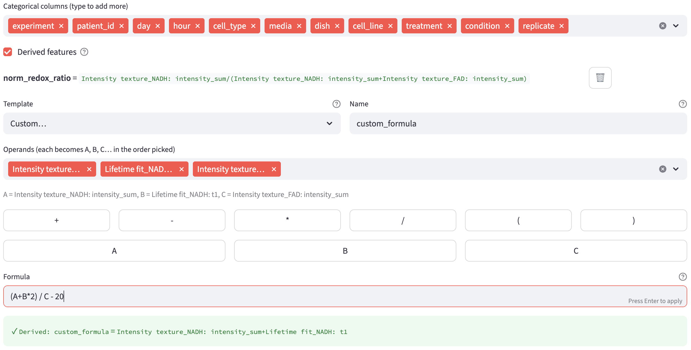
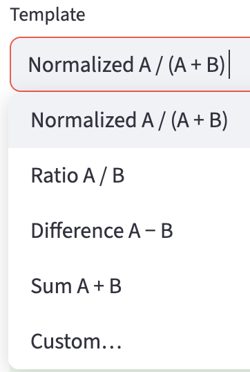
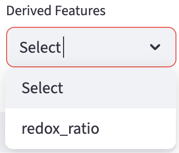

# Derived Features {#sec-derived-feature}

FLIM Playground lets users compose new **derived features** by combining existing features, potentially from *different channels*. An example would be the normalized optical redox ratio, composed from the `intensity_sum` feature from each of the two channels: NAD(P)H / (NAD(P)H + FAD).

## Build Derived Features

The builder is revealed when the `Derived features` checkbox near the bottom of the [Configuration](#sec-data-extraction-config) page is ticked. 

{width=100% fig-align=center}

Any derived features already defined for the current profile are listed at the top, each showing its name, its expanded formula, and a `🗑️` button to delete it. Below the list, a new feature is composed from:

- a `Template` (a common formula, or `Custom…` to write your own),
- a `Name` (`e.g. redox_ratio`) — the output column becomes `Derived: <Name>`, and
- the operands that fill the formula.

::: {.callout-note collapse="true" }
# Not finding the features you expect?
The operands/features available for selection should span all channels. If no channel has a [feature extractor](data_extraction_config.qmd#feature-extractor) selected yet, the builder shows "Select feature extractors for your channels first — there are no features to derive from yet." — configure the extractors first, then come back.

Operands come only from the categorized numerical features. Raw bookkeeping columns — such as `amp1`, `offset`, `reduced_chi_square`, the centroid coordinates, and the `a2` / `a3` fit remainders — are intentionally excluded from the operand list and cannot be used as derived-feature inputs.
:::

Derived features are stored **per profile**, so each [extraction profile](data_extraction_config.qmd#extraction-profiles) keeps its own set.

### Templates

Choosing a `Template` other than `Custom…` fills in the formula for you and renders one searchable dropdown per operand slot (`A`, `B`, …). Four ready-made templates are provided:

{width=30% fig-align=center}

Each takes two operands: pick a feature for `A` and a feature for `B`, give the result a `Name`, and the live preview confirms it. The fifth option, `Custom…`, unlocks the free formula editor described next.

### Custom Formulas

`Custom…` mode lets you compose an arbitrary formula. First pick the operands from the `Operands (each becomes A, B, C… in the order picked)` multiselect — the features you choose are aliased `A`, `B`, `C`, … in pick order, and a caption echoes the mapping (e.g. `A = Intensity texture_fad: intensity_sum,  B = …`). Then build the formula in the `Formula` box, typing directly or using the append buttons for the operators (`+ - * / ( )`) and for each alias.

The formula language supports:

- the four arithmetic operators `+`, `-`, `*`, `/`,
- a leading sign (unary `+` / `-`),
- numeric constants, and
- parentheses for grouping.

Division by zero yields `NaN` rather than raising an error or producing infinity. Anything outside this language — function calls, exponentiation (`**`), modulo (`%`), comparisons, or a bare operand with no operator — is rejected.

## Compute Derived Features

Derived features are computed during [Numerical Feature Extraction](#sec-numerical-feature-extraction), right after each field of view's base features are extracted and concatenated. The definitions are baked into the FOV metadata, so re-running extraction from a saved metadata file reproduces the same derived columns. Each definition adds one `Derived: <name>` column to the output dataset.

If any cell ends up with a `NaN` in a derived column (for instance from a divide-by-zero or a `NaN` operand), a single dataset-wide warning is shown for that feature — "Derived feature **name** has **N** NaN value(s) out of _M_ cell(s) (e.g. from divide-by-zero or a NaN operand)." As with other features, cells with `NaN` are **not** dropped from the output.

## Derived Feature In Data Analysis

On the [Data Analysis](#sec-data-analysis) page, all derived features are collected into one `Derived Features` group in the [numerical selection widgets](data_analysis.qmd#numerical-selection-widgets), alongside the per channel-extractor groups. A derived feature is labeled by its plain name (e.g. `redox_ratio`); unlike extracted lifetime or intensity features, it carries no unit or symbol, since its meaning is entirely user-defined.

{width=30% fig-align=center}

