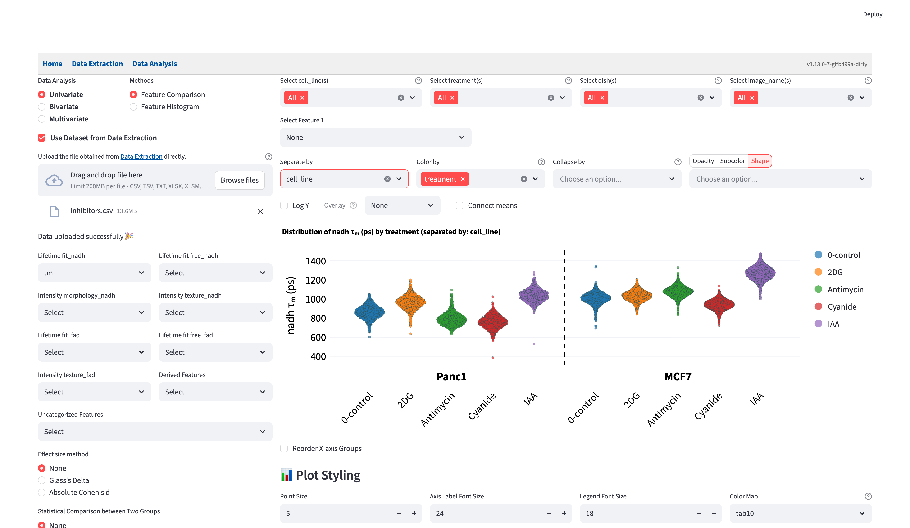
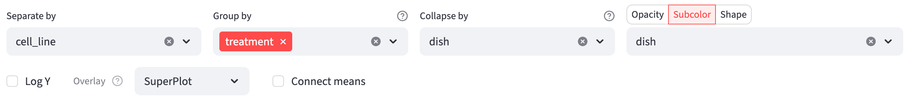
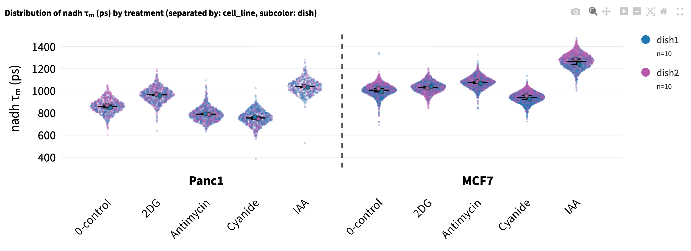
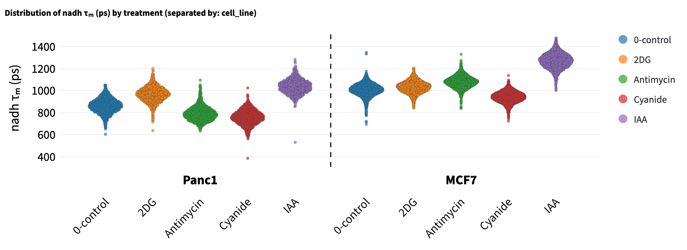
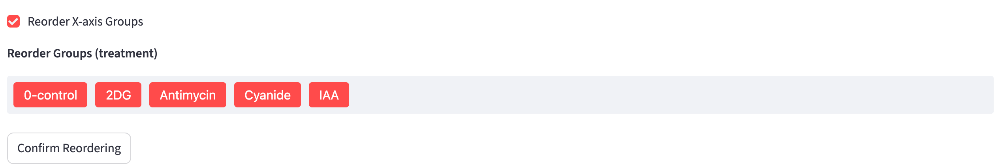

# Feature Comparison {#sec-feature-comparison}
This method allows users to compare the distributions of a single numerical feature across groups. It can help users spot overarching trends between distributions, identify within-distribution shape-related characteristics such as skewness or bimodality that might signal sub-populations, and diagnose potential outliers. 

{width=100% fig-align=center fig-alt="Feature Comparison page with numerical feature selection on the left and categorical filters, grouping controls, and treatment distributions separated by cell line on the right."}

:::{.callout-note}
To keep the point-based visualization style that supports [interactive hover](data_analysis.qmd#unique-id-hover) while showing the violin-plot-like distribution, [Sina plot](https://en.wikipedia.org/wiki/Sina_plot) is used: it uses `gaussian_kde` from `scipy.stats` to make sure the width of the point distribution is proportional to the kernel density.

The spread is computed per group on the x-axis, so [`Shape by`, `Opacity by`](data_analysis.qmd#opacity-and-shape-by) and [`Subcolor by`](#subcolor-by) change how a point looks, not where it sits.
:::

## Shared Interface Components 

- On the left, users can use the [selection widgets](data_analysis.qmd#univariate-analysis) to select the numerical feature to be compared. Exactly one feature can be selected from all feature groups. 
- On the top right, users can use the [filters](data_analysis.qmd#filter-widgets) to subset the data to find the groups of interest. 
- Below the filters, choose [`Separate by`](#separate-by), `Color by` (or `Group by` in Subcolor mode), and [`Collapse by`](#collapse-by). The **Opacity | Subcolor | Shape** selector shares one column picker: choose a mode, then its categorical column. Only that point encoding is applied.
- On the bottom right, users can change the plot style using the [plot styling widgets](data_analysis.qmd#plotting-configuration-widgets). 

## Plot Options

Above the plot, use **Log Y**, **Overlay**, and **Connect means** to control the display:

- **Log Y**: transforms the selected feature with $\log_{10}(x + 10^{-6})$ before plotting and calculating summaries and comparisons. The small offset allows zero values; the axis label becomes $\log_{10}(\ldots)$. If negative values are present, the app reports an error and keeps the original scale. With `Collapse by`, it averages first and then transforms the category means.
- **Overlay → Boxplot**: overlays a box-and-whisker summary on each group. The box spans the interquartile range ($Q_1$–$Q_3$) with the median as a solid line and the mean as a dashed line; the whiskers follow the [Tukey](https://en.wikipedia.org/wiki/Box_plot) definition at $Q_1 - 1.5 \times \text{IQR}$ and $Q_3 + 1.5 \times \text{IQR}$, bounded by the data range. Choose `None` to show the points without an overlay. Selecting `Collapse by` also makes [`SuperPlot`](#superplot) available.
- **Connect means**: draws a line connecting the mean of each group (within each section when [`Separate by`](#separate-by) is used), which can help reveal trends across ordered groups.

## Collapse by

Choose a categorical column in **Collapse by**, such as `dish`, `patient`, or `image_name`, to replace individual observations with one mean per category within each displayed group. The app first applies the filters and removes rows missing the selected measurement. It then averages the measurement separately for every combination of the selected collapse category, `Color by` / `Group by`, and `Separate by`. A dish represented in two treatments therefore contributes one point to each treatment.

The boxplot, connected means, effect sizes, and statistical tests now use these category means. Each point has equal weight in its displayed group's mean, regardless of how many observations were averaged into it. Selecting a collapse column keeps the existing x-axis groups and sections. A column already used for either grouping control is unavailable in `Collapse by`.

Collapse changes the analysis unit, but the supported t-tests still assume independent samples. The app does not pair observations across groups, even when the same dish or patient appears in several groups.

Hover over a category mean to see its label and contributing observation count, such as `dish1 (n=1874)`. **Show group counts (n) in legend** counts category means after collapse. If a point-encoding column varies within any group being averaged, the app turns that encoding off and explains why; using the collapse column itself for Subcolor, Opacity, or Shape keeps it available.

### SuperPlot

After selecting `Collapse by`, choose **Overlay → SuperPlot** to show the original observations as smaller, fainter points behind the category means. The larger points remain the category means, and each displayed group receives a mean bar with ± one standard error of the mean (SEM), calculated across those category means. A group with only one category mean still has a mean bar, but its SEM is undefined.

{width=100% fig-align=center fig-alt="SuperPlot controls with dish selected for Collapse by and Subcolor, treatment for Group by, cell_line for Separate by, and SuperPlot for Overlay."}

The original observations provide context while all comparisons continue to use category means. Hovering over a small point shows its individual identifier; hovering over a large point shows the category and its observation count. Legend counts still count category means. With **Log Y**, the small points are transformed individually and the larger points are transformed after averaging, so a large point need not equal the mean of the small points on the transformed scale.

{width=100% fig-align=center fig-alt="Treatment groups separated by cell line, with faint individual cell points, larger dish means, mean and SEM bars, and dish counts in the legend."}

## Separate by

`Separate by` takes effect before [`Color by`](data_analysis.qmd#color-by). `Separate by` divides the plot into sections separated by a dashed line, with each section labeled by one of the available categories of the selected categorical feature after [filtering](data_analysis.qmd#filter-widgets). The selected feature of `Separate by` is automatically removed from available features in `Color by`. The section order is determined by the order of the categories which are sorted [numeric-alphabetically](data_analysis.qmd#nte-order). 

Point encodings and comparisons are then applied within each section. For example, select `cell_line` in `Separate by` and `treatment` in `Color by` to compare treatments separately for each cell line. Treatment colors stay consistent across sections. [Effect sizes](#effect-size) are calculated within each section, with annotations limited by the selected pairs and [effect size threshold](#effect-size-threshold).

{width=100% fig-align=center fig-alt="Feature Comparison plot with separate cell-line sections divided by a dashed line and treatment groups within each section."}

If `Separate by` is left blank and both `cell_line` and `treatment` are selected in `Color by`, then colors are assigned to each cell line and treatment combination, and effect sizes are calculated across all combinations of group pairs (again, only pairs at or above the [effect size threshold](#effect-size-threshold) are shown).

## Subcolor by

`Color by` gives one color per x-axis group, which leaves no way to ask where the points *within* a group came from. If each treatment pools three donors, a shift between treatments may be a real effect, or it may be one donor sitting away from the other two. `Subcolor by` answers that.

Select **Subcolor** in the **Opacity | Subcolor | Shape** selector, then choose a categorical column in the picker below it. `Color by` is relabeled `Group by`: it continues to define the x-axis groups, while the subcolor column supplies point colors. Switching to Opacity or Shape keeps the selected column when it remains available, but applies only the new encoding. Clear the column to turn the encoding off.

Only the paint changes: x positions, tick labels, the [boxplot and mean connector](#plot-options), [effect sizes](#effect-size), [statistical tests](#statistical-test), and [comparison pairs](#comparison-widget) all stay on the `Group by` groups. The color map is **global**, one color per value across the whole figure, so a donor appearing under three treatments is the same color in all three, gets a single legend entry, and toggles everywhere at once. With the [group count toggle](data_analysis.qmd#plotting-configuration-widgets) on, its `n` is likewise the figure-wide count.

The picker offers categorical features with more than one category after [filtering](data_analysis.qmd#filter-widgets), except the [`Separate by`](#separate-by) feature, and is disabled while `Group by` is empty. A grouping column can also supply the point encoding. To give each collapsed category a consistent color across treatments, choose the same categorical column in `Collapse by` and Subcolor. Missing values form an `N/A` level with a color of its own rather than being dropped.

::: {.callout-note}
# How the subcolors are chosen
Subcolors are generated rather than sliced out of the [colormap](data_analysis.qmd#plotting-configuration-widgets): cyclic palettes put their first and last entries at neighboring hues, and qualitative ones such as `tab10` repeat once you ask for more colors than they hold. The colormap's first color seeds a palette of exactly the size needed, built in [OKLCH](https://en.wikipedia.org/wiki/Oklab_color_space) so the members read as a family — hue confined to an arc around the seed, lightness stepping outward for separation. Candidates are scored composited over the background at the opacity points are drawn with, since two semi-transparent colors that differ in RGB can look the same on screen. The result is deterministic, so the [exported script](data_analysis.qmd#export-workflow-as-python-script) matches the app.
:::

::: {.callout-important}
`Subcolor by` is for a **small** nested feature, roughly 2–5 values. Past about 7, no palette lets a reader assign a point to a value; use [`Separate by`](#separate-by) or a [filter](data_analysis.qmd#filter-widgets) instead.
:::

## Reorder X-axis Groups

Groups are ordered [numeric-alphabetically](data_analysis.qmd#nte-order) by default, which puts the control wherever its name happens to sort. The `Reorder X-axis Groups` checkbox below the plot opens a drag-and-drop list; rearrange it and press `Confirm Reordering`.

{width=100% fig-align=center fig-alt="Reorder X-axis Groups control expanded to show draggable treatment labels and the Confirm Reordering button."}

The order is applied **before** [comparison pairs](#comparison-widget) are formed, and each pair runs left to right, so the leftmost member is the one [Glass's Delta](#glasss-delta) treats as the control. Reordering is how you tell FLIM Playground which group that is.

- It reorders the `Color by` / `Group by` groups only. [`Separate by`](#separate-by) sections keep their default order, and one group order is shared by every section.
- It is stored per (numerical feature, `Color by`, `Separate by`) combination. Groups you did not move keep their relative order, and groups that turn up later are appended rather than resetting your arrangement.
- It is carried into the [exported script](data_analysis.qmd#export-workflow-as-python-script) as `CUSTOM_ORDER`.

## Comparison Widget

Statistical tests and effect size calculations are performed on the selected comparison pairs. FLIM Playground uses the groups on the x-axis populated by [Color by](data_analysis.qmd#color-by) — labeled `Group by` when [`Subcolor by`](#subcolor-by) is on — to create comparison groups, starting from the leftmost group. Pairs are formed after any [custom x-axis order](#reorder-x-axis-groups) is applied. For example, if there are 5 groups, then $\binom{5}{2} = 10$ comparisons will be created. The number of groups can get combinatorially large and many of the comparisons are not meaningful. Therefore, two widgets are provided to filter the comparison groups:

- A selection widget that shows all possible comparisons by default and users can deselect groups they do not need.

- A threshold widget that filters out comparisons whose effect size falls below the threshold.

### Effect Size Threshold {#effect-size-threshold}

The threshold widget is rendered per effect size method, and the two do not share a default:

| Effect size method | Default | Step | Range |
|--------------------|---------|------|-------|
| Glass's Delta      | 0.7     | 0.05 | 0–3   |
| Absolute Cohen's d | 0.5     | 0.1  | 0–3   |

A pair is kept when the **absolute** effect size is greater than or equal to the threshold, so a large negative [Glass's Delta](#glasss-delta) is not dropped for being negative; 0 keeps every selected pair. Each threshold is remembered per numerical feature. Under [`Separate by`](#separate-by), one threshold and one pair selection govern every section.

## Effect Size 
Complementary to statistical tests, which address “is there a difference?”, effect size metrics answer “how large is the difference?”, enabling cross-study comparison. FLIM Playground offers two effect size calculation methods, Glass's Delta and Absolute Cohen's d, each can be in mean or median form. 

### Glass's Delta

Mean ($\bar{X}$) form:
$$
\Delta_G
  = \frac{\bar{X}_{\text{treatment}} - \bar{X}_{\text{control}}}
         {s_{\text{control}}},\qquad
s_{\text{control}}
  = \sqrt{\frac{1}{\,n_c-1\,}\sum_{i=1}^{n_c}
           \bigl(X_{control_i}-\bar{X}_{\text{control}}\bigr)^{2}}
$$

Median ($\tilde{X}$) form:
$$
\widetilde{\Delta}_G
  = \frac{\tilde{X}_{\text{treatment}} - \tilde{X}_{\text{control}}}
         {\operatorname{MAD}_{\text{control}}},\qquad
\operatorname{MAD}_{\text{control}}
  = 1.4826 \times
    \operatorname{median}\,\bigl\lvert
      X_{control_i}-\tilde{X}_{\text{control}}
    \bigr\rvert, \qquad i = 1, \ldots, n_c
$$

:::{.callout-note}
$\operatorname{MAD}$ stands for [median absolute deviation](https://en.wikipedia.org/wiki/Median_absolute_deviation). In order to make $\operatorname{MAD}$ asymptotically consistent with the standard deviation under normality, it is scaled by $C = 1 / \Phi^{-1}(0.75) \approx 1.4826$. Implementation-wise, it uses `median_abs_deviation` from `scipy.stats`, and `scale` option is set to `"normal"` to account for the constant multiplier $C$. THE MEDIAN FORM of both Glass's Delta and Absolute Cohen's d IS NOT REPORTED IN THE LITERATURE. 
:::

::: {.callout-important}
Which group is treatment and which is control matters! From the formula of $\Delta_G$, switching the order not only flips the sign of the result, but also changes the denominator, which is ${s_{\text{control}}}$, the standard deviation of the *control*. FLIM Playground treats the group on the left as control and the group on the right as treatment. Use the [custom x-axis order](#reorder-x-axis-groups) to place the control on the left. [Absolute Cohen's d](#absolute-cohens-d) does not assume a treatment-control structure.
:::

### Absolute Cohen's d
Mean ($\bar{X}$) form:

$$
|d|
  = \left\lvert\frac{\bar{X}_{1}-\bar{X}_{2}}
         {s_p}\right\rvert,\qquad
s_p
  = \sqrt{\frac{(n_1-1)s_1^{2} + (n_2-1)s_2^{2}}
                 {n_1 + n_2 - 2}}
$$

Median ($\tilde{X}$) form:

$$
|\tilde{d}|
  = \left\lvert\frac{\tilde{X}_{1}-\tilde{X}_{2}}
         {s_{\tilde{p}}}\right\rvert,\qquad
s_{\tilde{p}}
  = \sqrt{\frac{(n_1-1)\operatorname{MAD}_{1}^{2}
             + (n_2-1)\operatorname{MAD}_{2}^{2}}
                 {n_1 + n_2 - 2}}
$$

## Statistical Test

Statistical tests are performed on the selected comparison pairs that meet the effect size threshold (if users choose to calculate effect sizes). The statistical tests supported are:

- Independent t-test (student's t-test, for equal variances) 
- Welch's t-test (for unequal variances)

FLIM Playground uses `scipy.stats.ttest_ind` to perform the independent t-test and `scipy.stats.ttest_ind` with `equal_var=False` to perform the Welch's t-test.

With [`Collapse by`](#collapse-by), sample sizes count the category means in each comparison group. The app reports when a selected comparison has too few points for a statistic; adding observations to an existing category can change its mean but does not add another point.

P-values are summarized with significance asterisks: if $p \leq 0.0001$, four asterisks (`****`) are shown; otherwise if $p \leq 0.001$, three (`***`); otherwise if $p \leq 0.01$, two (`**`); otherwise if $p \leq 0.05$, one (`*`). Values with $p > 0.05$ are not given a significance asterisk marker in this convention.

## Comparison Annotation

Eligible comparisons are annotated with brackets above the points and existing annotations. The annotation combines the numeric effect size with significance asterisks when both are available; it does not display a numeric p-value. For example:

- `1.23**` shows an effect size of 1.23 with $p \leq 0.01$.
- `**` shows significance when only a statistical test is selected.
- `Δ=1.23` shows an effect size without significance asterisks, including when the selected test has $p > 0.05$.
