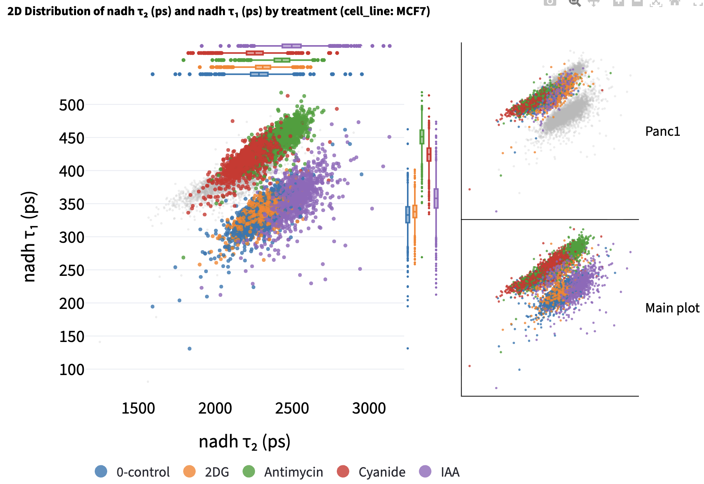
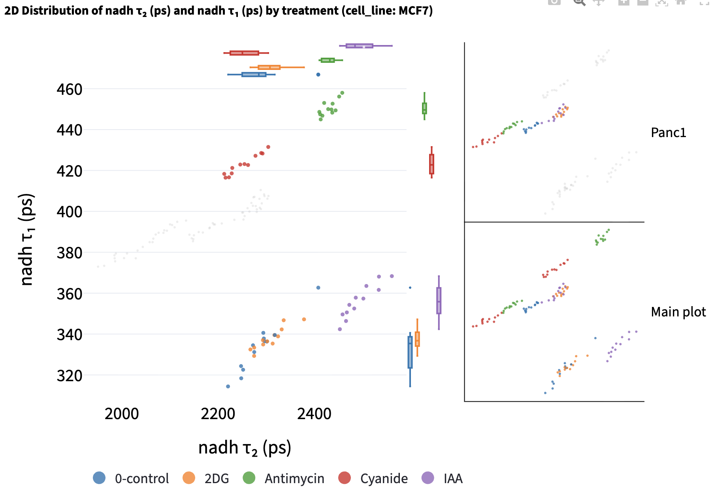
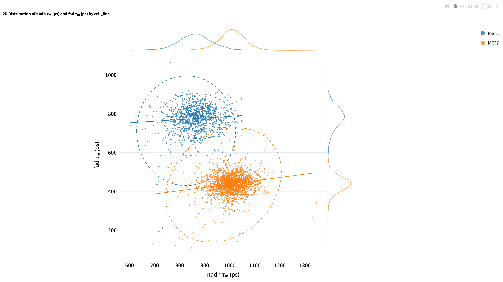
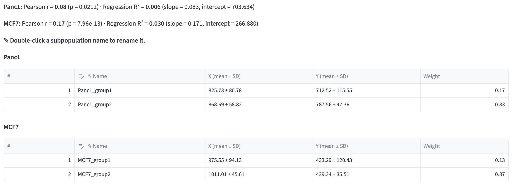

# 2D Feature Distribution {#sec-feature-distribution}

This method visualizes the distribution of two numerical features on a scatter plot. It helps reveal patterns such as correlations, clusters, trends, or outliers.

## Shared Interface Components

- On the left, users can use the [selection widgets](data_analysis.qmd#bivariate-analysis) to select the two numerical features on the x-axis and y-axis. 
- On the top right, users can use the [filters](data_analysis.qmd#filter-widgets) to subset the data to find the groups of interest. 
- Below the filters, choose `Color by`, [`Separate by`](#separate-by), and [`Collapse by`](#collapse-by). The **Opacity | Shape** selector shares one categorical column picker; only the selected encoding is applied. These point encodings preserve the groups used for marginal distributions, correlation, regression, and GMM fitting.
- On the bottom right, users can change the plot style using the [plot styling widgets](data_analysis.qmd#plotting-configuration-widgets). 

## Log-scale Axes

**Log X** and **Log Y** transform the selected feature with $\log_{10}(x + 10^{-6})$ and relabel its axis $\log_{10}(\ldots)$. The small offset allows zero values. The transformation happens before marginal distributions, Pearson correlation, regression, and 2D GMM fitting, so all of them use the transformed values. If a selected feature contains negative values, the app reports an error and keeps that feature on its original scale. With [`Collapse by`](#collapse-by), it averages first and then transforms the category means.

## Separate by

Choose one categorical column in **Separate by** to show a full-data overview beside one small panel for each category. The overview contains all observations; each panel highlights its category and keeps the other observations as faint gray context. All panels share axis ranges, colors, shapes, and opacities. The separation column cannot also be used for `Color by` or `Collapse by`.

Click a category panel to promote it into the main plot. The promoted panel gets the marginal distributions, if enabled, and the previous overview moves into that panel's slot and is marked **Main plot**. Click the promoted main plot to restore the overview. This only swaps the rendered traces; it does not refit the data or alter the shared ranges.

For the [inhibitor dataset](https://github.com/skalalab/flim_playground/blob/main/example_data/Data_Analysis/inhibitors.csv), select **tm** under **Lifetime fit_nadh** for X and **tm** under **Lifetime fit_fad** for Y. Set **Separate by → cell_line** and **Color by → treatment**, keep the categorical filters at **All**, and leave **Collapse by** blank. The overview shows both cell lines, and the Panc1 and MCF7 panels each highlight one cell line with the other in gray. Click either panel to promote it for detailed inspection.

{width=100% fig-align=center fig-alt="2D Feature Distribution with a promoted cell-line category in the large plot, marginal boxplots, treatment colors, a gray context cloud, and a smaller panel labeled Main plot."}

Marginal distributions, Pearson correlation, regression, and GMM fits are calculated independently within every separation category and color group. The statistics and component tables below the chart list every category, and each GMM table title combines its separation category and color group. With **Show group counts (n) in legend**, the shared legend counts the full filtered table; the per-category models and summaries use only their own points, or their aggregated points after collapse.

## Collapse by

Choose a categorical column such as `dish`, `patient`, or `image_name` in **Collapse by** to plot one mean X/Y point per value of that column within each separation category and color group. The app removes rows missing either selected feature before averaging, so each point's X and Y means use the same observations. Hover text includes the collapse category's label and contributing observation count.

Marginal distributions, Pearson correlation, regression, and GMM fitting then use these category means with equal weight. A column is unavailable for collapse if it already defines `Color by` or `Separate by`. Other categorical columns remain available for point encoding only when their values are constant within every collapsed group; the app explains when it must disable a varying encoding.

{width=100% fig-align=center fig-alt="2D Feature Distribution with Collapse by dish, marginal boxplots, treatment colors, and a gray context cloud."}

A labeled GMM download after collapse contains one row per averaged group, with averaged numerical columns. It retains categorical metadata only when constant within every collapsed group. Clear `Collapse by` to return to individual observations.

## Marginal Distribution

Marginal distributions (the distribution of a single feature) are plotted at the top and the right of the main scatter plot. Users can choose the plot type from the dropdown menu. The default is `None`, which leaves the scatter plot at full size.

- `None`: hides both marginal plots.

- `gaussian fit`: provides a kernel-density estimate using Gaussian kernels. It uses `gaussian_kde` from `scipy.stats` and sets all parameters to default values.
- `boxplot`: summarizes each color group with a box and whiskers, which makes the median and spread easier to compare across groups than overlapping density curves.
- `violin`: shows the full distribution shape for each color group, combining the density information of the Gaussian fit with the per-group separation of the boxplot.

## 2D Gaussian Mixture Model

Select **2D Gaussian Mixture Model** above the plot to fit a GMM to each color group, separately within every category when `Separate by` is active. As in the [1D GMM](feature_histogram.qmd#fit-gaussian-mixture-models), **Max Components** and **Min Weight Threshold** control candidate fits; the valid model with the lowest BIC is chosen.

Ellipses that capture approximately 95% of the points in each subcomponent are drawn. The color of the ellipses is determined by the color group that the subcomponent belongs to. 

::: {.callout-note collapse="true"}
# How ellipses are drawn

Each ellipse represents a subcomponent of the GMM. 

- Center of the ellipse is the mean of the subcomponent ($\mu_x, \mu_y$).

- The ellipse is rotated by $\theta = \arctan2\!\left(v_{1y}, v_{1x} \right)$, where $\mathbf{v}_1 = \begin{bmatrix} v_{1x} \\ v_{1y} \end{bmatrix}$ is the first eigenvector of the covariance matrix, so that the major axis of the ellipse is aligned with the eigenvector corresponding to the largest eigenvalue. 

- The semi-axis lengths are $r\sqrt{\lambda_1}$ and $r\sqrt{\lambda_2}$, where $\lambda_1$ and $\lambda_2$ are the covariance eigenvalues (variances along the principal axes) scaled by $r = \sqrt{\chi^2_{\,\mathrm{df}=2,\,p=0.95}}$ (Mahalanobis distance) that captures approximately 95% of the points in the subcomponent. 
:::

The plot shows ellipses for each fitted component in every separation category and color group. Each category's ellipses and regression line are drawn in its own panel, while the shared overview shows the points and legend. Click a category panel to promote its fits into the main plot.

{width=100% fig-align=center fig-alt="Two-feature scatter plot colored by cell line with density curves along the top and right margins, component ellipses, and fitted regression lines."}

::: {.callout-tip}
Click a legend group to hide or show its points and associated curves. This can make overlapping groups easier to inspect.

Use the chart's **Fullscreen** control to inspect a tall plot with both marginal distributions visible.
:::

Tables below the plot report each component's **X (mean ± SD)**, **Y (mean ± SD)**, and **Weight**. These describe the fitted Gaussian components using soft membership probabilities. They can differ from the mean, SD, and fraction of observations assigned to each component by the hard assignment rule.

{width=100% fig-align=center fig-alt="Bivariate result summaries and GMM tables showing each component's name, X and Y means and standard deviations, and weight."}

### Export labeled data

The app uses [hard assignment](feature_histogram.qmd#hard-assignment) to give each analyzed point the label of its highest-probability component. A component's number identifies it within that fitted model; unlike the 1D GMM, the 2D components are not ranked by increasing mean. Groups with too little data, constant X or Y, no valid model, or only one fitted component remain unassigned.

Double-click a subpopulation's **Name** in the component table to rename it, and use **Exported column name** to name the new label column. The default is `2D_GMM_group`, with an available suffix such as `_2` when needed to preserve an existing column. Click **Download 2D GMM data** to save `2D_gmm_data.csv`.

{width=100% fig-align=center fig-alt="Exported column name field and Download 2D GMM data button below the bivariate results."}

Default labels are `{color_group}_group1`, `{color_group}_group2`, and so on. With `Separate by`, they include the category as `{category}::{color_group}_group1`, or `{category}_group1` if `Color by` is empty. Giving several components the same name combines their exported labels without changing the fit. The [naming rules](feature_histogram.qmd#export-labeled-data) are shared with the 1D GMM.

The CSV includes all analyzed categories, even when one panel is promoted. It contains rows passing the filters with both selected measurements present, plus the label column; after collapse each row represents one averaged group. Selected measurements retain any logarithmic transformation used in the analysis. Unassigned rows have empty labels, and a download is offered when at least one group has generated labels.

On reupload, review the label column and assign it **Categorical** to use it for filtering and grouping. The [exported Python script](data_analysis.qmd#export-workflow-as-python-script) records the fit, category layout, any promoted panel, collapse, and naming settings. Set `SAVE_DERIVED_DATA = True` in the script to also write the labeled CSV.

## Correlation coefficient

**Pearson's correlation coefficient $r$ and its p-value are reported below the plot for each separation category and color group**. Scroll below the scatter plot to find the results. The coefficient ranges from $-1$ to $1$: its sign gives the direction of a linear association, and values near zero indicate a weak linear association.

{width=100% fig-align=center fig-alt="Panc1 has Pearson r 0.08 with p 0.0212, and MCF7 has Pearson r 0.17 with p 7.96e-13; regression R squared, slope, and intercept appear alongside each correlation result."}

Correlation and regression use each separation category and color group after filtering and any [log transforms](#log-scale-axes). Both use category means when `Collapse by` is active. A group needs at least two points and variation in both X and Y; otherwise the app reports why correlation and regression are unavailable.

## Regression line

Select **Regression line** to add a linear fit and report its $R^2$, slope, and intercept alongside the correlation results.

$R^{2}$ tells how much of the variability in $y$ is captured by the model, compared to just predicting the $\bar{y}$. 

::: {.callout-note collapse="true"}
# $R^{2}$

- $R^{2} = 1$ → perfect prediction.
- $R^{2} = 0$ → model predicts no better than the mean.
:::
