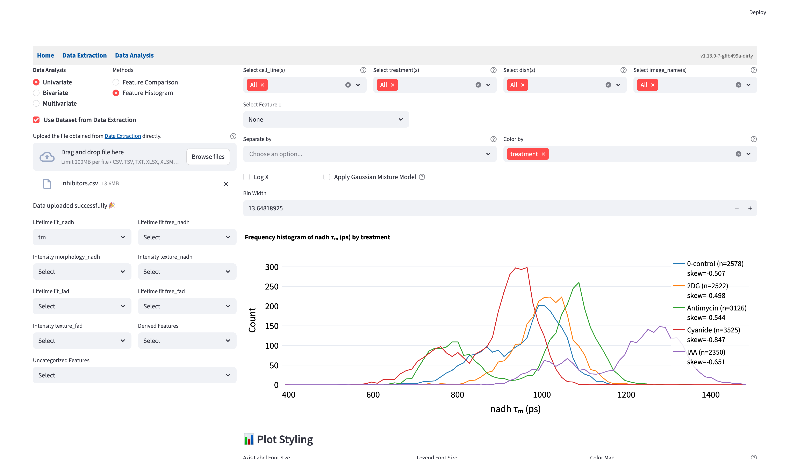
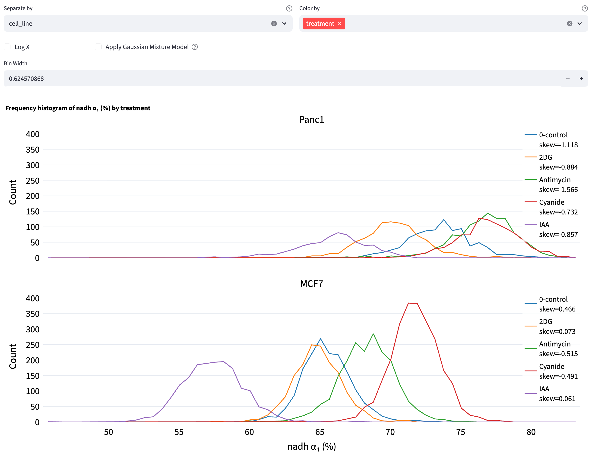
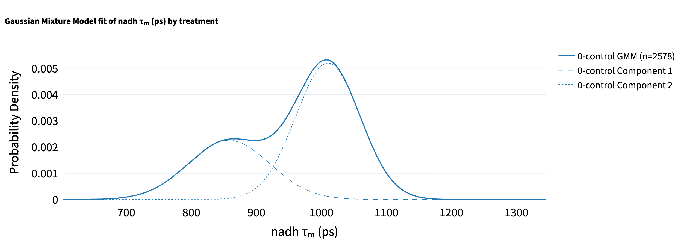
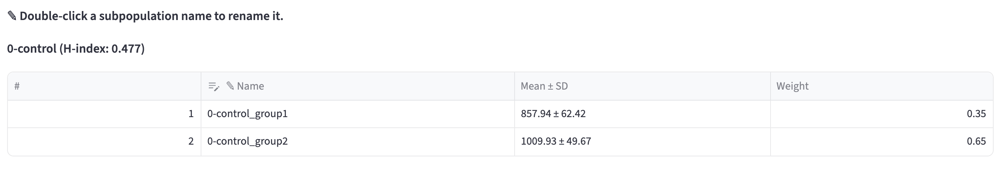
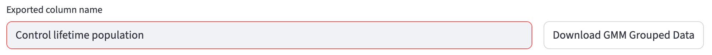
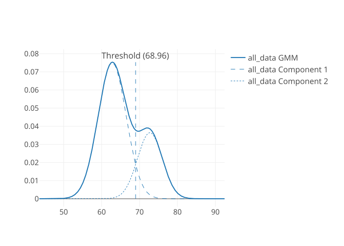
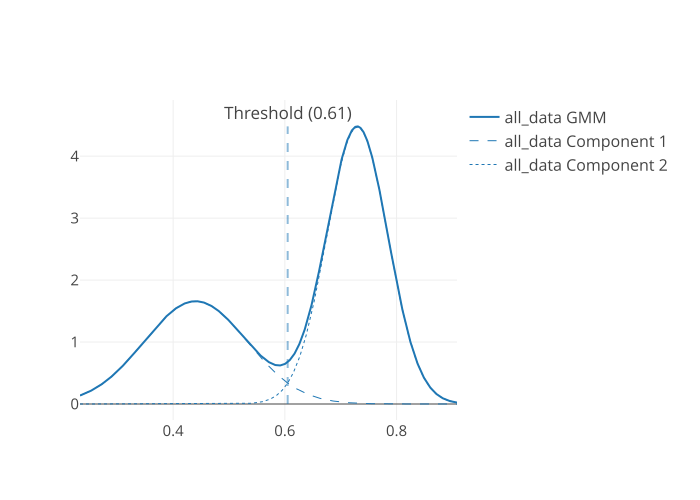
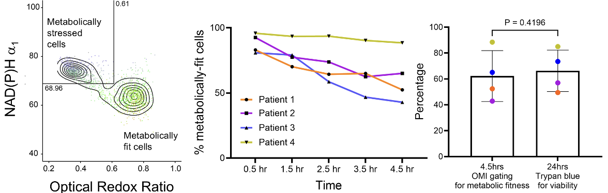

# Feature Histogram {#sec-feature-histogram}
Feature histograms give an instant readout of each group’s center, spread, skew and any multi-peaked shape that raw tables hide. FLIM Playground plots a histogram for each group based on the selected numerical feature. Additionally, the [Gaussian Mixture Model](#gaussian-mixture-model-mode) mode can help find subcomponents of each histogram in an unsupervised way. To quantify the distribution heterogeneity, normalized [H-index](#heterogeneity-index) is calculated for each group. 

::: {#feature-histogram-img}
{ width=100% fig-align=center fig-alt="Feature Histogram page with a selected numerical feature, treatment groups, histogram count curves, legend counts and skewness, and controls for Log X, Gaussian mixture modeling, and Bin Width."}
:::

## Shared Interface Components

- On the left, users can use the [selection widgets](data_analysis.qmd#univariate-analysis) to select the numerical feature to see the histogram/GMM distribution. Exactly one feature can be selected from all feature groups. 
- On the top right, users can use the [filters](data_analysis.qmd#filter-widgets) to subset the data to find the groups of interest. 
- Below the filters, use `Color by` to define groups and [`Separate by`](#separate-by) to place categories in separate panels. Both histogram and GMM modes analyze individual observations within each category and color group.
- On the bottom right, users can change the plot style using the [plot styling widgets](data_analysis.qmd#plotting-configuration-widgets). 

## Histogram Mode
Select **Apply Gaussian Mixture Model** to switch from histogram mode to [GMM mode](#gaussian-mixture-model-mode). Clear it to return to the histogram.

A **Log X** checkbox next to the mode switch transforms the selected feature with $\log_{10}(x + 10^{-6})$ before computing either analysis. Histogram bins and skewness then describe transformed values; the GMM components, model selection, [classification](#classification) thresholds, and [H-index](#heterogeneity-index) are also computed in log space. The small offset allows zero values. If negative values are present, the app reports an error and keeps the original scale.

Histogram mode plots observation counts for each group. Use **Bin Width** to adjust the shared bins. The default uses NumPy's automatic choice between the Sturges and Freedman–Diaconis estimators, capped at one-third of the data range (see [NumPy's bin estimators](https://numpy.org/devdocs/reference/generated/numpy.histogram_bin_edges.html#numpy.histogram_bin_edges)). The maximum width is one-third of the range and the step is $1/50$ of the range. The app keeps separate width choices for each feature's raw and logarithmic scales. A constant or very small dataset may have a single bin and no width control.

The legend reports each group's bias-corrected skewness. It displays `undefined` for fewer than three observations or a constant group. Enable **Show group counts (n) in legend** under **Plot Styling** to include the number of observations in each group.

A rule of thumb categorization of skewness is as follows:

- Strongly left-skewed: < -1
- Moderately left-skewed: -1 to -0.5
- Approximately symmetric: -0.5 to -0.25 and 0.25 to 0.5
- Almost symmetric: -0.25 to 0.25
- Moderately right-skewed: 0.5 to 1
- Strongly right-skewed: > 1

Skewness alone cannot describe every distribution shape: a symmetric distribution can still have several peaks. When these peaks might represent subpopulations, such as cell types, states, or cell-cycle phases, use [Gaussian Mixture Model mode](#gaussian-mixture-model-mode) to explore possible components.

## Separate by

Choose one categorical column in **Separate by** to stack one full-width histogram or GMM panel per category. The same color represents the same `Color by` group in every panel. The separation column is removed from the available `Color by` choices.

For the [inhibitor dataset](https://github.com/skalalab/flim_playground/blob/main/example_data/Data_Analysis/inhibitors.csv), select **a1** under **Lifetime fit_nadh**, set **Separate by → cell_line**, and set **Color by → treatment**. Keep the categorical filters at **All** and **Apply Gaussian Mixture Model** cleared. The result is exactly two stacked histograms: **Panc1** above **MCF7**.

{width=100% fig-align=center fig-alt="Separate by is cell_line and Color by is treatment. NADH a1 percentage histograms are stacked in two panels, Panc1 above MCF7, with shared axes and bin edges and a separate treatment and skewness legend in each panel."}

All panels share axis ranges and, in histogram mode, the same bin edges. Histogram legends report local skewness; both modes can display local counts. GMM fits are calculated separately within each category and color group; their component tables and any fitting notices appear below the plots. Changing `Separate by` therefore changes the populations being modeled. This method always uses individual observations; averaging by category is available in [Feature Comparison](feature_comparison.qmd#collapse-by) and [2D Feature Distribution](feature_distribution.qmd#collapse-by).

## Gaussian Mixture Model Mode

{width=100% fig-align=center fig-alt="One-dimensional GMM density plot for the control treatment, showing the combined mixture curve and two component curves."}

A Gaussian Mixture Model (GMM) represents a dataset as a weighted sum of multiple Gaussian (normal) distributions, each defined by its own mean ($\mu$) and (co)variance ($\sigma^2$). By estimating the component parameters and their weights (mixing coefficients) from the data—commonly using the Expectation-Maximization (EM) algorithm—GMMs can capture complex, multimodal distributions that a single Gaussian cannot. 

### Fit Gaussian Mixture Models
- Fits candidate GMMs directly to the selected numerical values, starting with one component and continuing up to `Max Components`. The maximum can be set from 2 to 5; its default is 3. Each component has a weight ($w_i$), mean ($\mu_i$), and variance ($\sigma_i^2$).
- Retains only *valid* models in which every component has weight at least `Min Weight Threshold` (default 0.1, or 10%; the weights of all components add to 1).
- FLIM Playground will choose the valid model with the lowest BIC score that penalizes the model complexity to avoid overfitting.

The plot shows the fitted mixture density and, for a model with multiple components, its component curves. Tables below the plot report **Mean ± SD**, **Weight**, and the group's H-index. These are fitted component parameters based on soft membership probabilities; the mean, SD, and fraction of rows assigned to a component by a hard rule can differ. A group needs at least two distinct observations for fitting. Groups with insufficient data or no valid model receive a notice without preventing the other groups from being analyzed.

### Heterogeneity index 
To quantify the subpopulation structure, based on the GMM fit, FLIM Playground computes an “H‑index” for each group as a weighted entropy‑distance: each component contributes according to its weight’s uncertainty ($-w_i \log w_i$) [@shannon1948] scaled by how far its mean $\mu_i$ sits from the overall mixture mean $\bar\mu = \sum_{i=1}^k w_i\,\mu_i$, normalized by the standard deviation of $\mu_i$s.  
$$
H =\sum_{i=1}^{k}\bigl(-w_i \log w_i\bigr)\,d_i, \qquad d_i \;=\;
\frac{\lvert\mu_i - \bar{\mu}\rvert}{\sigma}
$$

### Classification

For fits with more than one component, the app assigns each observation to one subpopulation using [hard assignment](#hard-assignment) by default. Select **Use intersection as threshold** to use [intersection thresholding](#intersection-thresholding) instead. Components are numbered in ascending order of their fitted means under either rule. A one-component fit has H-index 0 and leaves its rows unassigned, as do groups with insufficient data or no valid fit.

#### Export labeled data

Double-click a subpopulation's **Name** in its component table to set the label used in the download. **Exported column name** defaults to `GMM_group`; if that column already exists, the app uses an available name such as `GMM_group_2`. Click **Download GMM Grouped Data** to save `gmm_grouped_data.csv`.

{width=100% fig-align=center fig-alt="Editable two-component GMM table with Name, Mean plus or minus SD, and Weight columns, and the group's H-index above it."}

{width=100% fig-align=center fig-alt="Exported column name field set to Control lifetime population beside the Download GMM Grouped Data button."}

Default values look like `0.5hr_group1` and `0.5hr_group2`. With `Separate by`, labels include the category, for example `{category}::{color_group}_group1`; without a color group they use `{category}_group1`. You can give multiple components the same exported name to combine their labels. Names must be nonempty, and the exported column name cannot overwrite another column. Naming changes affect the exported copy and script, while the fitted curves and parameters stay the same.

The CSV contains the analyzed observations after filtering and removal of missing values in the selected feature. It retains their available columns, including the analyzed values when **Log X** is enabled, plus the new label column. Unassigned rows have an empty label. The download is available when at least one group has generated labels.

On reupload, the label column follows the normal [column-role review](data_analysis_config.qmd#id-config); its name has no special reserved role. Assign it **Categorical** to use its labels in filters and grouping. The [exported Python script](data_analysis.qmd#export-workflow-as-python-script) retains the naming choices; set `SAVE_DERIVED_DATA = True` in the script to also save the labeled CSV.

#### Intersection thresholding
- Once the GMM is estimated, thresholds can be obtained by locating the intersection points of adjacent component densities:
                        $$
                        w_1\,\mathcal{N}(x;\mu_1,\sigma_1^2)
                        \;=\;
                        w_2\,\mathcal{N}(x;\mu_2,\sigma_2^2)
                        $$
where $w_1, \mu_1, \sigma_1$ are the mixture weight, mean, and standard deviation of the first Gaussian component, respectively, and $w_2, \mu_2, \sigma_2$ those of the second component.
- The app searches between adjacent component means with Brent's root-finding method. When valid, increasing intersection thresholds are found, data points are assigned to the intervals they define. Weighted Gaussian components need not intersect between their means, so this rule is not always available.

::: {.callout-important}
If valid, increasing intersection thresholds cannot be found for a group, the app reports this and uses hard assignment for that group.
:::

#### Hard assignment
- For each data point, it computes the posterior probability (responsibility) of each component, and assigns the data point to the component with the highest responsibility. 

$$\text{label}(x) = \arg\max_{i} \gamma_i(x)$$

$$\text{where} \quad \gamma_i(x) = \frac{w_i \; \mathcal{N}\bigl(x \mid \mu_i, \sigma_i^2\bigr)}{\sum_{j=1}^K w_j \; \mathcal{N}\bigl(x \mid \mu_j, \sigma_j^2\bigr)}$$

### Example 
Pham et al. [@Pham2026] used GMM with intersection thresholding to create gates using NAD(P)H $a_1$ and optical redox ratio. These gates were used to define metabolically stressed and fit cells in their study of the impact of cryopreservation on T cell metabolism. 

::: {.columns}
::: {.column width="50%"}
{width=100%}
:::
::: {.column width="50%"}
{width=100%}
:::
:::

They compared the GMM-derived gate with cell viability by Trypan blue staining: 

{width=100% fig-align=center}

It suggests that optical metabolic imaging (OMI) could serve as an early, non-destructive indicator of T cell viability post-thaw.
