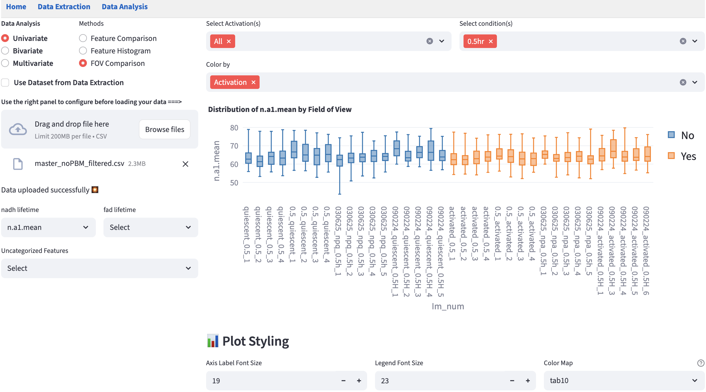
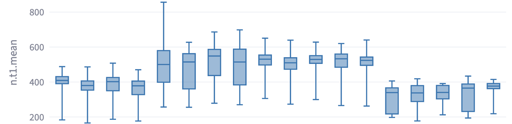

# Field of View Comparison {#sec-fov-comparison}

In imaging datasets like FLIM data, field of view (FOV) is an important categorical feature that documents where a certain set of rows (e.g. cells) originate. Visualizing each FOV side by side on a numerical feature can help identify potential FOV-level outliers. 

FLIM Playground finds the FOV identifier column from the dataset using the `FOV column name` field in [data analysis config](data_analysis_config.qmd#identifiers-config) (dataset not extracted by Data Extraction) or [data extraction config](data_extraction_config.qmd#sec-data-extraction-config) (dataset extracted by [Data Extraction](#sec-data-extraction)). 

If found:

{width=100% fig-align=center}

If the column is not found, FLIM Playground does not stop. It falls back to deriving a FOV name for each row from that row's [unique row id](data_analysis_config.qmd#identifiers-config), by taking everything before the last underscore. A row with the id `day1_image3_17` is therefore assigned to the FOV `day1_image3`. This matches the `{FOV Identifier}_{cell_label}` convention used by [Data Extraction](#sec-data-extraction), so for datasets extracted by FLIM Playground the derived value is the correct FOV name.

Only rows whose unique row id contains no underscore at all cannot be split. Those are labeled `missing fov name`, and the warning below appears if at least one such row is present:

{width=80% fig-align=center}

::: {.callout-warning}
Because the fallback is silent when every row id happens to contain an underscore, a plot can be rendered with no warning while grouping by something that is not a real FOV. If your unique row ids do not follow the `{FOV}_{cell}` convention, the boxplots will be grouped by an arbitrary fragment of the id string. Confirm that the `FOV column name` in the [data analysis config](data_analysis_config.qmd#identifiers-config) actually matches a column in your dataset before reading anything into this plot.
:::

## Shared Interface Components

- On the left, users can use the [selection widgets](data_analysis.qmd#univariate-analysis) to select the numerical feature to see the boxplot of each FOV. Exactly one feature can be selected from all feature groups. 
- On the top right, users can use the [filters](data_analysis.qmd#filter-widgets) to subset the data to find the groups of interest. 
- Below the filters, users can apply the [visual channels widgets](data_analysis.qmd#visual-channels-widgets) that allow users to `Color by` categorical features. `Opacity by` and `Shape by` are *not* supported because there are no points in the boxplot.
- On the bottom right, users can change the plot style using the [plot styling widgets](data_analysis.qmd#plotting-configuration-widgets). 

Besides the shared components, this module does not have any method-specific components. 

::: {.callout-note}
The box for each FOV follows the [Tukey](https://en.wikipedia.org/wiki/Box_plot) convention: the box spans the interquartile range ($Q_1$–$Q_3$) with the median line, and the whiskers extend to the most extreme points within $Q_1 - 1.5 \times \text{IQR}$ and $Q_3 + 1.5 \times \text{IQR}$.
:::

## Example
Sometimes, the FOV-level boxplots may show consistent divergence across different imaging days, which may suggest that there is experimental or data extraction inconsistency (e.g. shifts are not optimized correctly for one day versus the others). Below is an example that, despite the same conditions, systematically diverged across days, but was consistent within the same day. 

{width=100% fig-align=center}
