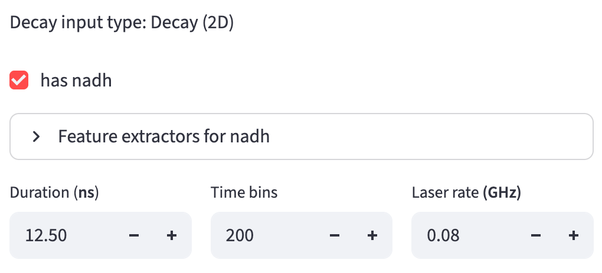

# Field of View Metadata {#sec-fov-metadata}
It is the first step in the [Data Extraction](#sec-data-extraction) workflow. It organizes the metadata of each field of view (FOV)—including file paths for all required inputs and decay information—into a single metadata file. This file is then used for [numerical feature extraction](#sec-numerical-feature-extraction), as well as for users' own bookkeeping and troubleshooting.

::: {#fov-metadata}
{width=100% fig-align=center fig-alt="FOV Metadata Extraction with channel and folder settings on the left, and a successful field-of-view check, metadata table, and export button on the right."}
:::

It is divided into two sections: 

- The left 1/3 of the screen is the metadata configuration panel, inherited from the [Data Extraction Configuration](#sec-data-extraction-config) step. 
- The right 2/3 shows the extraction status for all FOVs. 

## Metadata 

Metadata are configured earlier in the [Data Extraction Configuration](#sec-data-extraction-config) step and copied here. Some fields remain editable for flexibility, while others are fixed to ensure usability. Non-editable fields can be modified in the Data Extraction Configuration step. After saving your modifications, return to this page and refresh it to see the changes. 

### Decay Type

See [decay types](data_extraction_config.qmd#decay-types) for more details. The decay type is not editable here. 

### Channel Names 
See [channel name config](data_extraction_config.qmd#channel-name) for more details. The names are not editable here, though users can choose which channel to include. 

### Feature Extractors

See [feature extractor config](data_extraction_config.qmd#feature-extractor) for more details. The feature extractors for each channel are shown but not editable here. 

### Decay Info

The [decay settings](data_extraction_config.qmd#decay-info) start from the active profile. [Laser rate]{#laser-frequency} is editable when `Lifetime fit free` is selected; 2D inputs also show duration and time-bin controls.

#### 2D Decay-specific

Since the [2D decay](data_extraction_config.qmd#two-d-decay) file does not provide the `duration` and the number of `time bins` per laser pulse interval, users need to specify them. 

{width=80% fig-align=center fig-alt="Decay (2D) metadata controls with the NADH channel included, duration 12.5 ns, 200 time bins, and laser rate 0.08 GHz."}

### File Suffix

Copied from the [file suffix config](data_extraction_config.qmd#file-suffix). 
Users can edit the file suffixes here. 

### Fluorescence Lifetime Standard

When [Fluorescence Lifetime Standard](data_extraction_config.qmd#calibration-method) calibration is selected, specify the standard's filename suffix for each fit-free channel under `File suffixes`, and its shared lifetime in nanoseconds. These values start from the active configuration. The folder scan finds each standard by suffix, independently of the FOV name.

### Folder Path
Finally, users can specify the folder path that contains all the required input files. 

## Metadata Extraction
### FOV File Paths

The first step is to find the fields of view:

- It finds files recursively in the folder path using the first per-FOV file suffix, skipping calibration suffixes.
- The prefix of all the matched files is considered to be the field of view name. 
    - FOV name = file name - 1st file suffix

Then, it uses the found FOV names to find all other files: 

- The file name to search = FOV name + other file suffixes for each file suffix

Calibration files are shared across FOVs and are searched for by suffix alone, independently of the FOV name. For example, the same `standard.ptu` or `irf.ptu` will be used for every FOV in the folder. Files matching configured IRF or fluorescence lifetime standard suffixes are excluded from FOV discovery, even when they share the sample's `.ptu` extension. This also applies to configured references for an inactive calibration method; those files are excluded if present but are not required.

Each FOV card reports whether the required inputs were found:

- **Missing:** no file matches the expected FOV name plus suffix, or no calibration file matches its suffix.
- **Duplicate:** multiple files match a calibration suffix, or the same per-FOV filename appears in different subfolders. Keep one unambiguous match for each required input.

FOVs marked ✅ are included in the metadata; FOVs marked ❌ are excluded.

::: {.callout-tip}
After correcting missing or duplicate filenames, click `Rescan folder` to repeat the scan.
:::

### Decay Info

If the decay type is [3D/4D decay](data_extraction_config.qmd#three-d4d-decay), FLIM Playground will try to infer the `duration` and the number of `time bins` per laser pulse interval from the decay file metadata. It will also check for inconsistencies across all decay files. 

#### Channel Assignment

If the decay file associated with the channel found by the previous step is a 4D array, then FLIM Playground will try to infer the channel number for that channel. For each channel name, it will list all non-empty channels as potential channels to be assigned. If there is only one, the assignment is automatic. If there are multiple, users need to select the channel intended. It will also check for inconsistencies across all decay files about their dimensions and complain if there are any.

Picking the right channel number is easy to get wrong when one file holds several non-empty channels, so when there is a choice to make, a preview of the first field of view appears under the dropdown: one thumbnail per candidate channel, with a ✅ on the one currently selected. Glance at it to confirm the channel you picked looks like the fluorophore you expect. 

::: {#calibration-references}

#### IRF {#irf-reference-validation}

For channels that require IRF calibration, the metadata records the IRF file path. IRFs are checked when numerical extraction begins. The requirements depend on the [IRF format](data_extraction.qmd#irf):

- **TXT/CSV:** the loaded curve must contain one value per sample time bin.
- **PTU:** the file must contain non-empty, single-channel T3 imaging data. All pixels and repeated frames are summed into one IRF curve. Its time-bin count and bin width must match the sample's; its laser frequency must also match when a sample laser frequency is specified. The sample bin width is `duration / time_bins`. Small numerical rounding differences are tolerated, but the IRF is **not resampled** to fit a different acquisition grid.

#### Fluorescence Lifetime Standard {#standard-reference-validation}

When fluorescence lifetime standard calibration is selected, the standard is checked before metadata export. The requirements depend on the [standard format](data_extraction.qmd#fluorescence-lifetime-standard):

- **TIFF:** the image must be 3D, with exactly one dimension matching the sample's time-bin count so that the time axis can be identified. A missing or ambiguous time axis prevents metadata export.
- **PTU:** the file must contain non-empty, single-channel T3 imaging data. All pixels and repeated frames are summed into one standard reference curve. Its time-bin count and bin width must match the sample's; its laser frequency must also match when a sample laser frequency is specified. The sample bin width is `duration / time_bins`. Small numerical rounding differences are tolerated, but the standard is **not resampled** to fit a different acquisition grid.

The metadata records the standard's file path, known lifetime, and time axis. For a PTU standard, the app supplies the time axis automatically from the integrated reference curve.

:::

### Result Preview and Export

If there is a non-zero number of FOVs with ✅ and channel assignment and fluorescence lifetime standard checks (if applicable) are passed, a preview of the metadata data sheet will be shown for users to check. 

{width=100% fig-align=center fig-alt="A field of view reports All files found above the metadata preview and Export FOV Metadata as CSV button."}

As an example, the following metadata are extracted: 

- `image_name`: The `image_name` column is the name of each FOV, which is specified in the [fov identifier config](data_extraction_config.qmd#fov-identifier). 
- `nadh_Mask`, `nadh_Decay`, `nadh_IRF`, `fad_Mask`, `fad_Decay`, `fad_IRF`: the [file paths](#fov-file-paths) of the mask, decay, and IRF files for the `nadh` and `fad` channels. 
- `nadh_input_type`, `nadh_imaging_modality`, `fad_input_type`, `fad_imaging_modality`: the [imaging modality](data_extraction_config.qmd#imaging-modality) and the corresponding input type for each channel. These are two distinct values. For a channel whose modality is `FLIM`, the input type is one of the [decay types](data_extraction_config.qmd#decay-types); for a channel whose modality is `Intensity-only`, the input type is `Intensity (2D)`. Channels that share the same imaging modality share the same input type.
- `nadh_Lifetime fit free`, `nadh_Intensity morphology`, `nadh_Lifetime fit`, `fad_Intensity morphology`, `fad_Intensity texture`, `fad_Lifetime fit`: [feature extractors](#feature-extractors) for each channel. 
- `nadh_channel`, `duration`, `fad_channel`, `time_bins`, `laser_rate`: the [decay info](#decay-info) for each channel and info shared by all channels. 

`Export FOV Metadata as CSV` writes `fov_metadata_<timestamp>.csv` into the selected folder and caches it for the numerical extraction step.
