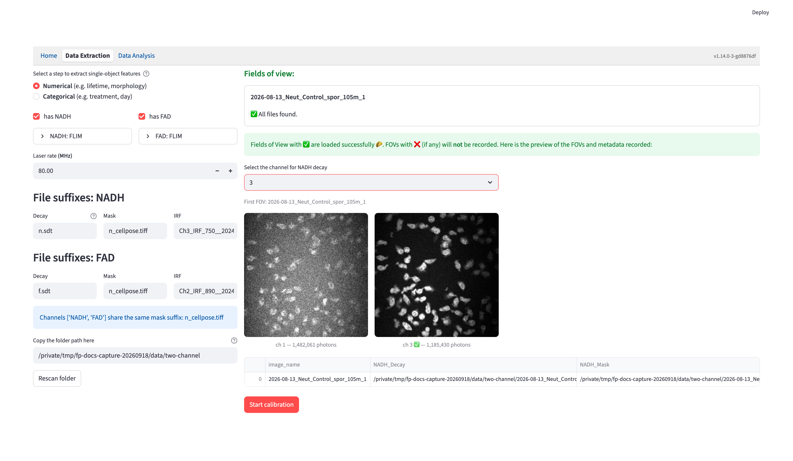
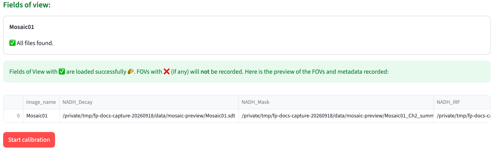

# Field of View Metadata {#sec-fov-metadata}
FOV metadata are prepared within **Data Extraction → Numerical**. It includes each field of view's file paths, acquisition information, and channel settings such as calibration configuration and features to be extracted. The metadata record is maintained behind the scenes and automatically saved. 

::: {#fov-metadata}
{width=100% fig-align=center fig-alt="Numerical source preparation with channel and folder settings on the left and field-of-view checks and a metadata preview on the right."}
:::

The left side contains source settings inherited from [Configuration](data_extraction_config.qmd); the right side shows file validation, any required channel assignments, and the metadata preview. After preparation, the source settings remain available in the collapsed **Metadata settings** expander.

## Source settings

Settings are inherited from the active [extraction profile](data_extraction_config.qmd#extraction-profiles). Source edits, a rescan, or a profile change invalidate an already prepared workflow, so the app repeats preparation before extraction. If another browser tab changed Configuration, follow the reload notice to use its new settings.

### Folder Path
Enter the folder path that contains the required input files. The scan includes subfolders; after correcting files or changing the path, click **Rescan folder**.

## Metadata Extraction
### FOV File Paths

The first step is to find the fields of view:

- It finds files recursively in the folder path using the first per-FOV file suffix, skipping calibration suffixes.
- The prefix of all the matched files is considered to be the field of view name. 
    - FOV name = file name - 1st file suffix

Then, it uses the found FOV names to find all other files: 

- The file name to search = FOV name + other file suffixes for each file suffix

Calibration files are shared across FOVs and are searched for by suffix alone, independently of the FOV name. For example, the same `standard.ptu` or `irf.ptu` will be used for every FOV in the folder. Files matching configured IRF or fluorescence lifetime standard suffixes are excluded from FOV discovery, even when they share the sample's `.ptu` extension. This also applies to configured references for an inactive calibration method; those files are excluded if present but are not required.

Each FOV card reports whether the required inputs were found:

- **Missing:** no file matches the expected FOV name plus suffix, or no calibration file matches its suffix.
- **Duplicate:** multiple files match a calibration suffix, or the same per-FOV filename appears in different subfolders. Keep one unambiguous match for each required input.

FOVs marked ✅ are included in the metadata; FOVs marked ❌ are excluded.

::: {.callout-tip}
After correcting missing or duplicate filenames, click `Rescan folder` to repeat the scan.
:::

### Decay Info {#metadata-decay-info}

If the decay type is [3D/4D decay](data_extraction_config.qmd#three-d4d-decay), FLIM Playground will try to infer the `duration` and the number of `time bins` per laser pulse interval from the decay file metadata. It will also check for inconsistencies across all decay files. 

#### Channel Assignment

If the decay file associated with the channel found by the previous step is a 4D array, then FLIM Playground will try to infer the channel number for that channel. For each channel name, it will list all non-empty channels as potential channels to be assigned. If there is only one, the assignment is automatic. If there are multiple, users need to select the channel intended. It also checks dimensions across FOVs and channels within each imaging modality. FLIM, intensity-only, and QPI modalities can have different spatial grids, provided each image matches its own mask; corresponding cells are joined by label.

Picking the right channel number is easy to get wrong when one file holds several non-empty channels, so when there is a choice to make, a preview of the first field of view appears under the dropdown: one thumbnail per candidate channel, with a ✅ on the one currently selected. Glance at it to confirm the channel you picked looks like the fluorophore you expect. 

The metadata records the standard's file path, known lifetime, and time axis. For a PTU standard, the app supplies the time axis automatically from the integrated reference curve.

### Result preview and automatic save

When at least one FOV has valid inputs and the applicable acquisition and reference checks pass, inspect the metadata preview. Click **Start calibration** if any selected channel needs IRF shift or QPI background calibration; otherwise click **Start extraction** to begin extracting immediately. Both actions automatically save the metadata in the source folder.

{width=100% fig-align=center fig-alt="Numerical source validation with field-of-view status, a metadata preview, and the next workflow action."}

As an example, the following metadata are extracted: 

- `image_name`: The `image_name` column is the name of each FOV, which is specified in the [fov identifier config](data_extraction_config.qmd#fov-identifier). 
- `nadh_Mask`, `nadh_Decay`, `nadh_IRF`, `fad_Mask`, `fad_Decay`, `fad_IRF`: the [file paths](#fov-file-paths) of the mask, decay, and IRF files for the `nadh` and `fad` channels. 
- `nadh_input_type`, `nadh_imaging_modality`, `fad_input_type`, `fad_imaging_modality`: the [imaging modality](data_extraction_config.qmd#imaging-modality) and the corresponding input type for each channel. These are two distinct values. For a channel whose modality is `FLIM`, the input type is one of the [decay types](data_extraction_config.qmd#decay-types); for a channel whose modality is `Intensity-only`, the input type is `Intensity (2D)`; for `QPI`, it is `QPI (2D)`. Channels that share the same imaging modality share the same input type.
- `nadh_Lifetime fit free`, `nadh_Intensity morphology`, `nadh_Lifetime fit`, `fad_Intensity morphology`, `fad_Intensity texture`, `fad_Lifetime fit`: [feature extractors](data_extraction_config.qmd#feature-extractor) for each channel.
- `nadh_channel`, `duration`, `fad_channel`, `time_bins`, `laser_rate`: the [recorded decay info](#metadata-decay-info) for each channel and information shared by all channels.

For [QPI](qpi.qmd) channels, the record also includes the OPD-image and mask paths, physical constants (`pixel_size_um`, `opd_unit`, and `alpha_um3_per_pg` with the channel prefix), and the confirmed background recipe. Spatial dimensions are recorded separately for each modality.

Preparation writes `fov_metadata_<timestamp>.csv` into the source folder. Confirming calibration and changing the confirmed fitting mode automatically update the same file. A failed metadata write shows **Retry saving metadata** and prevents feature extraction until saving succeeds. This CSV records the run for bookkeeping and troubleshooting; new runs begin from the source folder in [Numerical](numerical_feature_extraction.qmd#sec-numerical-feature-extraction).
