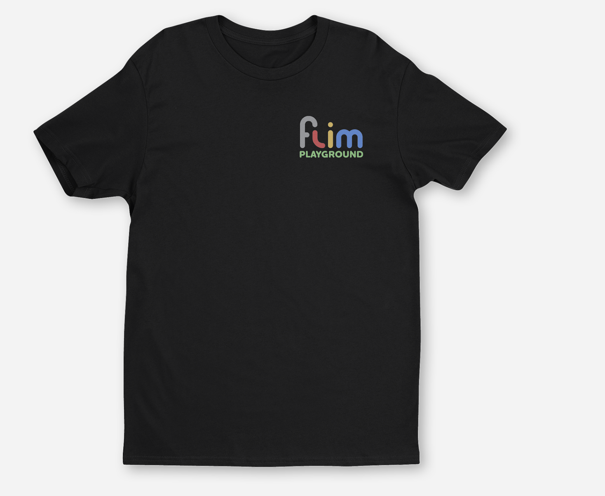
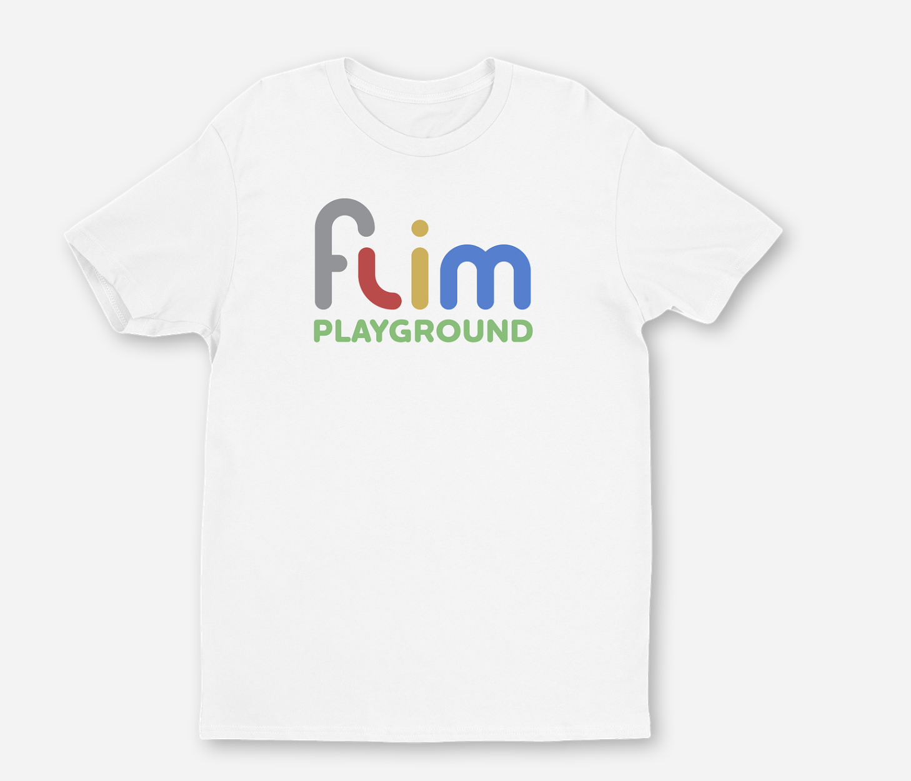
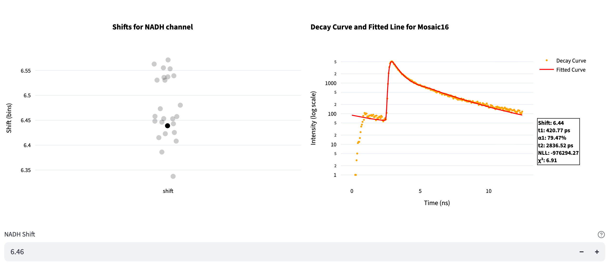
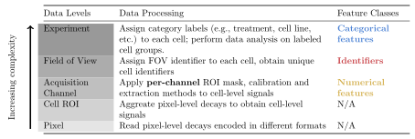
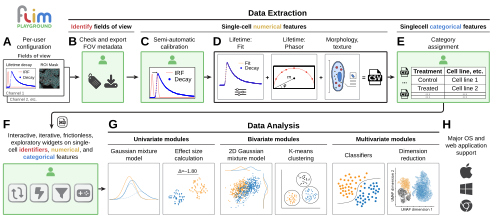

::: {.content-visible when-format="html"}
{width=300px fig-align="center"}

*Logo courtesy of Matt Stefely. The yellow dot is a photon sliding down a lifetime decay curve 🛝.*^[It also appears in real life: {height=90px} {height=90px} {height=90px} {height=90px} {height=90px}]

:::

::: {.content-visible when-format="pdf"}
<!-- Logo disabled for PDF format due to GIF compatibility issues -->
:::

# Quick Start

Welcome to the FLIM Playground 🥳🎉🥂! This is an interactive graphical user interface (GUI) that allows you to extract single-cell^[in general, any region of interest works, including the whole field of view] features from fluorescence lifetime imaging microscopy (FLIM) raw data ([Data Extraction](#sec-data-extraction)) and analyze extracted features or your own datasets using a built-in repertoire of methods ([Data Analysis](#sec-data-analysis)). 

To quickly try out different analysis methods, download this [sample dataset](https://github.com/skalalab/flim_playground/blob/main/example_data/Data_Analysis/inhibitors.csv) and try the [online demo](https://flim-playground.streamlit.app/). If you prefer to use your own datasets, read [this chapter on data analysis configuration](#sec-data-analysis-config) to learn how to configure the system.

Several talks have been given about FLIM Playground:

- [FLIM Playground @ SPIE 2026: 13 mins](https://www.spiedigitallibrary.org/conference-proceedings-of-spie/PC13856/PC138560G/FLIM-playground--an-interactive-end-to-end-graphical-user/10.1117/12.3079405.full)
- [FLIM Playground @ the Fluorescence Microscopy Summit by Photonics Media: 31 mins](https://youtu.be/3qEks0b2HSU)

## Try Data Analysis

1. **Load the sample.** In the online demo, open **Data Analysis → Univariate → Feature Comparison**. Keep **Use Dataset from Data Extraction** checked and upload `inhibitors.csv` from the sample link above. For your own table, clear the checkbox and follow the [column review walkthrough](data_analysis_config.qmd#sec-data-analysis-config).

2. **Compare groups.** Select **tm** under **Lifetime fit_nadh**, set **Color by** to `treatment`, and **Separate by** to `cell_line`. Change a [filter](data_analysis.qmd#filter-widgets) or select another measurement to explore the [Feature Comparison](feature_comparison.qmd#sec-feature-comparison) plot.

   {width=100% fig-align=center fig-alt="Feature Comparison plot of NADH mean lifetime, colored by treatment and divided into cell-line sections."}

3. **Save the workflow.** Below **Plot Styling**, click **Export the entire analysis as a Python script**. Keep the original CSV and follow the [script workflow](data_analysis.qmd#export-workflow-as-python-script) to reproduce the plot.

   {width=80% fig-align=center fig-alt="Export the entire analysis as a Python script button below the plot styling controls."}

## Try Data Extraction locally

Use a [local installation](#installation) for Data Extraction so the app can read input folders and save CSV files on your computer. The **Mosaic example** contains 25 NADH fields of view (`Mosaic01`–`Mosaic25`), with raw FLIM decays, cell masks, and an IRF. It is the same example used in the [IRF calibration and time-gate walkthrough](irf_calibration.qmd#time-gates).

1. **Download the inputs.** Download [the Mosaic example ZIP](https://raw.githubusercontent.com/skalalab/flim_playground/main/example_data/Data_Extraction/3d_decay_1channel.zip) from the FLIM Playground repository and unzip it. Open the extracted `3d_decay_1channel` folder. It contains:

   - 25 `.sdt` decay files, such as `Mosaic01.sdt`.
   - 25 matching cell masks, such as `Mosaic01_Ch2_summed_cellpose.tiff`.
   - `nadh_irf.txt`, shared by all 25 fields of view.

2. **Configure the example.** In **Home**, create a profile such as `Mosaic NADH example` and enter the settings below. Click **Update Configuration** to save.

   | Setting | Value for this example |
   |---|---|
   | Number of channels / Channel 1 name / Imaging modality | `1` / `NADH` / `FLIM` |
   | FLIM input format | `Decay (3/4D)` |
   | Extract feature types from NADH | `Lifetime fit` and `Lifetime fit free` |
   | Number of components | `2` |
   | Laser rate | `0.08` GHz |
   | Fit free calibration method | `IRF` |
   | Decay suffix | `.sdt` |
   | Mask suffix | `_Ch2_summed_cellpose.tiff` |
   | IRF suffix | `nadh_irf.txt` |
   | Unique cell identifier / FOV column name | `cell_id` / `image_name` |

   The app reads the image dimensions and timing from the SDT files: `512 × 512` pixels, `256` time bins, and a `12.5` ns decay period. See [configuration](data_extraction_config.qmd#sec-data-extraction-config) when adapting this setup to your own inputs.

3. **Check the folder.** Open **Data Extraction → FOV Metadata Extraction** and enter the full path to the extracted `3d_decay_1channel` folder. Confirm that `Mosaic01`–`Mosaic25` report **All files found**, inspect a decay and mask preview, then click **Export FOV Metadata as CSV**. See the [metadata walkthrough](fov_metadata.qmd#sec-fov-metadata) if a file is missing or duplicated.

4. **Calibrate and extract.** Switch to **Numeric Feature Extraction** to use the cached metadata. Keep **MLE**, **Hybrid**, two components, **Fix the Shift** selected, and the initial **Start (T1) = 0**, **End (T2) = 256** gates. Click **Optimize for Shifts**, then select `Mosaic16` in the shift plot to inspect its decay and fitted curve.

   {width=100% fig-align=center fig-alt="The Mosaic example's 25 NADH shift estimates, with Mosaic16 selected beside its measured and fitted decay, fit statistics, and editable common shift."}

   Follow [IRF Calibration](irf_calibration.qmd#sec-irf-calibration) to review the shifts; the [time-gate example](irf_calibration.qmd#time-gates) shows how to adjust the fitting interval. Click **Confirm Time Gates (if applicable) and Shift for each channel**, choose **Local** for faster cell-level fitting or keep **Hybrid**, then click **Confirm and Start**. Use **Download updated metadata** to save the calibration for another run. The app saves the cell-feature CSV beside the metadata; see [Save Results](numerical_feature_extraction.qmd#save-results).

5. **Analyze the cells.** Upload the saved cell-feature CSV in **Data Analysis** with **Use Dataset from Data Extraction** checked. Select **tm** under **Lifetime fit_NADH** in **Feature Comparison**, or open **Bivariate → Phasor Plot** to view the NADH coordinates. Use **Color by → image_name** to compare fields of view. For experiments whose FOV names encode labels such as treatment, follow [Categorical Feature Extraction](categorical_feature_extraction.qmd#sec-categorical-feature-extraction) before analysis.

## Installation

FLIM Playground is built entirely in Python and is open-source. 

For the complete, always-current instructions — per-platform download links, install steps, **upgrading**, and building from source — see the project README, kept as the single source of truth:

👉 **[Installation & upgrade guide](https://github.com/skalalab/flim_playground#install)**

## Introduction

Fluorescence lifetime imaging microscopy (FLIM) measures the time it takes for a fluorescent molecule to emit light (return to the ground state) after being excited by a pulse of light (enter the excited state). It is sensitive to changes in fluorophore microenvironment including, pH, temperature, and conformational changes due to protein-binding and the presence of quenchers [@datta2020]. Coupled with modern automated cell-segmentation methods [@stringer2021], FLIM enables single-cell analyses that can reveal biological heterogeneity.

::: {.callout-note collapse="true"}
# Instrumentation

To acquire FLIM data, a light source—typically a pulsed laser for time-domain methods or a modulated continuous-wave source for frequency-domain methods—is used to excite the fluorophore of interest. The emission is detected using instrumentation capable of resolving fluorescence decay, such as time-correlated single-photon counting (TCSPC), time-gated, or phase/modulation-based detection. In time-domain FLIM, the delay between excitation and photon arrival is measured, and often a histogram is built, with the x-axis representing the delay time and the y-axis representing the number of photons falling into each time bin. Compared to intensity images, FLIM has an additional dimension of time (e.g., 256 time bins per 12.5 nanoseconds). 

In frequency-domain FLIM, the phase shift and modulation depth of the emission relative to the excitation are determined. 
:::

## Challenges

A diverse set of [tools](https://www.phasorpy.org/docs/stable/phasor_approach/#software) — both open-source and commercial, ranging from libraries to code-free graphical user interfaces (GUIs) — is available to extract and analyze FLIM data, providing alternative methods and therefore flexibility to FLIM researchers. Examples include [PhasorPy](https://www.phasorpy.org/) [@phasorpy25], an open-source library for analyzing fluorescence lifetime using the phasor approach; [FLUTE](https://github.com/LaboratoryOpticsBiosciences/FLUTE) [@flute23], an open-source GUI for interactive phasor analysis; [FLIMPA](https://github.com/SofiaKapsiani/FLIMPA) [@flimpa2025], an open-source phasor analysis GUI enabling batch processing, ROI-based quantification, and experiment-level comparison through manual assignment; [FLIMLib](https://flimlib.github.io/), an open-source generic curve fitting library that can be used to fit fluorescence lifetime decay data; [SPCImage](https://www.becker-hickl.com/products/spcimage/) [@becker2021], a commercial software for fitting and phasor features.

However, while some tools offer code-free interfaces, users still need to write custom code—either to prepare data in the proper format as input, or to further process their outputs for downstream analysis. The fragmentation between tools arises because each focuses on only a subset of **data levels**: pixel, cell ROI, channel, field of view, and experiment. 

:::: {#data-levels .callout-note collapse="true" title="Data Levels"}

::: {.content-visible when-format="html"}
- **Pixel**: 
  - A single decay curve encoded in vendor-specific file formats (e.g., Becker & Hickl, PicoQuant, etc.)
- **Region of Interest (ROI)**
  - Mask with cell labels
- **Channel**
  - Different fluorophores
  - Fluorophore-specific calibration files
  - Masks focusing on different parts of the cell (e.g., whole cell, cytoplasm, nucleus, stain, etc.)
  - Different feature extraction methods (fitting, phasor, morphology, texture)
- **Field of View (FOV)**
  - Input decay types (e.g., [2D](data_extraction_config.qmd#two-d-decay), [3/4D](data_extraction_config.qmd#three-d4d-decay), [pixel-level pre-fit lifetime features](data_extraction_config.qmd#three-d4d-pixel-pre-fit))
- **Experiment**
  - Different treatments, time points, cell lines, etc., and combinations thereof
:::

::: {.content-visible when-format="pdf"}
- \textcolor[HTML]{1f77b4}{\textbf{Pixel}}: 
  - A single decay curve encoded in vendor-specific file formats (e.g., Becker & Hickl, PicoQuant, etc.)
- \textcolor[HTML]{ff7f0e}{\textbf{Region of Interest (ROI)}}
  - Mask with cell labels
- \textcolor[HTML]{2ca02c}{\textbf{Channel}}
  - Different fluorophores
  - Fluorophore-specific calibration files
  - Masks focusing on different parts of the cell (e.g., whole cell, cytoplasm, nucleus, stain, etc.)
  - Different feature extraction methods (fitting, phasor, morphology, texture)
- \textcolor[HTML]{d62728}{\textbf{Field of View (FOV)}}
  - Input decay types (e.g., [2D](data_extraction_config.qmd#two-d-decay), [3/4D](data_extraction_config.qmd#three-d4d-decay), [pixel-level pre-fit lifetime features](data_extraction_config.qmd#three-d4d-pixel-pre-fit))
- \textcolor[HTML]{9467bd}{\textbf{Experiment}}
  - Different treatments, time points, cell lines, etc., and combinations thereof
:::

::: {.content-visible when-format="html"}
An integrated framework should take into account all data levels ■ ■ ■ ■ ■ (•) while maintaining the flexibility to handle various input types (◦). **It should provide a level of abstraction to address fragmentation from data levels and input types**.
:::

::: {.content-visible when-format="pdf"}
An integrated framework should take into account all data levels \textcolor[HTML]{1f77b4}{■} \textcolor[HTML]{ff7f0e}{■} \textcolor[HTML]{2ca02c}{■} \textcolor[HTML]{d62728}{■} \textcolor[HTML]{9467bd}{■} (•) while maintaining the flexibility to handle various input types (◦). **It should provide a level of abstraction to address fragmentation from data levels and input types**.
:::

Additionally, the use of FLIM is rapidly evolving, and new methods are being developed all the time. An integrated framework should allow users to choose among alternative methods seamlessly, be the backbone of iterative explorations integral to research, and be ready to incorporate new methods: **The provided level of abstraction should address fragmentation from extraction and analysis methods**. 

Finally, many of the existing tools, including GUI-based software, are not cross-platform, which limits their accessibility. The [Installation](#installation) addresses this last challenge.

A closer parallel to FLIM Playground's integrated approach is the combination of [CellProfiler](https://cellprofiler.org/) [@cellprofiler4], which extracts per-object morphological and texture features, and [CellProfiler Analyst](https://cellprofileranalyst.org/) [@cpa21], which ingests these outputs or other feature tables for visualization and statistical analysis. However, FLIM Playground stands apart in that it can extract lifetime features from time-resolved data, alongside morphological and texture features from intensity images. Its general Data Analysis section incorporates FLIM-specific methods (e.g., [phasor analysis](#sec-phasor-analysis)) and provides statistical models that address additional analysis aspects such as data heterogeneity, in addition to training machine learning classifiers.

::::

## Method

### Feature Classes

Tabular data columns can be categorized into three feature classes:

::: {.content-visible when-format="html"}
- Identifiers: an optional row identifier for tracking observations; the app supplies row numbers for user tables without one
- Categorical features: conceptually help us group the rows (e.g., `treatment` will group the rows into different treatment groups)
- Numerical features: quantify the differences/similarities between data groups
:::

::: {.content-visible when-format="pdf"}
- \textcolor[HTML]{C94146}{Identifiers}: an optional row identifier for tracking observations; the app supplies row numbers for user tables without one
- \textcolor[HTML]{4880D4}{Categorical features}: conceptually help us group the rows (e.g., `treatment` will group the rows into different treatment groups)
- \textcolor[HTML]{D3AE4A}{Numerical features}: quantify the differences/similarities between data groups
:::

**Science, from the data perspective, is about closing the conceptual categorical gaps with quantitative measurements.**

At [data levels](#data-levels), the data are processed to extract the feature classes in [Data Extraction](#sec-data-extraction), and the classes are used in the [Data Analysis](#sec-data-analysis) section. A user table can also mark columns **Ignore**; field-of-view labels use the **Categorical** role. See [column roles](data_analysis.qmd#column-roles).

{width=100% fig-align=center}

### Design
FLIM Playground has two independent sections:

{width=100% fig-align=center}

#### Data Extraction

[Data Extraction](#sec-data-extraction) extracts single-cell features from the raw data. It adopts a [framework](data_extraction_config.qmd#sec-data-extraction-config) that offers channel-level flexibility in input types and extraction methods without incurring too much overhead for users. Following the above [categorization](#feature-classes), it is divided into the following steps:

::: {.content-visible when-format="html"}
- [Data Extraction Configuration (A)](#sec-data-extraction-config): allows users to choose among alternative input types and extraction methods (extractors).
- [Metadata organization (B)](#sec-fov-metadata): extracts the field of view identifiers and their configurations
- [Numerical Feature Extraction](#sec-numerical-feature-extraction): extracts single-cell numerical features based on user-selected extractors. More extractors can be integrated in the future.
  - [IRF Calibration (C)](irf_calibration.qmd#sec-irf-calibration): estimate shifts for raw lifetime fitting or IRF-based phasor extraction; [dye-based calibration](lifetime_fit_free.qmd#fluorescence-lifetime-standard) is applied during phasor extraction
  - Lifetime extractors (D): 
    - [Fitting](#sec-lifetime-fit)
    - [Phasor](#sec-lifetime-fit-free)
  - Intensity-based extractors (D):
    - [Morphology](#sec-intensity-morphology)
    - [Texture](#sec-intensity-texture)
  - [Derived features](#sec-derived-feature)
- [Categorical feature extraction (E)](#sec-categorical-feature-extraction): extracts single-cell categorical features and combines experiment-level datasets.
:::

::: {.content-visible when-format="pdf"}
- [Data Extraction Configuration (A)](#sec-data-extraction-config): allows users to choose among alternative input types and extraction methods (extractors).
- [Metadata organization (B)](#sec-fov-metadata): extracts the field of view \textcolor[HTML]{C94146}{identifiers} and their configurations
- [Numerical Feature Extraction](#sec-numerical-feature-extraction): extracts single-cell \textcolor[HTML]{D3AE4A}{numerical features} based on user-selected extractors. More extractors can be integrated in the future.
  - [IRF Calibration (C)](irf_calibration.qmd#sec-irf-calibration): estimate shifts for raw lifetime fitting or IRF-based phasor extraction; [dye-based calibration](lifetime_fit_free.qmd#fluorescence-lifetime-standard) is applied during phasor extraction
  - Lifetime extractors (D): 
    - [Fitting](#sec-lifetime-fit)
    - [Phasor](#sec-lifetime-fit-free)
  - Intensity-based extractors (D):
    - [Morphology](#sec-intensity-morphology)
    - [Texture](#sec-intensity-texture)
  - [Derived features](#sec-derived-feature)
- [Categorical feature extraction (E)](#sec-categorical-feature-extraction): extracts single-cell \textcolor[HTML]{4880D4}{categorical features} and combines experiment-level datasets.
:::

#### Data Analysis

[Data Analysis](#sec-data-analysis) analyzes features—whether extracted through Data Extraction or by other methods—using visualizations and statistical modeling. It deploys a [shared framework (F)](data_analysis.qmd#shared-interactive-widgets) built to handle the [feature classes](#feature-classes) across all analysis methods, enabling the same interactive and frictionless exploration experience and allowing new methods to be integrated in the future easily.

- [Data Analysis (G)](#sec-data-analysis) goes in-depth into how FLIM Playground handles the feature classes and [Data Analysis Config](#sec-data-analysis-config) goes through how users can configure FLIM Playground to analyze datasets that are not extracted by [Data Extraction](#sec-data-extraction). 

Here is the list of analysis methods incorporated into FLIM Playground, grouped by the number of numerical features they take as inputs:

::: {.content-visible when-format="html"}
- [Univariate analysis](data_analysis.qmd#univariate-analysis)
  - [Feature Comparison](#sec-feature-comparison)
  - [Feature Histogram](#sec-feature-histogram)
- [Bivariate analysis](data_analysis.qmd#bivariate-analysis)
  - [2D Feature Distribution](#sec-feature-distribution)
  - [Phasor Plot](#sec-phasor-analysis)
- [Multivariate analysis](data_analysis.qmd#multivariate-analysis)
  - [Dimension Reduction](#sec-dimension-reduction)
  - [Classification](#sec-classification)
:::

::: {.content-visible when-format="pdf"}
- [Univariate analysis](data_analysis.qmd#univariate-analysis)
  - [Feature Comparison](#sec-feature-comparison)
  - [Feature Histogram](#sec-feature-histogram)
- [Bivariate analysis](data_analysis.qmd#bivariate-analysis)
  - [2D Feature Distribution](#sec-feature-distribution)
  - [Phasor Plot](#sec-phasor-analysis)
- [Multivariate analysis](data_analysis.qmd#multivariate-analysis)
  - [Dimension Reduction](#sec-dimension-reduction)
  - [Classification](#sec-classification)
:::

Both sections are built in Python and as self-contained apps ready to run on major operating systems and in browsers (**H**).

### Summary

**FLIM Playground** resolves these [challenges](#challenges) with an interactive code-free graphical user interface (GUI) that spans the full pipeline. It integrates validation checks that guide users at every step, and has a built-in repertoire of analytical methods with interactive widgets that encourage hypothesis-driven, iterative exploration of large datasets. It is built on a modular architecture that enables incorporation of new algorithms in the future.

### Citation

FLIM Playground is published in [Cell Reports Methods](https://www.cell.com/cell-reports-methods/fulltext/S2667-2375(26)00184-0). If it contributed to your research—whether through Data Extraction for single-cell feature generation or through Data Analysis for data exploration, visualization, selection of analysis methods, or hyperparameter tuning (UMAP, clustering, classification, etc.)—please cite this work in your publication. Your citation directly supports us in maintaining and improving it ✨🎈🍾.
