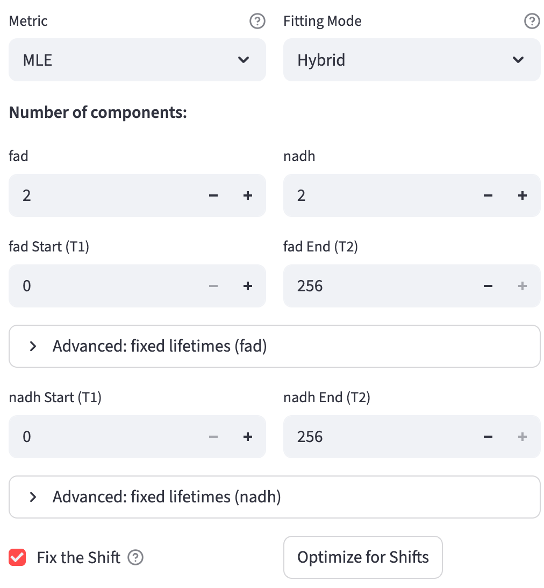
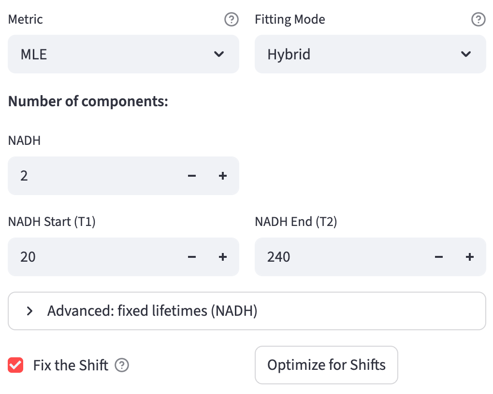
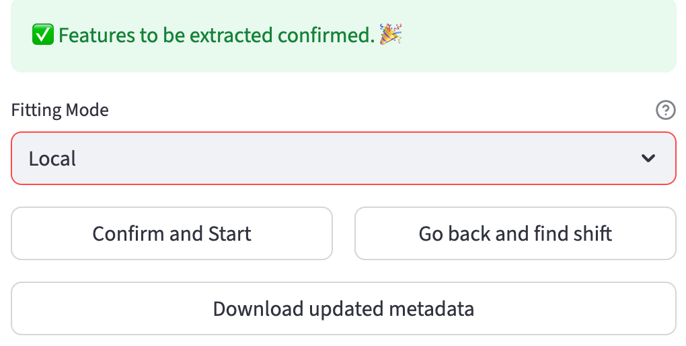

# IRF Calibration {#sec-irf-calibration}

The instrument response function (IRF) describes the detection system's response to an ultrashort light pulse. Its timing relative to a measured decay affects reconvolution fitting and IRF-based phasor calibration. This chapter covers estimating and confirming that shift in **Data Extraction → Numeric Feature Extraction**.

## When this stage is needed {#calibration}

**An IRF shift is required when at least one channel meets either of these conditions:**

| Channel input and selected extractor | How its shift is determined |
|---|---|
| Raw FLIM with `Lifetime fit` selected | [Fit calibration](#fit-calibration) optimizes the shift during reconvolution fitting. This is required even when phasor features use a calibration dye. |
| Raw or pre-fitted FLIM with `Lifetime fit free` selected and calibration method set to `IRF` | [Fit-free IRF calibration](#fit-free-calibration) estimates the shift by cross-correlation. If raw lifetime fitting is also selected, its fitted shift is reused. |

The app evaluates these conditions separately for each channel. Estimate shifts for the channels that meet them, or reuse shifts already saved in the metadata. Then continue to [Numerical Feature Extraction](numerical_feature_extraction.qmd#feature-extraction).

A calibration dye is a **Fluorescence Lifetime Standard**: its reference-based phasor calibration runs during [fit-free feature extraction](lifetime_fit_free.qmd#fluorescence-lifetime-standard). It does not trigger this IRF shift stage. A workflow with only intensity-only channels also proceeds directly to extraction.

## Input

Open **Data Extraction → Numeric Feature Extraction**. Use the cached metadata exported by [FOV Metadata Extraction](fov_metadata.qmd#sec-fov-metadata), or upload a saved metadata CSV. The metadata records each channel's input files, modality, selected extractors, and calibration method. Cached metadata takes precedence; refresh the page to clear it before uploading a different file.

## Fit Calibration

The IRF can shift relative to the measured decay between experiments. For a **raw FLIM channel with `Lifetime fit` selected**, estimate its IRF shift before reconvolution fitting, or reuse a shift already saved in the metadata. Pre-fitted lifetime values are read directly and do not enter this fitting-based shift search.

It is performed in two steps:

1. Gather the high signal-to-noise ratio (SNR) decay curves
2. For each curve, perform reconvolution fitting and set the shift value as the free parameter to be optimized/fitted. The shift search range is centered on the initial shift guess and extends $\pm 2 \times \text{FWHM}$ of the IRF in both directions, where FWHM is the full width at half maximum of the IRF measured in time bins. This focused search window prevents the optimizer from getting stuck in suboptimal basins when [time gates](#time-gates) are restrictive.

The distribution of the shift values is displayed as an interactive scatter plot. When clicking on a point, the corresponding decay curve with the fitted curve and the key statistics are displayed for diagnostics. Based on the distribution or using certain prior knowledge, users can specify the shift value applied to all fields of view (if `Fix the Shift` is selected, see [fitting options](#fitting-options)), or use the fov-specific shift value found by the fitting (if `Fix the Shift` is deselected).

::: {#irf-shift}
{width=100% fig-align=center fig-alt="Twenty-five NADH shift estimates, with Mosaic16 selected beside its measured decay, red fitted curve, fit statistics, and editable common shift."}
:::

### Gather High SNR Decay Curves

The high-SNR curves are gathered according to the [decay type](data_extraction_config.qmd#decay-types). For [2D input](data_extraction_config.qmd#two-d-decay), the selection targets approximately 30 curves, with at least one per FOV (one CSV file). It prefers the brightest curves below `100000` photons; if a FOV has none below that threshold, it uses its brightest curves without the cap. For [3D/4D input](data_extraction_config.qmd#three-d4d-decay), one curve per image sums the pixels inside its [ROI mask](data_extraction.qmd#mask).

### Reconvolution Fitting

Fitting is essentially an optimization problem: it minimizes the difference between the fitted curve and the measured curve. The fitted curve is modeled by an $n^{th}$ component exponential function convolved with the shifted IRF, and the difference is modeled as an objective metric. Therefore, users are provided with controls over two parts of the fitting process through the [fitting options panel](#fitting-options):

1. How to construct the objective metric
2. How to perform the optimization

Implementation-wise, FLIM Playground uses the `lmfit` package that takes generic objectives to perform the optimization process that is flexible enough to handle the reconvolution fitting.

Each decay curve is fitted independently. **Fit calibration** (one optimization per high-SNR curve in the IRF shift step) and **Lifetime fit** ROI-level extraction (one optimization per ROI per channel) both schedule those independent fits **in parallel across CPU cores**, so on a multi-core machine many fits run at once.

The fitting-options panel appears when a channel uses raw `Lifetime fit` and shifts still need estimation.

::: {#fitting-options}
{width=80% fig-align=center fig-alt="MLE metric and Hybrid fitting mode, two components per channel, start and end time gates, fixed-lifetime expanders, Fix the Shift, and Optimize for Shifts."}
:::

Let's break down the fitting options one by one.

#### Number of Components

The number $n$ in the $n^{th}$ component exponential function:
$$
I(\mathbf{t})=\sum_{i=1}^{n} A_i\, e^{-\mathbf{t}/\tau_i}, \qquad \tau_i>0
$$

Therefore, $n$ determines the parameters to be fitted: the amplitudes $A_i$ and the lifetimes $\tau_i$. $\mathbf{t}$ is the time axis of the decay curve calculated by the `duration` and `time bins` from the [decay info](fov_metadata.qmd#decay-info):
$$\mathbf{t}=\bigl[0,\ \Delta t,\ 2\Delta t,\ \ldots,\ (N-1)\Delta t\bigr],
\quad \text{where }\Delta t=\frac{T}{N}.
$$

It supports $n=1,2,3$ components.

Additionally, the constant offset parameter ($Z$) that represents a time-independent background (i.e., room light) is also optimized [@warren2013].

$$
\hat{y}(t) = \bigl[I(t) + Z\bigr] \circledast \text{IRF}(t)
$$

where $\circledast$ denotes circular (periodic) convolution, implemented by multiplying the FFTs of the decay and IRF, then applying the inverse FFT. Circular convolution correctly accounts for the wrap-around effects inherent in periodic TCSPC decays, where photons arriving after the end of the measurement window appear at the beginning of the next period.

::: {.callout-note title="Previous Versions (< 1.8.0)"}
In versions prior to 1.8.0, the fitting process utilized linear convolution with a cut off:

$$
\hat{y}(t) = \bigl( I(t) * \text{IRF}(t) \bigr)_{0:N} + Z
$$

where $*$ denotes linear convolution and the subscript $(0:N)$ denotes truncating the result to the length of the original decay curve, effectively ignoring the part of the convolution that extends beyond the measurement window. The difference between this approach and circular convolution is minimal for shorter lifetimes. However, the correct way to fit incomplete decays is formulated above using circular convolution, which is now the standard used in the latest version.
:::

#### Fixed Lifetimes

While finding the optimal amplitudes $A_i$ and lifetimes $\tau_i$ (when [number of components](#number-of-components) is greater than 1), users can optionally assign fixed values to specific $\tau_i$ components during the interactive fitting phase. These explicit constraints remain constant (are not treated as free parameters) while minimizing the cost metric, making the optimization more robust when the true lifetime state is known. The default fixed lifetime values can be initialized in the [Data Extraction Configuration](data_extraction_config.qmd#fixed-lifetimes).

::: {.callout-note}
Fixed lifetimes apply only to channels that FLIM Playground fits. For [pre-fit](data_extraction_config.qmd#three-d4d-pixel-pre-fit) inputs (SPCImage `.asc`), whose lifetimes are read rather than fit, the fixed-lifetime controls are not shown.
:::

#### Time Gates
Detector dead time can make some bins at the beginning or end of a decay unreliable. Set **Start (T1)** and **End (T2)** independently for each fitted channel to choose the bins included in its fitting objective. T1 is included and T2 is excluded: the default `0–256` uses bins `0–255` of a 256-bin decay.

To adjust the gates in the `3d_decay_1channel` example:

1. Select a point in the [shift distribution](#irf-shift) to inspect its measured and fitted decay. Expand the decay plot if needed, then hover over measured points to read their bin numbers.
2. Change **NADH Start (T1)** from `0` to `20` and **NADH End (T2)** from `256` to `240`. This example fits bins `20–239`, trimming both ends while retaining the decay peak. Choose the limits from the decay in your own dataset.
3. Click **Optimize for Shifts** and select `Mosaic16` again to inspect the updated fit. The plot still displays the full decay; only bins inside the gates contribute to the fitting objective and reported fit statistics.
4. When satisfied, click **Confirm Time Gates (if applicable) and Shift for each channel**. Use **Download updated metadata** after confirmation to retain these settings for later extraction.

{width=65% fig-align=center fig-alt="NADH fitting controls show MLE, Hybrid mode, two components, Start T1 set to 20, End T2 set to 240, and Optimize for Shifts."}

{width=100% fig-align=center fig-alt="Updated NADH shift distribution and the measured and fitted Mosaic16 decay after changing the time gates, with recalculated fit statistics."}

#### Metric

Maximum Likelihood Estimation (`MLE`) estimates the parameters by maximizing the likelihood function, which is the probability of the measured data given the model parameters. A mathematically convenient way to do this is to minimize the negative log-likelihood function:

$$
\text{NLL}(\theta; t_s,t_e)
= -\sum_{n=0}^{N-1} \mathbf{1}_{[t_s,t_e)}(t_n)\,\bigl[y_n \log \hat{y}(t_n) - \hat{y}(t_n)\bigr].
$$

$\mathbf{1}_{[t_s,t_e)}$ is the indicator function that is 1 if $t_n$ is within the [time gates](#time-gates) $[t_s, t_e)$, and 0 otherwise. $y_n$ is the observed count at time $t_n$, and $\hat{y}(t_n)$ is the model prediction at $t_n$.

Weighted Least Squares (`WLS`) minimizes the squared residuals between the measured curve and the model prediction, with each time bin weighted by the inverse of its expected variance. Because photon counts follow Poisson statistics (variance $\approx$ mean), the per-bin variance is estimated by the model prediction $\hat{y}(t_n)$, so each residual is scaled by $1/\sqrt{\max(\hat{y}(t_n), 1)}$, and the cost minimized is

$$
\text{WLS}(\theta; t_s,t_e)
= \sum_{n=0}^{N-1} \mathbf{1}_{[t_s,t_e)}(t_n)\,\frac{\bigl(y_n - \hat{y}(t_n)\bigr)^2}{\max(\hat{y}(t_n), 1)}.
$$

This weighting is Pearson's $\chi^2$ — the per-bin variance is taken from the model $\hat{y}(t_n)$ rather than the noisy measured count — which keeps the high-count bins near the decay peak from dominating the fit; the $\max(\cdot, 1)$ floor avoids division by zero where the model is near zero. The reported [reduced chi-square](lifetime_fit.qmd#goodness-of-fit) also uses model-based variance, but divides by positive model values without the WLS floor and adjusts for the number of free parameters.

#### Fitting Mode

The fitting mode selects the optimization strategy. It is a trade-off between speed and the effort to avoid local minima.

During shift estimation, `Fitting Mode` offers **Hybrid** only. After all required shifts have been confirmed or loaded from saved metadata, the fitting workflow offers both **Hybrid** and **Local** for the subsequent cell-level fits. Choose the mode before clicking `Confirm and Start`.

- `Local`: Each cell is fit with a single local optimizer — `leastsq` (least squares with Levenberg-Marquardt) if the chosen metric is `WLS`, otherwise `nelder` (Nelder-Mead). To give those per-cell fits a good starting point, a one-time **warm start** is performed first: the `differential evolution` global optimizer is run once on the *mean* decay of all ROIs in the batch, and the resulting lifetimes (and the constant offset) seed the initial values for every per-cell fit. The mean is used rather than the sum so the seed stays at single-cell scale, keeping a cell's result independent of how many cells share its batch. This warm start runs once, up front, before the per-cell fits are [parallelized across CPU cores](#reconvolution-fitting); because the global search runs once for the whole batch instead of once per cell, `Local` is substantially faster than `Hybrid`.
- `Hybrid`: The slower but more accurate option. For **each cell**, it runs the `differential evolution` algorithm to obtain a good initial guess for all parameters, followed by the `Local` optimizer to refine the solution.

## Fit-Free IRF Calibration {#fit-free-calibration}

This shift calibration applies to channels with `Lifetime fit free` selected and [calibration method](data_extraction_config.qmd#calibration-method) set to `IRF`, including pre-fitted FLIM channels when phasor features are requested. The [fluorescence lifetime standard](lifetime_fit_free.qmd#fluorescence-lifetime-standard) method instead calibrates phasors during extraction.

Before calculating phasors, the app subtracts the mean signal in the final 10% of each cell's decay and clips negative values to zero. See [fit-free preprocessing](lifetime_fit_free.qmd#preprocessing).

### Shift IRF

It is performed similarly to the [fit calibration](#fit-calibration) steps, but in the second step, the shift is not optimized (fitted). It shares the [same interface](#irf-shift) as the [fit calibration](#fit-calibration) step, where a scatter plot of the shift values is displayed for each channel, only that the plot is not interactive to show the fit. Instead, it outputs the shift that maximizes the cross-correlation between the IRF and each decay. If `Fix the Shift` is selected, users can specify the shift value that will be applied to all fields of view. With `Fix the Shift` cleared, image inputs use their individual FOV shifts; 2D inputs use the median sampled shift within each FOV.

::: {.callout-note}
If both `Lifetime fit` and `Lifetime fit free` are selected for a **raw FLIM channel**, the optimized IRF shift from [fit calibration](#fit-calibration) is reused for IRF-based phasor extraction. For pre-fitted FLIM, the existing fitted values do not trigger reconvolution fitting; IRF-based phasor extraction uses the cross-correlation shift described above.
:::

The signals of the shifted IRF are deconvolved from the offset-subtracted decay curves using [`phasor.phasor_divide`](https://www.phasorpy.org/docs/stable/api/phasor/#phasorpy.phasor.phasor_divide) from the `phasorpy` package.

## Confirm Calibration

Once users are satisfied with the calibration settings ([fitting options](#fitting-options) and shift values), they can click the `Confirm Time Gates (if applicable) and Shift for each channel` button at the bottom of the [page](#irf-shift).

After confirmation, choose the fitting mode for raw FLIM channels using `Lifetime fit`, then click `Confirm and Start`, or use `Go back and find shift` to repeat calibration. `Download updated metadata` preserves the shifts, time gates, fitting options, component counts, and fixed lifetimes. For metadata exported in the current session, this updates its existing file; for uploaded metadata, it downloads a new CSV. Loading that calibrated CSV later lets you reuse its shifts.

::: {#calibration-done}
{width=80% fig-align=center fig-alt="Confirmed extraction settings with Local fitting mode and buttons for Confirm and Start, Go back and find shift, and Download updated metadata."}
:::

