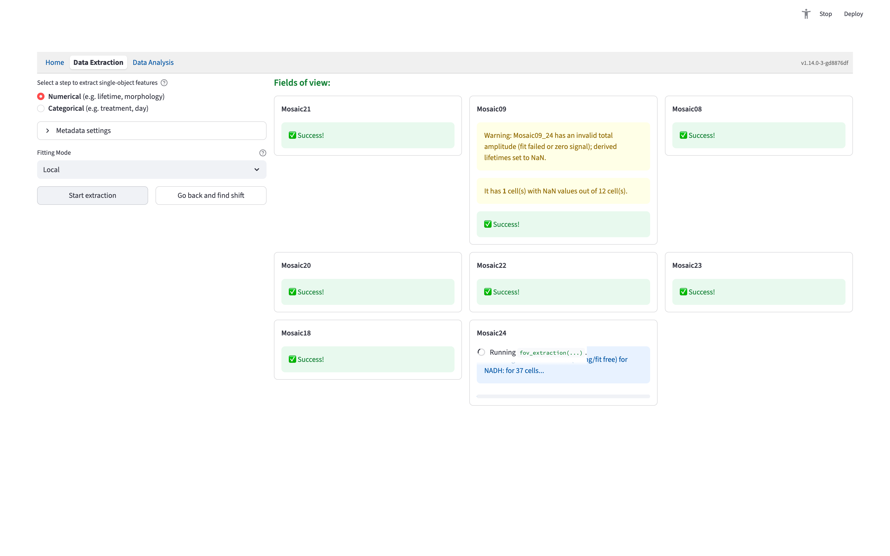
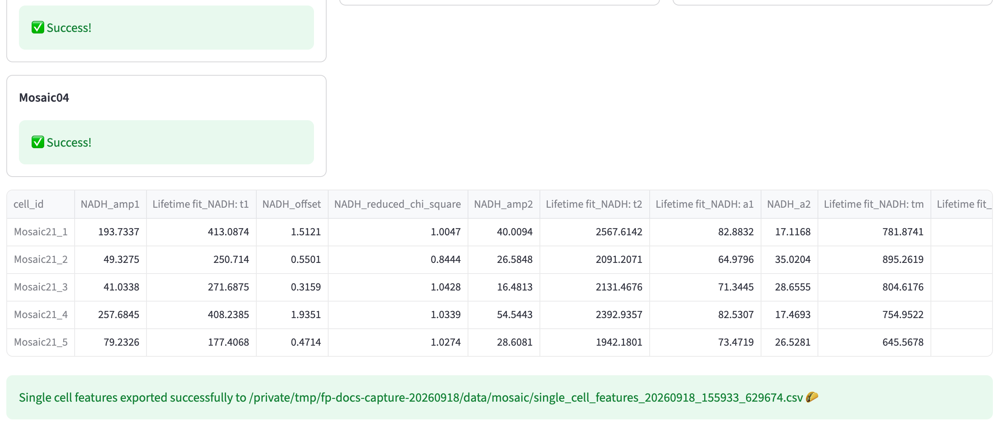

# Numerical Feature Extraction {#sec-numerical-feature-extraction}

Open **Data Extraction → Numerical** in a [local installation](index.qmd#installation) to turn a folder of input files into a single-cell feature table. This one workflow checks the inputs, prepares the FOV metadata, calibrates the channels that need it, and extracts and saves the numerical features based on configured per-channel feature extractors.

## Field of View Metadata

See [Field of View Metadata](fov_metadata.qmd#sec-fov-metadata) for FOV search by scanning a user-provided folder, file validation, channel assignment, acquisition checks, and the automatically saved metadata record.

## Calibration interface {#calibration-interface}

Interactive calibration is needed only for some use cases. See [IRF Calibration](irf_calibration.qmd#sec-irf-calibration) for FLIM shift calibration and [QPI Background Correction](qpi.qmd#background-correction) for QPI calibration.

After the folder is scanned, the next button reflects whether the selected extractors need interactive calibration:

- **Start calibration** prepares channels that need an IRF shift or QPI background correction.
- **Start extraction** prepares and immediately extracts when no interactive calibration is needed, for example an intensity-only workflow.

### Review each channel that needs calibration

| Channel and selected extractor | Calibration to review |
|---|---|
| Raw FLIM with `Lifetime fit` | [Reconvolution fitting and IRF shift](irf_calibration.qmd#fit-calibration), including fitting options and time gates |
| FLIM with `Lifetime fit free` and `IRF` calibration | [IRF shift](irf_calibration.qmd#fit-free-calibration); a raw lifetime fit supplies its fitted shift when both extractors are selected |
| QPI with `Dry-mass statistics` or `Spatial texture` | [Background correction](qpi.qmd#background-correction) for that channel |

For FLIM shift calibration, review the left-hand settings and click **Optimize for Shifts**. In a workflow that also requires QPI correction, this button is **Calibrate channels**. QPI-only background calibration opens directly after **Start calibration**.

Fluorescence lifetime standard calibration is applied during [phasor extraction](lifetime_fit_free.qmd#fit-free-standard-calibration). It does not require an interactive IRF shift unless that channel also performs raw lifetime fitting. A QPI channel selecting only morphology does not require background calibration.

When every required channel is ready, click **Confirm calibration for each channel**. Confirmation automatically updates the same metadata record with the chosen settings.

## Feature Extraction

After confirming calibration, choose **Hybrid** or **Local** fitting for raw FLIM channels using `Lifetime fit`, then click **Start extraction**. To revisit calibration, use **Go back and find shift**, **Go back and correct background**, or **Go back and recalibrate**, as appropriate for the channels.

The selected extractors provide:

- [Lifetime fit](lifetime_fit.qmd): fitted lifetime components, fractions, and fit statistics, or cell-level aggregation of pre-fitted pixel values.
- [Lifetime fit free](lifetime_fit_free.qmd): phasor coordinates and corresponding lifetimes.
- [Intensity morphology](intensity_morphology.qmd): shape measurements from ROI masks.
- [Intensity texture](intensity_texture.qmd): intensity-image texture, or only the per-cell decay sum for 2D decay input.
- [QPI dry-mass statistics and spatial texture](qpi.qmd#output-features): measurements from background-corrected optical path difference.

Configured [derived features](derived_feature.qmd) are calculated after the successful FOV results are combined.

The right side lists FOVs and their extraction status. Progress bars appear during processing, and completed FOVs show their result badges. Keep the page open while the batch runs and check any errors or warnings before using the output.

{width=100% fig-align=center fig-alt="Numerical workflow showing fitting controls and per-field-of-view extraction progress and result badges."}

Cells with missing feature values (`NaN`) remain in the exported table; the app reports warnings about those values.

## Save Results

The completed table is automatically written as `single_cell_features_<timestamp>.csv` in the source folder. The page shows a preview and the saved path.

{width=100% fig-align=center fig-alt="Completed numerical extraction with a cell-feature table preview and a successful export message showing the local CSV path."}

If saving the features fails, correct the reported problem and click **Retry exporting features**. This saves the already calculated table without rerunning extraction. The metadata CSV remains a record of the input files, extraction settings, and confirmed calibration; the workflow starts from a source folder on each new run.
