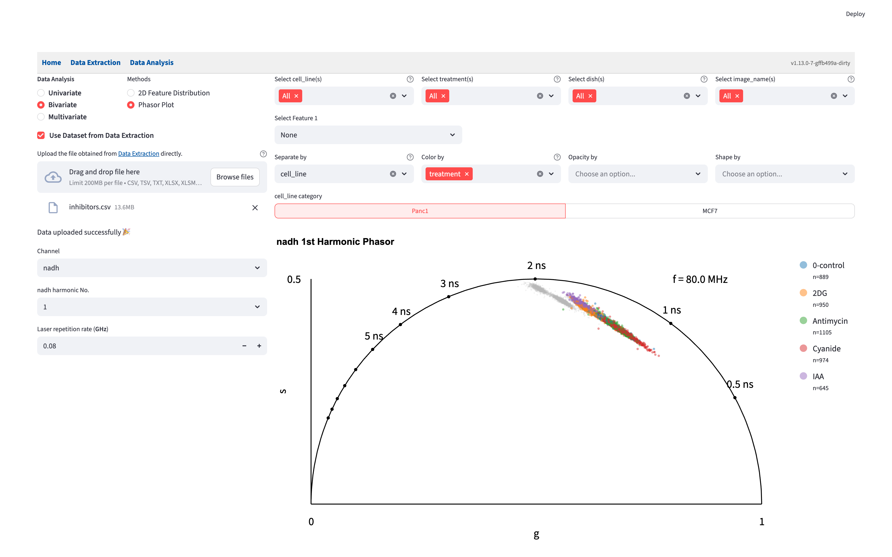
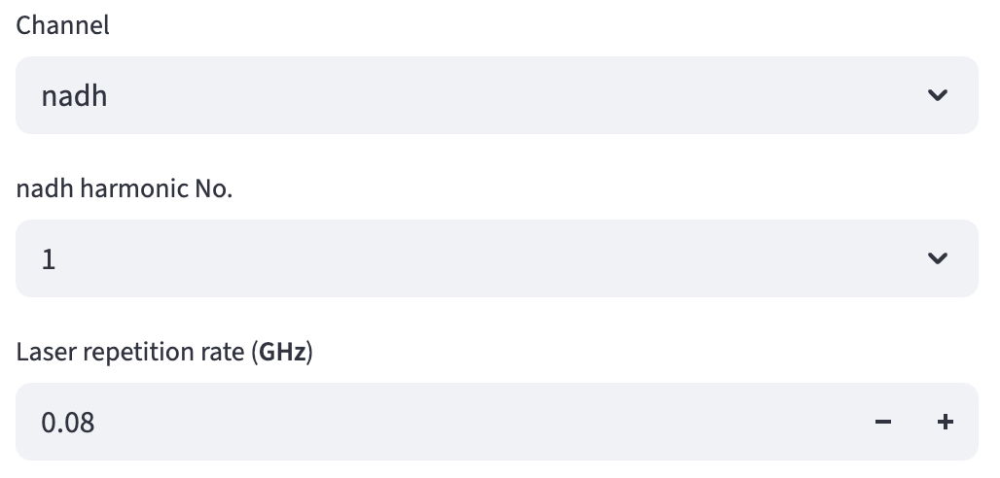
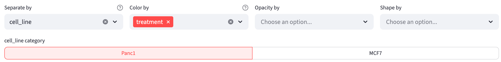
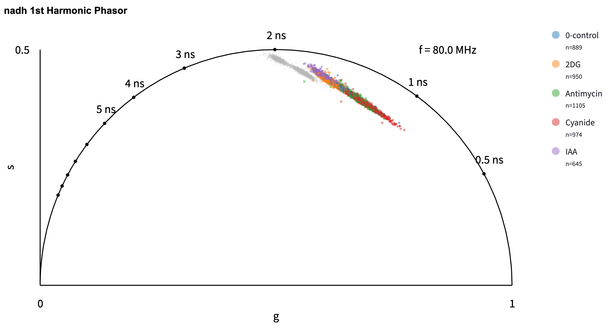

# Phasor Plot {#sec-phasor-analysis}

**Phasor Plot** displays a matching pair of first- or second-harmonic phasor coordinates against the universal semicircle. Use it to compare the positions and spread of groups measured with the [Lifetime fit free](#sec-lifetime-fit-free) extractor, or from a user table with the expected coordinate names.

::: {.callout-note title="Phasor Plot appears only for datasets with phasor coordinates"}
After a dataset is loaded, **Phasor Plot is hidden from the Bivariate method selector if the dataset has no recognized, complete G/S coordinate pair**. A pair must belong to the same channel and harmonic, and both columns must be numerical. See [coordinate names and column roles](#select-phasor-coordinate) below.
:::

{width=100% fig-align=center fig-alt="Full Phasor Plot interface with dataset upload, NADH channel and first harmonic, filters, Separate by cell_line, Color by treatment, the selected cell-line category, and the phasor chart."}

## Shared Interface Components

- On the top right, users can use the [filters](data_analysis.qmd#filter-widgets) to subset the data to find the groups of interest. 
- Below the filters, use `Color by`, `Opacity by`, and `Shape by` to encode categorical features. [`Separate by`](#separate-by) adds a category selector above the plot.
- On the bottom right, users can change the plot style using the [plot styling widgets](data_analysis.qmd#plotting-configuration-widgets). 

## Select Phasor Coordinate 

On the left, select **Channel** when more than one channel is present, then choose its **harmonic No.** Only harmonics with both G and S coordinates are offered. A table containing just one complete harmonic pair can still use Phasor Plot.

{width=80% fig-align=center fig-alt="Channel set to nadh and nadh harmonic No. set to 1."}

The method recognizes numerical columns named `Lifetime fit free_{channel}: G(1st)` and `Lifetime fit free_{channel}: S(1st)`, or their `G(2nd)` and `S(2nd)` counterparts. For example, a first-harmonic NADH pair is `Lifetime fit free_nadh: G(1st)` and `Lifetime fit free_nadh: S(1st)`. In a user-table review, assign both columns **Numerical**; they may belong to different feature groups. After upload, Phasor Plot is available only if the table contains a complete pair.

Set **Laser repetition rate (GHz)** to the acquisition's base repetition rate, for example `0.08` for 80 MHz. This controls the lifetime reference markers; it does not recalculate or calibrate the uploaded coordinates. The app removes rows missing either coordinate from the displayed plot.

The plot is drawn against the universal semicircle, with markers along it for lifetimes from 0.5 to 10 ns to read your points against. Switching to the 2nd harmonic moves those markers, because the transform is evaluated at twice the frequency and a given lifetime lands somewhere else. The frequency printed inside the plot tells you which view you are reading — `f = 160 MHz (2 × 80 MHz)` for the 2nd harmonic of an 80 MHz system — so check it before comparing a point against a marker. The semicircle itself is the same for both harmonics.

## Separate by

{width=100% fig-align=center fig-alt="Separate by is cell_line, Color by is treatment, and the category selector switches between Panc1 and MCF7; opacity and shape have no selection."}

Choose `cell_line` in **Separate by** and `treatment` in **Color by**, then select a cell line above the plot. For example, select `Panc1` to highlight its treatments while keeping `MCF7` observations in gray for context. The selected category keeps its color, opacity, and shape encodings; observations from other categories remain visible as faint gray context points. The full-size axes and lifetime references remain the same as you switch categories.

The separation column cannot also be used for `Color by`. Point colors stay consistent across categories, and **Show group counts (n) in legend** counts only the selected category's complete G/S observations. Gray context points do not contribute to those counts or provide individual hover labels.

{width=100% fig-align=center fig-alt="First-harmonic NADH phasor plot with Panc1 observations colored by treatment, faint gray context points, and lifetime markers along the universal semicircle."}

## Export the plot

Click **Export the entire analysis as a Python script** below **Plot Styling** to reproduce the current channel, harmonic, repetition rate, filters, encodings, and selected category. Follow the [shared script workflow](data_analysis.qmd#export-workflow-as-python-script) to generate an SVG figure from the original table.
