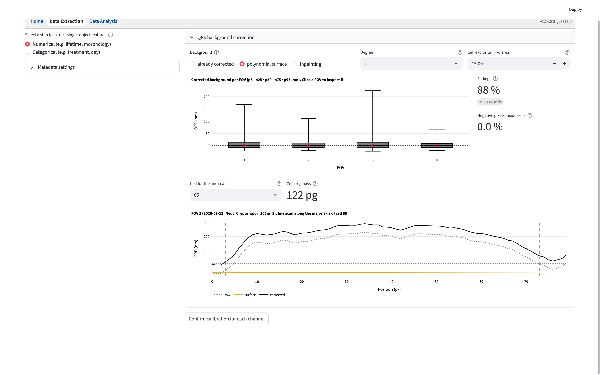
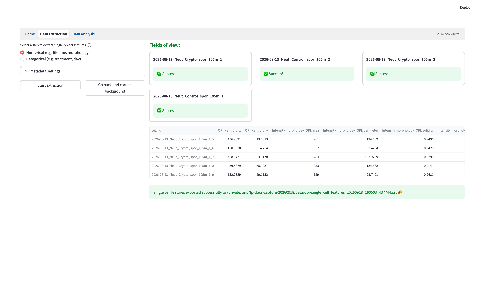

# Quantitative Phase Imaging {#sec-qpi}

The **QPI** imaging modality extracts single-cell dry-mass measurements and spatial texture from a 2D optical path difference (OPD) image and a labeled cell mask. It can be used alone or alongside image-based FLIM and intensity-only channels in the [Numerical workflow](numerical_feature_extraction.qmd).

## QPI-specific inputs {#inputs-and-configuration}

Set the channel to **QPI** on the [Configuration](data_extraction_config.qmd#imaging-modality) page. That page is the source of truth for the QPI file formats, extractors, physical constants, mask, and file suffixes.

For each FOV, pair a 2D OPD image with a matching [label mask](data_extraction_config.qmd#mask); the two files must have identical dimensions. QPI dimensions must be consistent across QPI FOVs, but the QPI grid may differ from a FLIM grid. Cells are joined across modalities by FOV name and mask label, so the same label must identify the same cell.

The input must already represent optical path difference. Phase-angle conversion, reconstruction, unwrapping, registration, and rescaling happen before extraction.

## Background Correction

Selecting **Dry-mass statistics** or **Spatial texture** requires a confirmed background recipe for each QPI channel. Click **Start calibration** to review it. A QPI-only calibration opens directly; a mixed workflow may first require **Calibrate channels** to estimate its FLIM shifts. A QPI channel selecting only **Intensity morphology** uses its mask and does not require background calibration.

Each required channel has an open **background correction** expander. Its recipe is applied to every FOV in that channel; other channels can use different recipes.

| Background choice | Operation and controls |
|---|---|
| **already corrected** | Subtracts no additional background. Use it for an OPD image whose background has already been corrected. |
| **polynomial surface** | Fits a smooth surface to background pixels outside the excluded cell region, then subtracts it. Choose degree `2`, `4`, or `6`. The fit iteratively rejects residuals beyond `2.5 × (1.4826 × MAD)` on either side of the median, over the full fit region, for at most 10 rounds. |
| **inpainting** | Fills the excluded cell region from its surroundings using biharmonic inpainting, smooths the resulting surface with a Gaussian filter, then subtracts it. |

The initial recipe uses a degree-4 polynomial and **Cell exclusion (+% area)** of `15`. For polynomial and inpainting correction, this control expands the combined cell-mask region by the requested percentage of its area before estimating the background; it is not a distance in pixels. Higher polynomial degrees can follow more curved backgrounds but need more background pixels. If the fit reports too few usable pixels, reduce the degree or exclusion expansion.

### Inspect the correction

The background plot summarizes each FOV's corrected background in **nanometres**, showing its 5th, 25th, 50th, 75th, and 95th percentiles. Click a FOV's median point to inspect that field of view.

- **Fit kept** appears for polynomial correction and reports the fraction of background pixels retained by the fit. Below 85%, the app warns that the surface may be too low and masses may be inflated.
- **Negative pixels inside cells** reports the fraction below zero after eroding each cell mask by two pixels. Use it with the line scan to assess whether the estimated surface is above the cell signal.
- **Cell for the line scan** selects a cell, initially the largest ROI. **Cell dry mass** shows its signed mass in picograms using the configured pixel size, OPD unit, and α.
- The major-axis line scan compares **raw**, **surface**, and **corrected** OPD in nanometres. Dashed vertical lines mark the selected cell's mask boundaries along the scan.

{width=100% fig-align=center fig-alt="QPI background-correction expander with method controls, per-FOV background summaries, diagnostic readouts, cell selection, dry mass, and a line scan of raw, surface, and corrected OPD."}

Review every required channel, then click **Confirm calibration for each channel**. The app records the chosen method, degree, and exclusion percentage in `{channel}_bg_method`, `{channel}_bg_degree`, and `{channel}_bg_expand_pct` in the automatically saved metadata. These are settings; calibration does not write a corrected image file. Extraction applies the confirmed recipe through the same correction used for the preview.

## Output Features

Click **Start extraction** after confirmation. OPD values are converted to micrometres, and each corrected pixel contributes

$$
m_i = \frac{\mathrm{OPD}_{i,\mu\mathrm{m}}\,p^2}{\alpha},
$$

where $p$ is the pixel size in micrometres, $\alpha$ is in µm³/pg, and $m_i$ is the pixel dry mass in picograms. The units reduce to pg because µm × µm² / (µm³/pg) = pg. For a cell with $N$ labeled pixels,

$$
M = \sum_{i=1}^{N} m_i,
\qquad
\rho = \frac{M}{N p^2},
$$

where $M$ is the signed dry mass in pg and $\rho$ is `mass_density_pg_per_um2` in pg/µm². Negative corrected values are retained in both $M$ and $\rho$.

### Dry-mass statistics

Columns use the prefix `Dry-mass statistics_{channel}: `.

| Feature suffix | Meaning |
|---|---|
| `dry_mass_pg` | Sum of signed pixel masses, in pg. |
| `mass_density_pg_per_um2` | Total dry mass divided by the ROI area in µm². |
| `dry_mass_variance` | Sample variance of pixel masses, in pg² (`ddof = 1`). |
| `dry_mass_skewness` | Bias-corrected skewness of pixel masses. |
| `dry_mass_kurtosis` | Bias-corrected excess kurtosis of pixel masses. |
| `dry_mass_entropy` | Shannon entropy of the normalized nonnegative pixel masses, using natural logarithms. |
| `dry_mass_evenness` | Entropy divided by the logarithm of the number of ROI pixels. |

Entropy and evenness clip negative pixel masses to zero because they require a nonnegative distribution. With $q_i = \max(m_i, 0) / \sum_j \max(m_j, 0)$, entropy is $-\sum_i q_i \ln q_i$ and evenness is entropy divided by $\ln N$. This does not change the signed total mass. Variance, skewness, and kurtosis are undefined for fewer than 2, 3, and 4 ROI pixels, respectively; entropy and evenness are undefined without at least two pixels and positive clipped mass. Undefined statistics are `NaN`.

### Spatial texture

Columns use the prefix `Spatial texture_{channel}: `.

| Feature suffix | Meaning |
|---|---|
| `avg_dm_gradient_mag` | Mean Scharr gradient magnitude of the pixel-mass image inside the ROI, displayed in pg/px. |
| `radial_mass_index` | Mean nonnegative pixel mass in the core divided by that in the periphery. Distances are measured from the geometric centroid and normalized by the furthest ROI pixel; the core is at most 0.33 and the periphery at least 0.66 of that distance. |
| `polar_gradient_index` | Distance between the geometric and corrected-OPD-weighted centroids, divided by the equivalent-area diameter. |

The radial index is `NaN` when either region is absent or the peripheral mean is not positive. The polar index is `NaN` when total signed mass is not positive.

### Morphology and analysis

The optional [Intensity morphology](intensity_morphology.qmd) extractor supplies the same mask-based features as it does for other modalities. Its area and lengths remain in pixels; the QPI pixel-size setting is used for dry mass and density. If channels request morphology from the same mask file, those features are emitted once under the first such channel.

{width=100% fig-align=center fig-alt="Completed QPI numerical extraction with a preview of the selected QPI feature columns and the automatically saved CSV path."}

The table is automatically saved in the source folder, as described in [Save Results](numerical_feature_extraction.qmd#save-results). In the local app, open **Data Analysis** with **Use a table from another source** off; in the hosted app, upload the CSV with that option on. Numerical pickers group the QPI columns by extractor and channel. QPI measurements are also available as operands in [derived features](derived_feature.qmd), including formulas combining channels.
